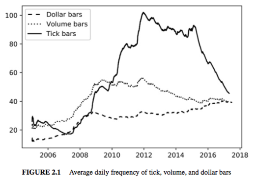
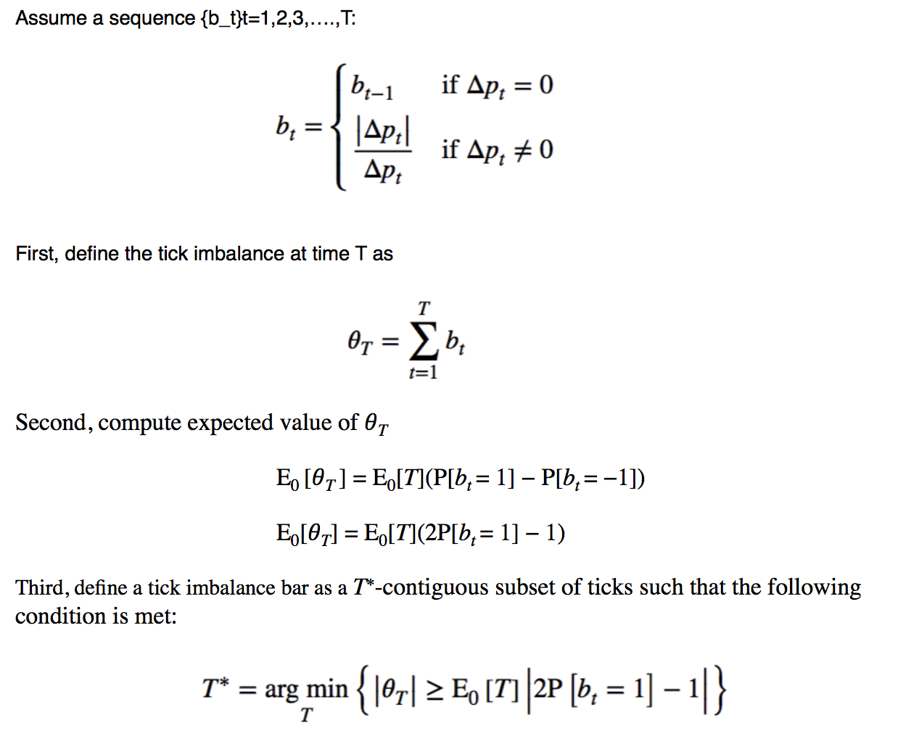
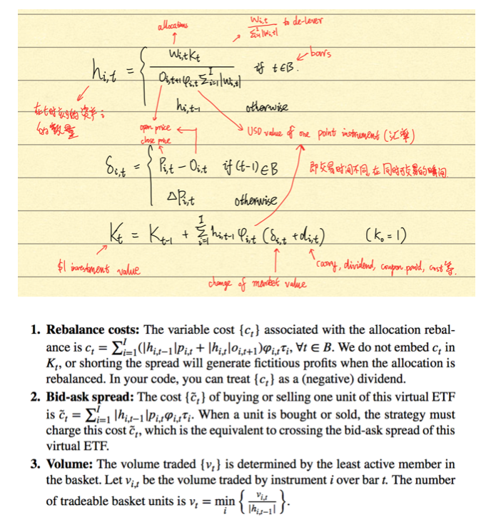
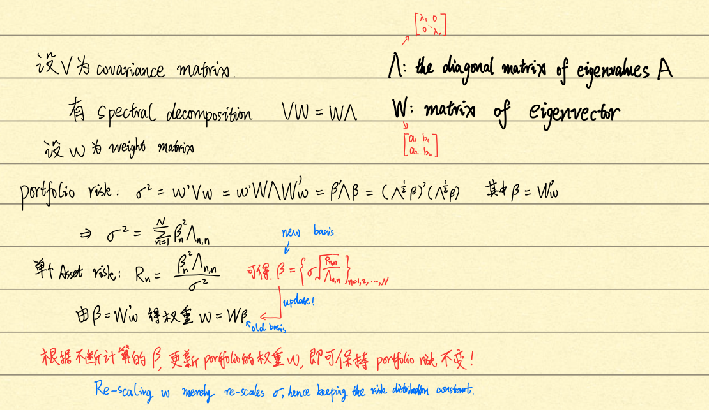

# Advances in Financial Machine Learning

Book:
[Advances in Financial Machine Learning](https://book.douban.com/subject/27188754/)

<!-- vim-markdown-toc GitLab -->

*   [Part 1 Data analysis](#part-1-data-analysis)
    *   [Chapter 2 Financial Data](#chapter-2-financial-data)

<!-- vim-markdown-toc -->

# Part 1 Data analysis

## Chapter 2 Financial Data

*   **Essential Types of Financial Data**

    1.  Fudamental Data
        *   财报公布日期不同
        *   Backfilled or Reinstated.
    2.  Market Data
    3.  Analytics(Derivative data)
    4.  Alternative Data
        *   数据越难用越难获得越好用。

*   **Bars**

    1.  Standard Bars

        *   Time Bars
            *   一般包括 Timestamp, OHLC, Volume
            *   应尽量避免。一是因为市场不按照固定 intervals 出行情，CPU 更接近
                于 chronological intervals. 二是因为经过时间重组的数据有统计效果
                会削弱很多。
        *   Tick Bars
            *   即固定一定数量 Tick 之后产生的 Bar,比如每 1000Tick 产生一个 Bar
            *   因为固定 transaction 之后的价格变化接近 Gaussian 分布，而固定时
                间间隔的价格变化接近 Paretian 分布(因为在一定时间段内的交易量接
                近随机)。
            *   更接近 IID 假设。(Independent and Identically Distributed)
            *   注意 auction 无撮合，会在最后一刻一次性撮合，所以他的 price 包含
                了 outsized amount tick.
        *   Volume Bars
            *   即固定交易订单量之后产生的 Bar，比如每 1000 units 成交量后产生的
                Bar。
            *   比 Tick Bars 更接近 IID Gaussian distribution
            *   便于探究 Volume 和 Price 之间的关系。
        *   Dollar Bars
            *   即固定交易市值量之后产生的 Bar，根据品种主要的 Currency 划分。
            *   因为订单撮合机制，价格变化是交易市值的函数，所以 Dollar Bars 有
                效，比其他类型的 Bars 变化范围和速度更稳定。
            *   Dollar Bars 受发行股数变化，拆股等影响少。
        *   

    2.  Informatioon-Driven Bars
        *   Tick Imbalance Bars
            *   
        *   Volume/Dollar Imbalance Bars
        *   Tick Runs Bars
        *   Volume/Dollar Runs Bars

*   **Dealing with Multi-product Series**
    *   The ETF Trick
        *   Spread 策略难点
            1.  spread 是由一系列随时间变化的权重表示的，所以就算价格不变
                ，spread 也可能会 converge.
            2.  spread 有可能为负
            3.  每个资产不一定交易时间相同
            4.  要考虑手续费
        *   所以构建一个反映 the value of \$1 invested in a spread 的时间序列。
        *   
    *   PCA Weights
        *   用 PCA 计算 Risks 对应的权重，通过不断更新 weight 保持 portfolio 的
            Risk 不变。
        *   
