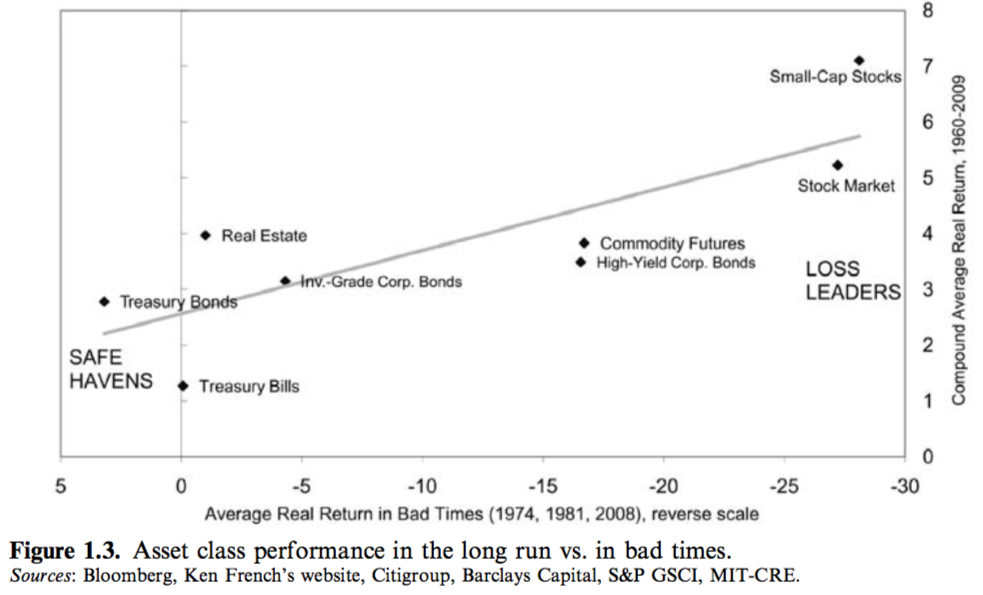

# Expected_Returns_An_Investor‘s_Guide_to_Harvesting_Market_Rewards

**Author:** Antti Ilmanen

<!-- vim-markdown-toc GitLab -->

* [PART I OVERVIEW, HISTORICAL RETURNS, AND ACADEMIC THEORIES 1](#part-i-overview-historical-returns-and-academic-theories-1)
    * [1. Introduction](#1-introduction)
        * [1.1 Historical Performance](#11-historical-performance)
        * [1.2 Financial and behavioral theories: A brief history of ideas](#12-financial-and-behavioral-theories-a-brief-history-of-ideas)
        * [1.3 Forward-looking indicators](#13-forward-looking-indicators)
        * [1.4 View-based expected returns](#14-view-based-expected-returns)
        * [1.5 General comments about the book](#15-general-comments-about-the-book)
        * [1.6 Notes](#16-notes)
    * [2. Whetting the appetite: Historical averages and forward-looking returns](#2-whetting-the-appetite-historical-averages-and-forward-looking-returns)
        * [2.1 Historical performance since 1990](#21-historical-performance-since-1990)
        * [2.2 Sample-specific results: Dealing with the pitfalls](#22-sample-specific-results-dealing-with-the-pitfalls)
        * [2.3 Forward-looking return indicators](#23-forward-looking-return-indicators)
        * [2.4 Notes](#24-notes)
    * [3. The historical record: The past 20 years in a longer perspective](#3-the-historical-record-the-past-20-years-in-a-longer-perspective)
        * [3.1 Stocks](#31-stocks)
        * [3.2 Bonds](#32-bonds)
        * [3.3 Real asset investing and active investing](#33-real-asset-investing-and-active-investing)
        * [3.4 FX and money markets](#34-fx-and-money-markets)
        * [3.5 Real return histories](#35-real-return-histories)
        * [3.6 Notes](#36-notes)
    * [4. Road map to terminology](#4-road-map-to-terminology)
        * [4.1 Constant or time-varying expected returns?](#41-constant-or-time-varying-expected-returns)
        * [4.2 Rational or irrational expectations formation?](#42-rational-or-irrational-expectations-formation)
        * [4.3 Return measurement issues](#43-return-measurement-issues)
        * [4.4 Returns in what currency?](#44-returns-in-what-currency)
        * [4.5 Risk-adjusted returns](#45-risk-adjusted-returns)
        * [4.6 Biased returns](#46-biased-returns)
        * [4.7 Notes](#47-notes)
    * [5. Rational theories on expected return determination](#5-rational-theories-on-expected-return-determination)
        * [5.1 The old world](#51-the-old-world)
        * [5.2 The new world](#52-the-new-world)
        * [5.3 Detour: a brief survey of the efficient markets hypothesis](#53-detour-a-brief-survey-of-the-efficient-markets-hypothesis)
        * [5.4 Notes](#54-notes)
    * [6. Behavioral finance](#6-behavioral-finance)
        * [6.1 Limits to arbitrage](#61-limits-to-arbitrage)
        * [6.2 Psychology](#62-psychology)
        * [6.3 Applications](#63-applications)
        * [6.4 Conclusion](#64-conclusion)
        * [6.5 Notes](#65-notes)
    * [7. Alternative interpretations for return predictability](#7-alternative-interpretations-for-return-predictability)
        * [7.1 Risk premia or market inefficiency](#71-risk-premia-or-market-inefficiency)
        * [7.2 Data mining and other ‘‘mirage’’ explanations](#72-data-mining-and-other-mirage-explanations)
        * [7.3 Notes](#73-notes)
* [PART II A DOZEN CASE STUDIES](#part-ii-a-dozen-case-studies)
    * [8 Equity risk premium](#8-equity-risk-premium)
        * [8.1 Introduction and terminology](#81-introduction-and-terminology)
        * [8.2 Theories and the equity premium puzzle](#82-theories-and-the-equity-premium-puzzle)
        * [8.3 Historical equity premium](#83-historical-equity-premium)
        * [8.4 Forward-looking (ex ante objective) long-term expected return measures](#84-forward-looking-ex-ante-objective-long-term-expected-return-measures)
        * [8.5 Survey-based subjective expectations](#85-survey-based-subjective-expectations)
        * [8.6 Tactical forecasting for market timing](#86-tactical-forecasting-for-market-timing)
        * [8.7 Notes](#87-notes)
    * [9 Bond risk premium](#9-bond-risk-premium)
        * [9.1 Introduction, terminology, and theories](#91-introduction-terminology-and-theories)
        * [9.2 Historical average returns](#92-historical-average-returns)
        * [9.3 Alternative ex ante measures of the BRP](#93-alternative-ex-ante-measures-of-the-brp)
        * [9.4 Yield curve steepness: important predictive relations](#94-yield-curve-steepness-important-predictive-relations)
        * [9.5 Explaining BRP behavior: first targets, then four drivers](#95-explaining-brp-behavior-first-targets-then-four-drivers)
        * [9.6 Tactical forecasting—duration timing](#96-tactical-forecastingduration-timing)
        * [9.7 Notes](#97-notes)
    * [10 Credit risk premium](#10-credit-risk-premium)
        * [10.1 Introduction, terminology, and theory](#101-introduction-terminology-and-theory)
        * [10.2 Historical average excess returns](#102-historical-average-excess-returns)
        * [10.3 Focus on front-end trading—a pocket of attractive reward to risk](#103-focus-on-front-end-tradinga-pocket-of-attractive-reward-to-risk)
        * [10.4 Understanding credit spreads and their drivers](#104-understanding-credit-spreads-and-their-drivers)
        * [10.5 Tactical forecasting of corporate bond outperformance](#105-tactical-forecasting-of-corporate-bond-outperformance)
        * [10.6 Assessing other non-government debt](#106-assessing-other-non-government-debt)
        * [10.7 Concluding remarks](#107-concluding-remarks)
        * [10.8 Notes](#108-notes)
    * [11 Alternative asset premia](#11-alternative-asset-premia)
        * [11.1 Introduction to alternatives](#111-introduction-to-alternatives)
        * [11.2 Real estate](#112-real-estate)
        * [11.3 Commodities](#113-commodities)
        * [11.4 Hedge funds](#114-hedge-funds)
        * [11.5 Private equity funds](#115-private-equity-funds)
        * [11.6 Notes](#116-notes)
    * [12 Value-oriented equity selection](#12-value-oriented-equity-selection)
        * [12.1 Introduction to dynamic strategies](#121-introduction-to-dynamic-strategies)
        * [12.2 Equity value: introduction and historical performance](#122-equity-value-introduction-and-historical-performance)
        * [12.3 Tweaks including style timing](#123-tweaks-including-style-timing)
        * [12.4 The reasons value works](#124-the-reasons-value-works)
        * [12.5 Does the value strategy work in equities beyond individual stock selection or in market or sector selection in other asset classes?](#125-does-the-value-strategy-work-in-equities-beyond-individual-stock-selection-or-in-market-or-sector-selection-in-other-asset-classes)
        * [12.6 Relations between value and other indicators for equity selection](#126-relations-between-value-and-other-indicators-for-equity-selection)
        * [12.7 Notes](#127-notes)
    * [13 Currency carry](#13-currency-carry)
        * [13.1 Introduction](#131-introduction)
        * [13.2 Historical average returns](#132-historical-average-returns)
        * [13.3 Improvements/refinements to the baseline carry strategy](#133-improvementsrefinements-to-the-baseline-carry-strategy)
        * [13.4 Why do carry strategies work?](#134-why-do-carry-strategies-work)
        * [13.5 Carry here, carry there, carry everywhere](#135-carry-here-carry-there-carry-everywhere)
        * [13.6 Notes](#136-notes)
    * [14 Commodity momentum and trend following](#14-commodity-momentum-and-trend-following)
        * [14.1 Introduction](#141-introduction)
        * [14.2 Performance of simple commodity momentum strategies](#142-performance-of-simple-commodity-momentum-strategies)
        * [14.3 Tweaks](#143-tweaks)
        * [14.4 Why does momentum—such a naive strategy—work?](#144-why-does-momentumsuch-a-naive-strategywork)
        * [14.5 Momentum in other asset classes](#145-momentum-in-other-asset-classes)
        * [14.6 Notes](#146-notes)
    * [15 Volatility selling (on equity indices) 307 15.1 Introduction](#15-volatility-selling-on-equity-indices-307-151-introduction)
        * [15.2 Historical performance of volatility-trading strategies](#152-historical-performance-of-volatility-trading-strategies)
        * [15.3 Tweaks/Refinements](#153-tweaksrefinements)
        * [15.4 The reasons volatility selling is profitable](#154-the-reasons-volatility-selling-is-profitable)
        * [15.5 Other assets](#155-other-assets)
        * [15.6 Notes](#156-notes)
    * [16 Growth factor and growth premium](#16-growth-factor-and-growth-premium)
        * [16.1 Introduction to underlying factors in Chapters 16–19](#161-introduction-to-underlying-factors-in-chapters-1619)
        * [16.2 Introduction to the growth factor](#162-introduction-to-the-growth-factor)
        * [16.3 Theory and evidence on growth](#163-theory-and-evidence-on-growth)
        * [16.4 Asset market relations](#164-asset-market-relations)
        * [16.5 Time-varying growth premium](#165-time-varying-growth-premium)
        * [16.6 Notes](#166-notes)
    * [17 Inflation factor and inflation premium](#17-inflation-factor-and-inflation-premium)
        * [17.1 Introduction](#171-introduction)
        * [17.2 Inflation process—history, determinants, expectations](#172-inflation-processhistory-determinants-expectations)
        * [17.3 Inflation sensitivity of major asset classes and the inflation premium](#173-inflation-sensitivity-of-major-asset-classes-and-the-inflation-premium)
        * [17.4 Time-varying inflation premium](#174-time-varying-inflation-premium)
        * [17.5 Notes](#175-notes)
    * [18 Liquidity factor and illiquidity premium](#18-liquidity-factor-and-illiquidity-premium)
        * [18.1 Introduction](#181-introduction)
        * [18.2 Factor history: how does liquidity itself vary over time?](#182-factor-history-how-does-liquidity-itself-vary-over-time)
        * [18.3 Historical evidence on average liquidity-related premia](#183-historical-evidence-on-average-liquidity-related-premia)
        * [18.4 Time-varying illiquidity premia](#184-time-varying-illiquidity-premia)
        * [18.5 Note](#185-note)
    * [19 Tail risks (volatility, correlation, skewness)](#19-tail-risks-volatility-correlation-skewness)
        * [19.1 Introduction](#191-introduction)
        * [19.2 Factor history](#192-factor-history)
        * [19.3 Historical evidence on average asset returns vs. volatility and correlation](#193-historical-evidence-on-average-asset-returns-vs-volatility-and-correlation)
        * [19.4 Theory and evidence on the skewness premium](#194-theory-and-evidence-on-the-skewness-premium)
        * [19.5 Verdict on why high-volatility assets fare so poorly](#195-verdict-on-why-high-volatility-assets-fare-so-poorly)
        * [19.6 Time-varying premia for tail risk exposures](#196-time-varying-premia-for-tail-risk-exposures)
        * [19.7 Notes](#197-notes)
* [PART III BACK TO BROADER THEMES 399](#part-iii-back-to-broader-themes-399)
    * [20 Endogenous return and risk: Feedback effects on expected returns](#20-endogenous-return-and-risk-feedback-effects-on-expected-returns)
        * [20.1 Feedback loops on the direction of risky assets](#201-feedback-loops-on-the-direction-of-risky-assets)
        * [20.2 Feedback loops on less directional positions](#202-feedback-loops-on-less-directional-positions)
        * [20.3 Agenda for market timers and researchers](#203-agenda-for-market-timers-and-researchers)
        * [20.4 Notes](#204-notes)
    * [21 Forward-looking measures of asset returns](#21-forward-looking-measures-of-asset-returns)
        * [21.1 Popular value and carry indicators and their pitfalls](#211-popular-value-and-carry-indicators-and-their-pitfalls)
        * [21.2 Building blocks of expected returns](#212-building-blocks-of-expected-returns)
        * [21.3 Notes](#213-notes)
    * [22 Interpreting carry or non-zero yield spreads](#22-interpreting-carry-or-non-zero-yield-spreads)
        * [22.1 Introduction](#221-introduction)
        * [22.2 Future excess returns or market expectations?](#222-future-excess-returns-or-market-expectations)
        * [22.3 Empirical horse races for various assets](#223-empirical-horse-races-for-various-assets)
        * [22.4 Conclusions](#224-conclusions)
        * [22.5 Notes](#225-notes)
    * [23 Survey-based subjective expected returns](#23-survey-based-subjective-expected-returns)
        * [23.1 Notes](#231-notes)
    * [24 Tactical return forecasting models](#24-tactical-return-forecasting-models)
        * [24.1 Introduction](#241-introduction)
        * [24.2 What type of model?](#242-what-type-of-model)
        * [24.3 Which assets/trades?](#243-which-assetstrades)
        * [24.4 Which indicator types?](#244-which-indicator-types)
        * [24.5 Enhancements and pitfalls](#245-enhancements-and-pitfalls)
        * [24.6 Notes](#246-notes)
    * [25 Seasonal regularities](#25-seasonal-regularities)
        * [25.1 Seasonal, cyclical, and secular patterns in asset returns](#251-seasonal-cyclical-and-secular-patterns-in-asset-returns)
        * [25.2 Monthly seasonals and the January effect](#252-monthly-seasonals-and-the-january-effect)
        * [25.3 Other seasonals](#253-other-seasonals)
    * [26 Cyclical variation in asset returns](#26-cyclical-variation-in-asset-returns)
        * [26.1 Typical behavior of realized returns and ex ante indicators through the business cycle](#261-typical-behavior-of-realized-returns-and-ex-ante-indicators-through-the-business-cycle)
        * [26.2 Typical behavior of realized returns and ex ante indicators across different economic regimes](#262-typical-behavior-of-realized-returns-and-ex-ante-indicators-across-different-economic-regimes)
        * [26.3 Notes](#263-notes)
    * [27 Secular trends and the next 20 years](#27-secular-trends-and-the-next-20-years)
        * [27.1 Contrasting 1988–2007 with 1968–1987](#271-contrasting-19882007-with-19681987)
        * [27.2 Reversible and sustainable secular trends](#272-reversible-and-sustainable-secular-trends)
        * [27.3 The next 20 years](#273-the-next-20-years)
        * [27.4 Notes](#274-notes)
    * [28 Enhancing returns through managing risks, horizon, skill, and costs](#28-enhancing-returns-through-managing-risks-horizon-skill-and-costs)
        * [28.1 Introduction: how can investors enhance returns?](#281-introduction-how-can-investors-enhance-returns)
        * [28.2 Risk](#282-risk)
        * [28.3 Investment horizon](#283-investment-horizon)
        * [28.4 Skill](#284-skill)
        * [28.5 Costs](#285-costs)
        * [28.6 Notes](#286-notes)
    * [29 Takeaways for long-horizon investors](#29-takeaways-for-long-horizon-investors)
        * [29.1 Key takeaways from theory](#291-key-takeaways-from-theory)
        * [29.2 Empirical return sources](#292-empirical-return-sources)
        * [29.3 My take on key debates](#293-my-take-on-key-debates)
        * [29.4 Know thyself: large long-horizon investors’ natural edges](#294-know-thyself-large-long-horizon-investors-natural-edges)
        * [29.5 Institutional practices](#295-institutional-practices)
        * [29.6 Notes](#296-notes)

<!-- vim-markdown-toc -->

# PART I OVERVIEW, HISTORICAL RETURNS, AND ACADEMIC THEORIES 1

## 1. Introduction

- **Three Perspectives on investments and their expected returns**
    1. ASSET CLASSES
        - Equities, Government Bonds, Credits
    2. STRATEGY STYLES
        - Value, carry, momentum, and volatility styles
    3. RISK FACTORS
        - Growth, Inflation, Illiquidity, Tail risks (Volatility, Correlation, Return asymmetries)

### 1.1 Historical Performance

- **为何用 historical returns 来预测不可靠？**
    - Any sample period may be biased, 不具有代表性。
    - Distant historical data may be irrelevant.
    - Expected returns may vary over time in a cyclical fashion.
    - Investors Upward biased. 投资者倾向于价格会上涨。

- **Findings about historical performance**
    - 长期来看，Stock markets outperformed fixed income markets.
    - Among fixed income markets, long-term bonds outperformed short-dated
        bonds.
    - Illiquid assets offer higher long-run returns.
        - Corporate bodns VS. Treasuries.
        - Small-cap VS. Large-cap stock.

- **Other Finding:**
    - Value(overweighting assets that appear cheap based on some valuation metrics, while underweighting richly valued peers)
    - Carry(overweighting high-yielding assets while underweighting low-yielding assets)
    - Momentum(overweighting assets that have outperformed over multiple months while underweighting recent laggards)
    - 不一定高volatility就有高expected return。 这可能体现了 investor
        - Lottery-seeking bias(overpaying for the hope of jackpot returns)
        - Leverage constraints (overpaying for inherently volatile assets that give high bang for the buck for naive return seekers)

### 1.2 Financial and behavioral theories: A brief history of ideas

- **History**
    1. 1950s: Focus on predicting cash flows not on risk or required returns.
    2. Three decades: CAPM, the efficient market hypothesis, constant risk
       premia --explain asset prices and expected returns.

- **Theory**
    - Discount cash flows to the present value
    - Asset-pricing theory: 主要讨论如何确定discount rates or required returns.
    - Capital Asset Pricing Model (CAPM): 风险完全由market beta决定，
      所以Investors can boosts retuns by bearing more beta risk.
    - 假设Expected returns为constant，则long-run average is a good estimate.

- **Highlight core ideas**
    - Two ways to earn: 1.bear risks, 2.pursue active management(reap peers)
    - The interrelations between factors matter. 负相关更好，可diversify.
    - Rewards来自多方面，mispricing，compensation for risk.
    - 风险与收益相关性ambiguous，因为 all volatility is not equal.
      每个asset背负不同的risk，只有systematic risks才能算premium，
      The reward for volatility can differ depending on which of several 
      systematic factors is the source of the volatility.
    - Assets or factors that perform poorly in "bad times" warrant high 
      required returns.
        - 
    - Expected rewards on all return sources can vary over time

### 1.3 Forward-looking indicators 

### 1.4 View-based expected returns 
### 1.5 General comments about the book 
### 1.6 Notes

## 2. Whetting the appetite: Historical averages and forward-looking returns 

### 2.1 Historical performance since 1990 
### 2.2 Sample-specific results: Dealing with the pitfalls 
### 2.3 Forward-looking return indicators 
### 2.4 Notes 

## 3. The historical record: The past 20 years in a longer perspective

### 3.1 Stocks 
### 3.2 Bonds 
### 3.3 Real asset investing and active investing 
### 3.4 FX and money markets 
### 3.5 Real return histories 
### 3.6 Notes 

## 4. Road map to terminology

### 4.1 Constant or time-varying expected returns? 
### 4.2 Rational or irrational expectations formation? 
### 4.3 Return measurement issues 
### 4.4 Returns in what currency? 
### 4.5 Risk-adjusted returns 
### 4.6 Biased returns 
### 4.7 Notes 

## 5. Rational theories on expected return determination

### 5.1 The old world 
### 5.2 The new world 
### 5.3 Detour: a brief survey of the efficient markets hypothesis 
### 5.4 Notes 

## 6. Behavioral finance

### 6.1 Limits to arbitrage 
### 6.2 Psychology 
### 6.3 Applications 
### 6.4 Conclusion
### 6.5 Notes

## 7. Alternative interpretations for return predictability

### 7.1 Risk premia or market inefficiency
### 7.2 Data mining and other ‘‘mirage’’ explanations
### 7.3 Notes

# PART II A DOZEN CASE STUDIES

## 8 Equity risk premium

### 8.1 Introduction and terminology
### 8.2 Theories and the equity premium puzzle
### 8.3 Historical equity premium
### 8.4 Forward-looking (ex ante objective) long-term expected return measures
### 8.5 Survey-based subjective expectations
### 8.6 Tactical forecasting for market timing
### 8.7 Notes

## 9 Bond risk premium

### 9.1 Introduction, terminology, and theories
### 9.2 Historical average returns
### 9.3 Alternative ex ante measures of the BRP
### 9.4 Yield curve steepness: important predictive relations
### 9.5 Explaining BRP behavior: first targets, then four drivers
### 9.6 Tactical forecasting—duration timing
### 9.7 Notes

## 10 Credit risk premium

### 10.1 Introduction, terminology, and theory
### 10.2 Historical average excess returns
### 10.3 Focus on front-end trading—a pocket of attractive reward to risk
### 10.4 Understanding credit spreads and their drivers
### 10.5 Tactical forecasting of corporate bond outperformance
### 10.6 Assessing other non-government debt
### 10.7 Concluding remarks
### 10.8 Notes

## 11 Alternative asset premia

### 11.1 Introduction to alternatives
### 11.2 Real estate
### 11.3 Commodities
### 11.4 Hedge funds
### 11.5 Private equity funds
### 11.6 Notes

## 12 Value-oriented equity selection

### 12.1 Introduction to dynamic strategies
### 12.2 Equity value: introduction and historical performance
### 12.3 Tweaks including style timing
### 12.4 The reasons value works
### 12.5 Does the value strategy work in equities beyond individual stock selection or in market or sector selection in other asset classes?
### 12.6 Relations between value and other indicators for equity selection
### 12.7 Notes

## 13 Currency carry

### 13.1 Introduction
### 13.2 Historical average returns
### 13.3 Improvements/refinements to the baseline carry strategy
### 13.4 Why do carry strategies work?
### 13.5 Carry here, carry there, carry everywhere
### 13.6 Notes

## 14 Commodity momentum and trend following

### 14.1 Introduction
### 14.2 Performance of simple commodity momentum strategies
### 14.3 Tweaks
### 14.4 Why does momentum—such a naive strategy—work?
### 14.5 Momentum in other asset classes
### 14.6 Notes

## 15 Volatility selling (on equity indices) 307 15.1 Introduction

### 15.2 Historical performance of volatility-trading strategies
### 15.3 Tweaks/Refinements
### 15.4 The reasons volatility selling is profitable
### 15.5 Other assets
### 15.6 Notes

## 16 Growth factor and growth premium

### 16.1 Introduction to underlying factors in Chapters 16–19
### 16.2 Introduction to the growth factor
### 16.3 Theory and evidence on growth
### 16.4 Asset market relations
### 16.5 Time-varying growth premium
### 16.6 Notes

## 17 Inflation factor and inflation premium

### 17.1 Introduction
### 17.2 Inflation process—history, determinants, expectations
### 17.3 Inflation sensitivity of major asset classes and the inflation premium
### 17.4 Time-varying inflation premium
### 17.5 Notes

## 18 Liquidity factor and illiquidity premium

### 18.1 Introduction
### 18.2 Factor history: how does liquidity itself vary over time?
### 18.3 Historical evidence on average liquidity-related premia
### 18.4 Time-varying illiquidity premia
### 18.5 Note

## 19 Tail risks (volatility, correlation, skewness)

### 19.1 Introduction
### 19.2 Factor history
### 19.3 Historical evidence on average asset returns vs. volatility and correlation
### 19.4 Theory and evidence on the skewness premium
### 19.5 Verdict on why high-volatility assets fare so poorly
### 19.6 Time-varying premia for tail risk exposures
### 19.7 Notes

# PART III BACK TO BROADER THEMES 399

## 20 Endogenous return and risk: Feedback effects on expected returns

### 20.1 Feedback loops on the direction of risky assets
### 20.2 Feedback loops on less directional positions
### 20.3 Agenda for market timers and researchers
### 20.4 Notes

## 21 Forward-looking measures of asset returns

### 21.1 Popular value and carry indicators and their pitfalls
### 21.2 Building blocks of expected returns
### 21.3 Notes

## 22 Interpreting carry or non-zero yield spreads

### 22.1 Introduction
### 22.2 Future excess returns or market expectations?
### 22.3 Empirical horse races for various assets
### 22.4 Conclusions
### 22.5 Notes

## 23 Survey-based subjective expected returns 

### 23.1 Notes

## 24 Tactical return forecasting models

### 24.1 Introduction
### 24.2 What type of model?
### 24.3 Which assets/trades?
### 24.4 Which indicator types?
### 24.5 Enhancements and pitfalls
### 24.6 Notes

## 25 Seasonal regularities

### 25.1 Seasonal, cyclical, and secular patterns in asset returns
### 25.2 Monthly seasonals and the January effect
### 25.3 Other seasonals

## 26 Cyclical variation in asset returns

### 26.1 Typical behavior of realized returns and ex ante indicators through the business cycle
### 26.2 Typical behavior of realized returns and ex ante indicators across different economic regimes 
### 26.3 Notes

## 27 Secular trends and the next 20 years

### 27.1 Contrasting 1988–2007 with 1968–1987
### 27.2 Reversible and sustainable secular trends
### 27.3 The next 20 years
### 27.4 Notes

## 28 Enhancing returns through managing risks, horizon, skill, and costs

### 28.1 Introduction: how can investors enhance returns?
### 28.2 Risk
### 28.3 Investment horizon
### 28.4 Skill
### 28.5 Costs
### 28.6 Notes

## 29 Takeaways for long-horizon investors

### 29.1 Key takeaways from theory
### 29.2 Empirical return sources
### 29.3 My take on key debates
### 29.4 Know thyself: large long-horizon investors’ natural edges
### 29.5 Institutional practices
### 29.6 Notes

