# Trading Systems: A New Approach to System Development and Portfolio Optimisation

**Author:** Uban Jaekle, Emilio Tomasini

<!-- prettier-ignore-start -->
<!-- vim-markdown-toc GitLab -->

* [Part I: A Practical Guide to Trading System Development and Evaluation](#part-i-a-practical-guide-to-trading-system-development-and-evaluation)
    * [Chapter 1: What is a trading system?](#chapter-1-what-is-a-trading-system)
        * [1.1 Hypothetic-ductive method has five stages:](#11-hypothetic-ductive-method-has-five-stages)
    * [Chapter 2: Design, test, optimisation and evaluation of a trading system](#chapter-2-design-test-optimisation-and-evaluation-of-a-trading-system)
        * [2.1 Design](#21-design)
        * [2.2 Test](#22-test)
        * [2.3 The forecasting power of a trading system](#23-the-forecasting-power-of-a-trading-system)
        * [2.4 Evaluation of a trading system](#24-evaluation-of-a-trading-system)
* [Part II: Trading System Development and Evaluation of a Real Case](#part-ii-trading-system-development-and-evaluation-of-a-real-case)
    * [Chapter 3: How to develop a trading system step-by-step](#chapter-3-how-to-develop-a-trading-system-step-by-step)
        * [3.1 The birth of a trading system](#31-the-birth-of-a-trading-system)
        * [3.2 the importance of commissions and slippage.](#32-the-importance-of-commissions-and-slippage)
        * [3.3 Optimisation and stability graphs.](#33-optimisation-and-stability-graphs)
        * [3.4 Inserting an intraday time filter](#34-inserting-an-intraday-time-filter)
        * [3.5 Determination of appropriate exits – risk management](#35-determination-of-appropriate-exits-risk-management)
        * [3.6 Summary: Step-by-step development of a trading system](#36-summary-step-by-step-development-of-a-trading-system)
    * [Chapter 4: Two methods for evaluating the system’s predictive power](#chapter-4-two-methods-for-evaluating-the-systems-predictive-power)
        * [4.1 Timescale analysis](#41-timescale-analysis)
        * [4.2 Monte Carlo analysis](#42-monte-carlo-analysis)
    * [Chapter 5: The factors around your system](#chapter-5-the-factors-around-your-system)
        * [5.1 The market’s long/short bias](#51-the-markets-longshort-bias)
        * [5.2 Out-of-sample deterioration](#52-out-of-sample-deterioration)
        * [5.3 The market data bias](#53-the-market-data-bias)
        * [5.4 Optimisation and over-fitting](#54-optimisation-and-over-fitting)
    * [Chapter 6: Periodic re-optimisation and walk forward analysis](#chapter-6-periodic-re-optimisation-and-walk-forward-analysis)
        * [6.2 Anchored vs. rolling walk forward analysis(WFA)](#62-anchored-vs-rolling-walk-forward-analysiswfa)
    * [Chapter 7: Position sizing](#chapter-7-position-sizing)
* [Part III: Systematic Portfolio Trading](#part-iii-systematic-portfolio-trading)
    * [Chapter 8: Dynamic portfolio construction](#chapter-8-dynamic-portfolio-construction)
* [Conclusion](#conclusion)

<!-- vim-markdown-toc -->
<!-- prettier-ignore-end -->

# Part I: A Practical Guide to Trading System Development and Evaluation

## Chapter 1: What is a trading system?

### 1.1 Hypothetic-ductive method has five stages:

1.  **Observation**. The system developer, through the continuous observation of
    the daily and intraday activity of the financial markets, devises a
    relationship among variables, i.e. among the daily volume activity and the
    closing price, or among the value of an indicator and the next day opening.
2.  **Hypothesis**. This comes from the innovative mind of the system developer
    – an intellectual spark, the origins of which nobody knows. The system
    developer understands that the relationship he hypothesises is not due by
    chance to the particular nature of the sample he analysed, but it is common
    to the majority of the samples he can deduct from the whole population of
    data.
3.  **Prediction**. If the relationship is true then a conditional proposition
    or a prediction can be constructed and ‘the prediction tells us what should
    be observed in a new set of observations if the hypothesis is indeed true.
4.  **Verification**. The system developer verifies if the prediction holds true
    in a new set of observations.
5.  **Conclusion**. The system developer, through the use of statistical
    inference tools such as confidence intervals and hypothesis tests, will
    decide if the hypothesis is true or false weighing whether new observations
    will confirm the predictions.

## Chapter 2: Design, test, optimisation and evaluation of a trading system

### 2.1 Design

1.  [Traders](www.traders-mag.co.uk)
2.  [Active Trader Analyst](www.technicalanalyst.co.uk)
3.  [Futures](www.futuresmag.com)
4.  [The Technical Analyst](www.technicalanalyst.co.uk)
5.  [Technical Analysis of Stocks & Commodities](www.traders.com)

### 2.2 Test

*   **Importance of Market data**

    1.  Same expiration contracts
    2.  Continuous contracts
    3.  Perpetual contracts

*   **自由度 Degrees of freedom**

    *   参数越少, 数据越多, 效果越好。

    *   **Calculation**:

        *   degrees of freedom = whole data sample – rules and conditions – data
            consumed by rules and conditions
        *   Generally, less than 90% remaining degrees of freedom is considered
            too few
        *   The same concept of the at least 90% degrees of freedom left could
            be applied in reverse as a rule of thumb with **a multiple of 10**
            to the relationship between data used by the system’s calculations
            and the testing window length. If you apply a 30-day moving average
            of the closing price you need to test it over at least 300 days (30
            x 10).

    *   **Example**:
        *   we consider a data sample of three years of highs, lows, opens and
            closing prices for a total 260 day per year x 3 x 4 = 3120 data
            points. We use **a 20-day average of highs** and **a 60-day average
            of lows**, The first average uses 21 degrees of freedom: 20 highs
            plus 1 more as a rule, and the second average uses 61 degrees of
            freedom: 60 lows plus 1 as a rule. The total is **82** degrees of
            freedom used in the example. The result in percentage terms is
            82/3120 = 2.6% so that 97.4% degrees of freedom are left.
        *   Data points used twice in calculations are counted once so that if
            you are using a 5-day moving average of the closes and a 10-day
            moving average of the closes you will have for the latter condition
            10 data + 1 rule while for the first condition you will have just 1
            rule. The total is 12 data consumed. It is obvious that since the
            5-day moving average is included into the longer one only the latter
            will be relevant for the degrees of freedom calculations.
    *   **Standard Error** = square root of n + 1, Where n = number of the
        trades

### 2.3 The forecasting power of a trading system

*   **Optimisation**

    *   周期必须根据影响因素判断, 比如货币政策影响周期为 6, 12, 18 个月。

*   **Walk forward analysis**

    *   Rolling walk forward: out-of-sample (OOS) = 20%:
        *   Run #1 |--------- In-sample 80% -------------- | OOS 20% |
        *   Run #2 ----------|--------- In-sample 80% -------------- | OOS 20% |
        *   Run #3 ---------------------|---------- In-sample 80% ------------ |
            OOS 20% |
    *   Anchored walk forward: out-of-sample (OOS) = 20%:
        *   Run #1 |------------In-sample 80% --------------- | OOS 20% |
        *   Run #2 |-------------------- In-sample 80% --------------- | OOS 20%
            |
        *   Run #3 |----------------------------- In-sample 80% ---------------
            | OOS 20% |
    *   Walk forward efficiency ratio
        *   将 in-sample 的年化利润和 out-of-sample 的 nianhua 利润作比较, 大于
            100%的话说明还不错。

-   **Robustness**
    *   This joke suggests that, at very least, the average of the results
        should be profitable if we want to trust the most performing inputs.
    *   We need to find an area where even after changing the input values net
        profit stays stable.
    *   When there is not a **linear relationship** with inputs and net profits,
        or drawdown, or whichever constraint you are putting as a primary rule
        of the optimisation, the whole set of results must be regarded as
        suspicious.

*   测试集
    *   对震荡行情, 趋势行情等不同行情进行测试。

### 2.4 Evaluation of a trading system

*   **Equity line**

    *   资金曲线应该是 smoothly without many deep drawdowns.
    *   flat times 是可以接受的。即没有进入市场。

*   **衡量交易系统好坏的指标条件**

    1.  标准化。比如化成年利率再进行比较。
    2.  同时考虑到收益和风险。

*   **平均分布 Even Distribution**

    1.  Profits and Losses
    2.  Series of consecutive winning and losing trades

*   **平均每笔交易利润 Average trade profit**

    *   平均每笔交易利润 = 总利润/总交易次数
    *   平均每笔交易利润百分比 = 总利润/总交易次数/初始资金
    *   画图
    *   单笔交易盈亏比率 = 平均每笔盈利/平均每笔亏损

*   **盈利交易数百分比 Percentage of profitable trades**

    *   胜率 = 盈利笔数/总笔数
    *   盈亏期望 = 胜率\*平均每笔盈利 + (1-胜率)\*平均每笔亏损
    *   胜率要相对的看, 比如趋势策略胜率低但单次盈利高。应和盈亏比率一起考虑。
    *   一般 50%就不错了, 超过 50%的话要注意。因为高胜率意味着盈利比率会变低。
    *   可以用盈亏期望排名来选择交易系统。

*   **Profit factor**

    *   总盈亏比 = 总利润/总亏损
    *   一般为 2 比较好, 有时候也 1.5~3.0

*   **回撤 Drawdown**

    *   四种回撤

        1.  Open trade drawdown. 通常意义上的回撤。创新高前造成的回撤。
        2.  End trade drawdown. 回吐多少盈利的回撤。
        3.  Close trade drawdown. 每笔交易的入场和出场之间的价格差值回撤。
        4.  Start trade drawdown. 每笔交易从入场到退场, 朝我们的有利方向前进前,
            会先往反方向前进多少, 这段时间造成的回撤。

    *   可以将各个回撤画出分布图, 计算均值和方差, 如果最大回撤在 1~2 个方差内,
        则可以接受, 超过 3 个方差的话就要值得 suspecious.

*   **持仓时间 Time averages**

    *   Average time in trades
    *   一个好的交易系统应该同时保持盈利与风险之间的平衡, 在 long 和 short 之间
        盈利和风险应该都是差不多的。

*   **RINA Index(Reward-risk ratio per unit of time)**

    *   RINA ratio = "select net profit" / 平均回撤 / 入场时间百分比
    *   select net profit 指总净利润减去 outliers.
    *   ourliers 指大于 3 个 std 的 pnl.
    *   RINA 大于 30 比较好, 越大越好。
    *   对每笔交易甚至每个 indicator, 计算正负三个 std 之间的值, 可以对变化范围
        有个了解。
    *   coefficient of varition = 标准差/均值, 一般低于 250%会比较好。

# Part II: Trading System Development and Evaluation of a Real Case

## Chapter 3: How to develop a trading system step-by-step

### 3.1 The birth of a trading system

*   **策略构成**
    1.  Definition of nessary inputs and variables
    2.  Time window filter
    3.  Definition of indicator
    4.  Entry setup
    5.  Exits

### 3.2 the importance of commissions and slippage.

*   **Main system figures**

| ~                                        | All Trades  | Long Trades | Short Trades |
| ---------------------------------------- | ----------- | ----------- | ------------ |
| Total Net Profit                         | $66, 318    | $56, 918    | $9, 400      |
| Gross Profit                             | $590, 530   | $310, 301   | $280, 230    |
| Gross Loss                               | ($524, 213) | ($253, 383) | ($270, 830)  |
| Profit Factor                            | 1.13        | 1.22        | 1.03         |
| Total Number of Trades                   | 1913        | 957         | 956          |
| Percent Profitable                       | 36.49%      | 39.81%      | 33.16%       |
| Winning Trades                           | 698         | 381         | 317          |
| Losing Trades                            | 1215        | 576         | 639          |
| Avg. Trade Net Profit                    | $35         | $59         | $10          |
| Avg. Winning Trade                       | $846        | $814        | $884         |
| Avg. Losing Trade                        | ($431)      | ($440)      | ($424)       |
| Ratio Avg. Win:Avg. Loss                 | 1.96        | 1.85        | 2.09         |
| Largest Winning Trade                    | $5, 628     | $5, 628     | $4, 338      |
| Largest Losing Trade                     | ($2, 522)   | ($1, 652)   | ($2, 522)    |
| Max. Consecutive Winning Trades          | 6           | 6           | 6            |
| Max. Consecutive Losing Trades           | 16          | 10          | 11           |
| Avg. Bars in Total Trades                | 37.77       | 39.18       | 36.36        |
| Avg. Bars in Winning Trades              | 61.84       | 62.96       | 60.5         |
| Avg. Bars in Losing Trades               | 23.94       | 23.45       | 24.38        |
| Max. Drawdown (Intra-day Peak to Valley) | ($15, 644)  | ($11, 133)  | ($19, 746)   |
| Date of Max. Drawdown                    | 27-Nov-03   |             |

### 3.3 Optimisation and stability graphs.

*   **Stability of parameters**
    *   调参时, 如果在一定参数范围内, 利润稳定就最好了。且范围越大越好。
    *   比如优化某参数, 在 5-8 之间利润稳定, 在 10-15 利润高, 但是波动非常大。此
        时选 5-8 为上策。
*   可以画出参数变化图和利润图
    *   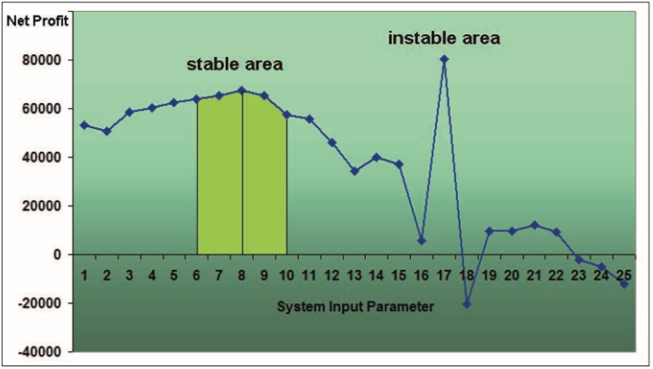
*   画出 3D plot
    *   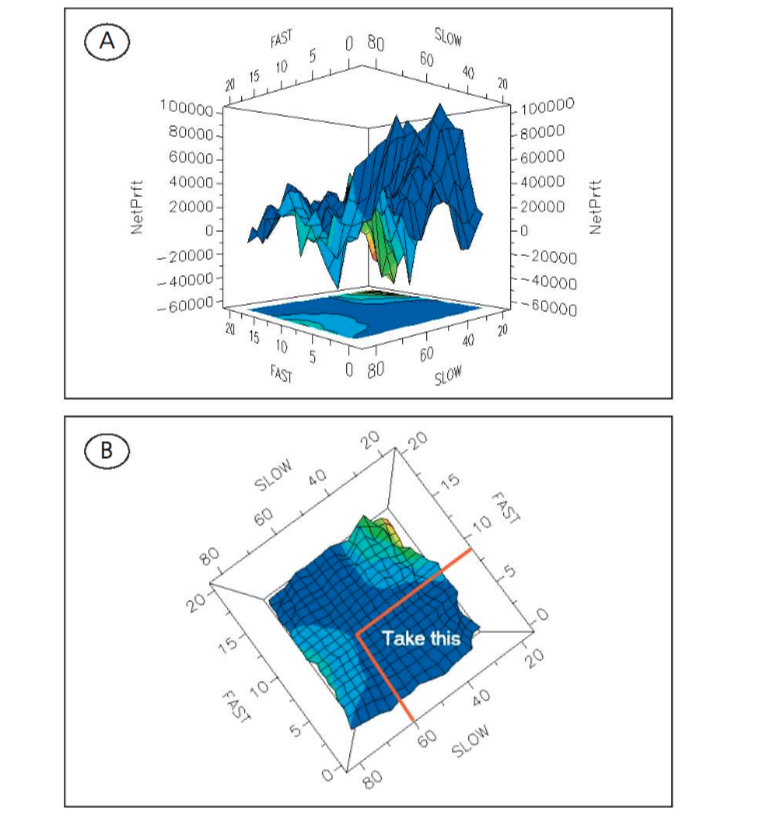

### 3.4 Inserting an intraday time filter

*   **方法**

    *   添加入场时间范围控制, 尝试寻找盈利大的时段。
    *   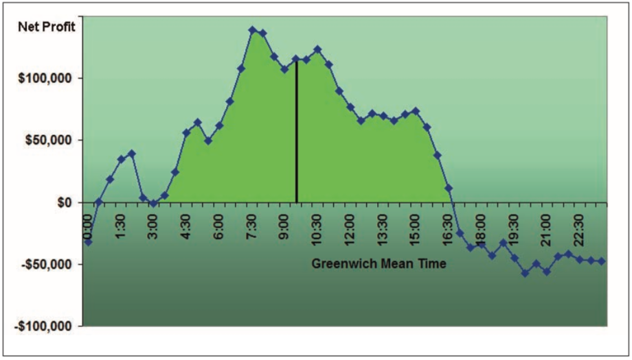

*   **Finding the best entry time**
    *   不同时间可能盈利能力不同, 要择时入场
    *   可能导致回撤变大或者恢复时间变长, 但是入场次数会减少。

### 3.5 Determination of appropriate exits – risk management

*   **The concept of Maximum Adverse Excursion (MAE)**

    *   MAE:每笔 trade 往反方向走的最大幅度
    *   MAE Graph, 散点图, 横坐标为 Drawdown in %, 纵坐标为 Profit(Loss) in %
        *   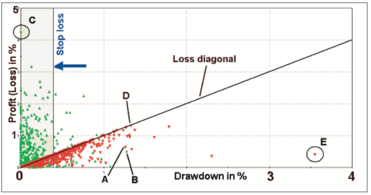

*   **Inserting a risk stop loss**

    *   Net Profit/Maximum Drawdown 可以反映收益和风险
    *   加入止损过小会导致本来最终盈利的仓位变成小幅亏损。
    *   移动止损比固定止损效果更好。
    *   Graph, 横坐标 Stop Distance(%), 纵坐标 NP/DD (Ratio of net
        profit/maximum drawdown)
        *   Stop loss
        *   Trailing stop loss
        *   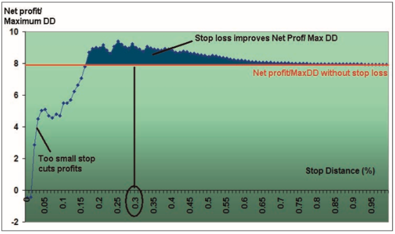
        *   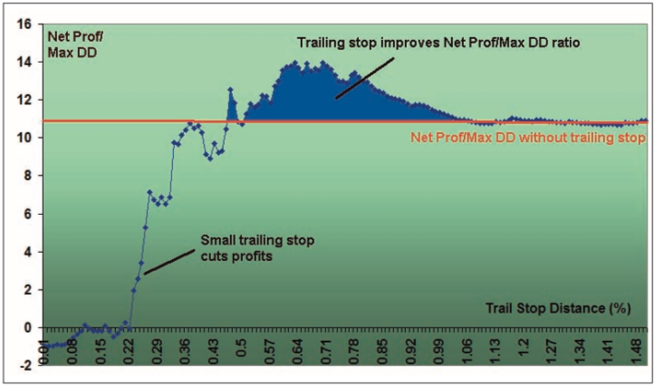
        *   在 loss diagonal 上的表示在亏损订单在最大亏损的时候退场了。即最大回
            撤与最终亏损相同。

*   **Looking for profit targets: Maximum Favourable Excursion (MFE)**

    *   MFE: 每笔交易往盈利方向的最大幅度
    *   MFE Graph, 散点图, 横坐标为 Run-up(%), 纵坐标为 Profit(Loss) in (%)
        *   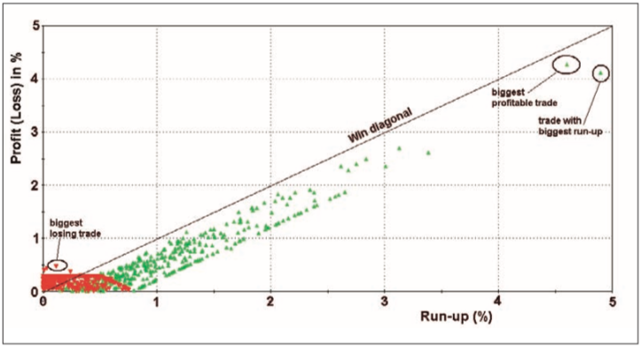
    *   在 win diagonal 上的表示在最大盈利的时候出场。Perfect！
    *   止盈位置设在支撑位、压力位等效果更好。
    *   止盈并不总是奏效
        *   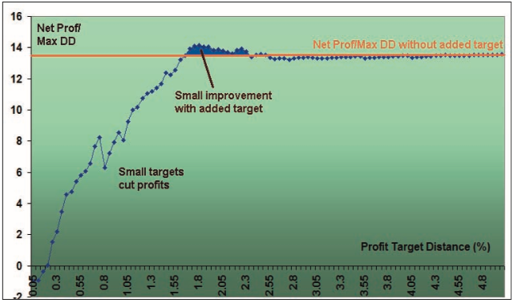

### 3.6 Summary: Step-by-step development of a trading system

*   **Step-by-step**:
    1.  code, define Entries
        *   Starting point **Idea** from book, internet, article, seminar etc.
    2.  Add slippage and commissions
    3.  Stability tests
        *   Check for stable area of input parameters
    4.  Adding filters: Time, Trend(e.g. ADX), Volatility etx.
    5.  MAE/MFA Analysis
        *   Finding Exits
    6.  Optimize
        *   Opt. Stop Loss
        *   Opt. Trailing Stop
        *   Opt. Profit Target
    *   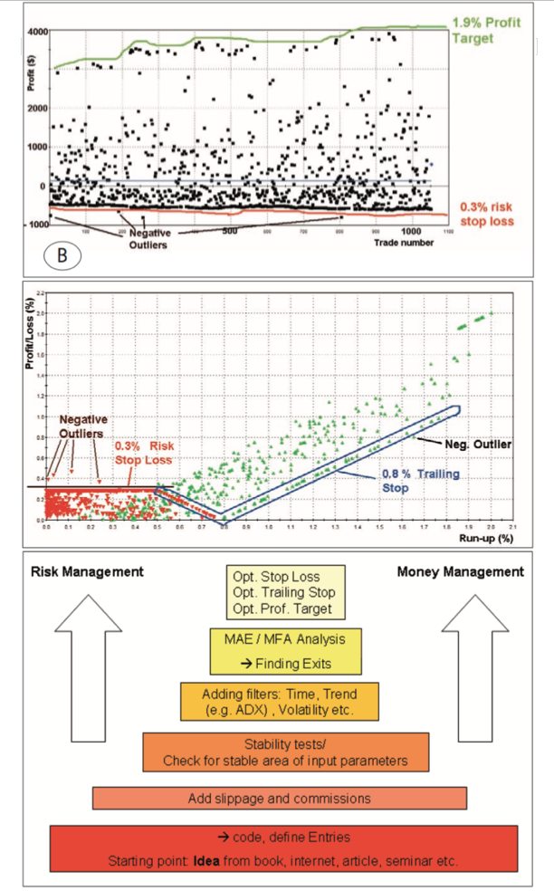

## Chapter 4: Two methods for evaluating the system’s predictive power

### 4.1 Timescale analysis

*   **Net profit and maximum drawdown dependent on the traded bar length**
    *   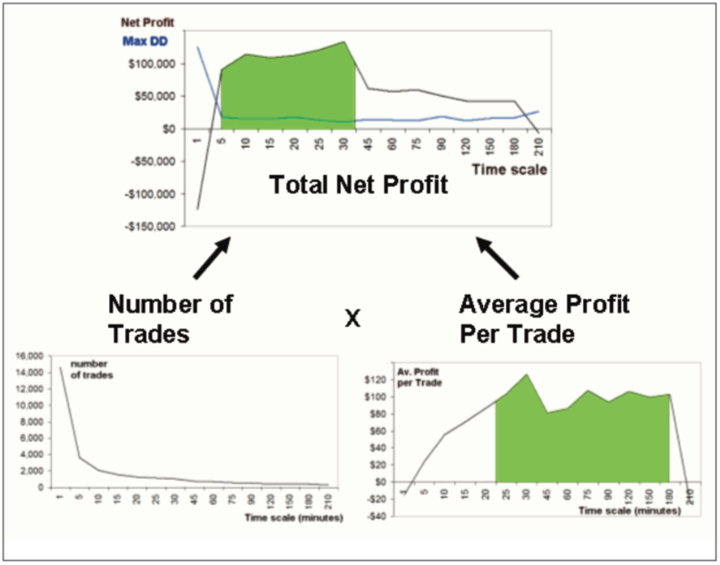
    *   graph, 横坐标 Time scale, 纵坐标 Net Profit
    *   graph, 横坐标 Time scale, 纵坐标 Number of Trades
    *   graph, 横坐标 Time scale, 纵坐标 Average Profit Per Trade
    *   在不同周期实行策略, 要多注意交易笔数和平均每笔盈亏。

### 4.2 Monte Carlo analysis

| Test period:                               | 21/10/2002-4/7/2008      | ~                           |
| ------------------------------------------ | ------------------------ | --------------------------- |
| Market                                     | GBP/USD, 30 min bars     | ~                           |
| Costs:                                     | 30$ Slipp. + Comm.       | ~                           |
| Number of samples for Monte Carlo Analysis | 5000                     | ~                           |
| Total Net Profit                           | $132, 589.50             | ~                           |
| Final Account Equity                       | $142, 589.50             | ~                           |
| Total Number of Trades                     | 1, 051                   | ~                           |
| Number of Winning Trades                   | 370                      | ~                           |
| Number of Losing Trades                    | 681                      | ~                           |
| Largest Winning Trade                      | $3, 900.00               | ~                           |
| Average Winning Trade                      | $1, 120.36               | ~                           |
| Largest Losing Trade                       | ($810.00)                | ~                           |
| Average Losing Trade                       | ($414.01)                | ~                           |
| ~                                          | Worst Case Max. Drawdown | Worst Case Average Drawdown |
| ORIGINAL SYSTEM                            | ($10, 292)               | ($1, 976)                   |
| MONTE CARLO results at 60% confidence      | ($12, 321)               | ($2, 006)                   |
| MONTE CARLO results at 70% confidence      | ($13, 222)               | ($2, 040)                   |
| MONTE CARLO results at 80% confidence      | ($14, 325)               | ($2, 090)                   |
| MONTE CARLO results at 90% confidence      | ($16, 136)               | ($2, 176)                   |
| MONTE CARLO results at 95% confidence      | ($17, 908)               | ($2, 259)                   |
| MONTE CARLO results at 99% confidence      | ($21, 364)               | ($2, 308)                   |

*   **The principle of Monte Carlo analysis**

    *   所有 trade 位置保持不变, 但是仓位大小随机更换。
    *   所有 trade 仓位大小保持不变, 但是位置随机更换。
    *   The Monte Carlo analysis is a tool which checks for possible worst case
        scenarios.
    *   测试在不同置信区间下的 Drawdown

-   **Limitations of the Monte Carlo method**
    *   Monte Carlo analysis is only useful when applied correctly and not to
        over-fitted trading systems
    *   Although the general behaviour of the markets can be described by the
        Gauss model, there are some days with very huge percentage changes that
        are outside the Gaussian curve.
    *   To get more reliable results for such extreme scenarios you have to
        choose more realistic distributions than the Gaussian distribution

## Chapter 5: The factors around your system

### 5.1 The market’s long/short bias

*   **Consequences for system development**
    *   盈利能力至少超过标的本身的涨幅。
    *   we tend to build the systems without long or short bias
    *   Since you do not know if this uptrend will continue in the future, your
        system is more stable and less adapted to this market bias if it
        produces the same amount of long and short signals.

### 5.2 Out-of-sample deterioration

| ~                                          | TRAIN                 | TEST                 |
| ------------------------------------------ | --------------------- | -------------------- |
| Test period from                           | 30/04/2002            | 01/03/2006           |
| until                                      | 28/02/2006            | 04/07/2008           |
| ~                                          | All Trades            | All Trades           |
| Total Net Profit                           | $78, 050.50           | $379.00              |
| Gross Profit                               | $150, 638.50          | $53, 000.00          |
| Gross Loss                                 | ($72, 588.00)         | ($52, 621.00)        |
| Profit Factor                              | 2.08                  | 1.01                 |
| ~                                          | ~                     | ~                    |
| Total Number of Trades                     | 69                    | 36                   |
| Total Number of Long Trades                | 30                    | 16                   |
| Total Number of ShortTrades                | 39                    | 20                   |
| Percent Profitable                         | 63.77%                | 47.22%               |
| Winning Trades                             | 44                    | 17                   |
| Losing Trades                              | 25                    | 19                   |
| Avg. Trade Net Profit                      | $1, 131.17            | $10.53               |
| Avg. Winning Trade                         | $3, 423.60            | $3, 117.65           |
| Avg. Losing Trade                          | ($2, 903.52)          | ($2, 769.53)         |
| Ratio Avg. Win:Avg. Loss                   | 1.18                  | 1.13                 |
| Largest Winning Trade                      | $8, 348.00            | $6, 409.00           |
| Largest Losing Trade                       | ($3, 658.00)          | ($3, 884.00)         |
| Max. Consecutive Winning Trades            | 4                     | 4                    |
| Max. Consecutive Losing Trades             | 4                     | 6                    |
| Avg. Bars in Total Trades                  | 13.88                 | 15.42                |
| Avg. Bars in Winning Trades                | 15.52                 | 20.71                |
| Avg. Bars in Losing Trades                 | 11                    | 10.68                |
| Trading Period                             | 3 Yrs, 11 Mths        | 2 Yrs, 4 Mths, 8 Dys |
| Percent of Time in the Market              | 89.17%                | 85.13%               |
| Time in the Market                         | 3 Yrs, 5 Mths, 27 Dys | 2 Yrs, 2 Dys         |
| Longest Flat Period                        | 14 Dys                | 30 Dys               |
| Max. Equity Run-up                         | $83, 593.50           | $19, 428.00          |
| Date of Max. Equity Run-up                 | 28/02/2006            | 06/12/2007           |
| Max. Equity Run-up as % of Initial Capital | 83.59%                | 19.43%               |
| Max. Drawdown (Intra-day Peak to Valley)   | ~                     | ~                    |
| Value                                      | ($14, 664.00)         | ($20, 091.00)        |
| Date of Max. Drawdown                      | 18/05/2004            | 10/08/2006           |

*   **Reasons for the out-of-sample deterioration**

    *   对比训练集和测试集, 防止过拟合。
    *   交易次数减少不代表系统不好。
    *   交易策略公开其实对策略的影响不一定大。

    *   **The system has been adapted too much to market noise within the
        training period**

    *   What your trading system is trying to detect are the patterns which
        repeat themselves. These patterns are mainly produced by human behaviour
        like greed, fear and exaggeration and not by random, artificial
        mathematical processes.

### 5.3 The market data bias

*   **Conclusion: How to choose your training data**
    *   训练集越长越好。
    *   但是训练集要尽量包含各种不同的市场状况。这样才不会有 long bias 或者
        short bias.

### 5.4 Optimisation and over-fitting

*   首先要确保交易逻辑正确。
*   越简单越好, 否则容易过拟合。

## Chapter 6: Periodic re-optimisation and walk forward analysis

### 6.2 Anchored vs. rolling walk forward analysis(WFA)

*   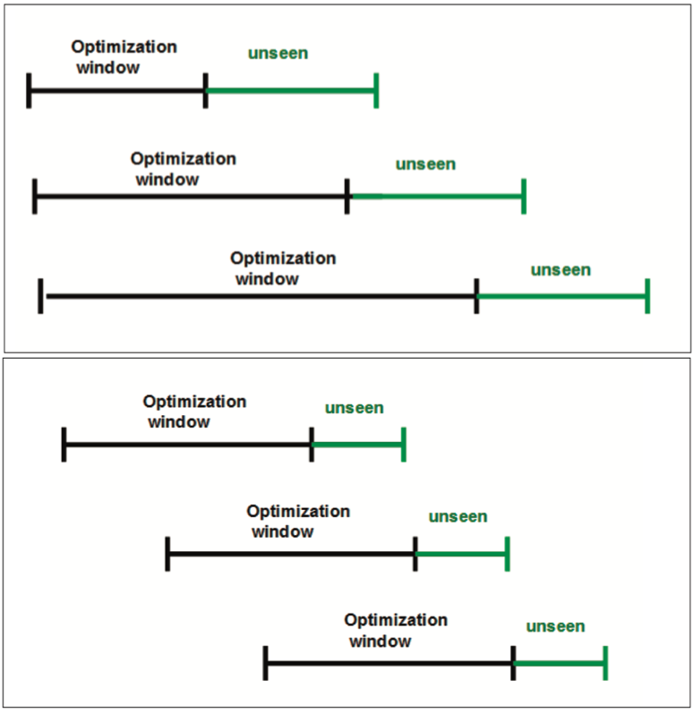

    *   Rolling walk forward 更符合真实情况, 能够避免过拟合。即通过不断地根据最
        新历史数据调整参数, 使策略符合当前市场状况。

*   **滚动窗口大小的选择**

    *   每一个市场都有自己特别的 Market structure, frequency, trends 等
    *   优化窗口越长, 包含更多市场状况的可能性就越大。

    1.  Optimisation window fits to the market structure. Ideal case: unseen
        data is same as data in optimisation window.
        *   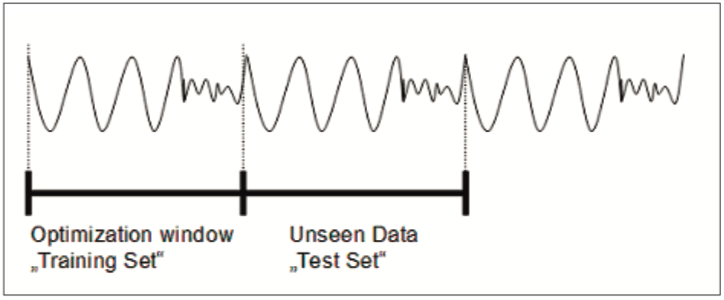
    2.  Data in the optimisation window has a different structure than the
        unseen data. Worst case optimisation window.
        *   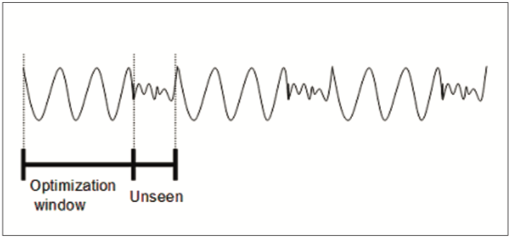

## Chapter 7: Position sizing

*   **Risk management:目标最小化风险**

    1.  控制回撤
    2.  确保策略按照训练集中的表现一样运行, 确保参数合适。

*   **Money management:目标最大化收益**
    1.  Maximum drawdown money management
        *   保证资金足够支持最大回撤。
    2.  Fixed fractional money management
        *   每笔交易最大止损为总资金量的百分比, 新增头寸与可止损资金量成正比。
        *   意味着如果资金量小, 那这个最大止损对于单笔交易可能会比止损目标还小,
            以至于影响策略。所以只能增大资金量, 这样每笔交易就有更宽的范围可以变
            化。
        *   随着资金量增加, 新的头寸可以逐步增加。
        *   随着资金量减少, 新的头寸应该逐步减少。
    3.  Fixed ratio money management
        *   $$N=0.5 \times [((2 \times N_0-1)^2+8 \times P/delta)^{0.5}+1]$$
            *   N:新头寸大小
            *   N0: 初始头寸大小
            *   P:已平仓收益。
            *   delta:表示利润到达多少后刚好新头寸翻倍。
        *   与 Fixed fractional 的比较
            *   Ralph Vince, fixed fractional lots = constant \* account-size
            *   Ryan Jones, fixed ratio lots = constant \*
                squareroot(account-size)
            *   Fixed fractional 新增头寸随着资金量增大而增大的, 而 Fixed ratio
                随着资金量的增大, 新增头寸增大速度先快后慢。
        *   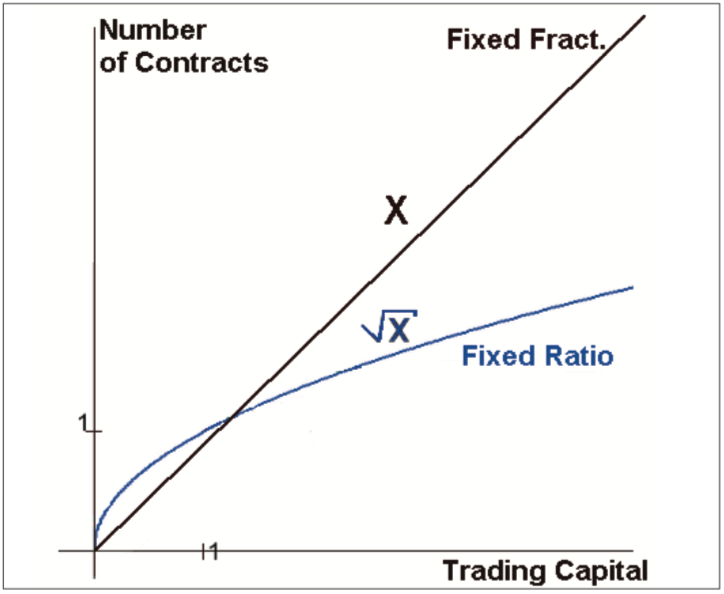

# Part III: Systematic Portfolio Trading

## Chapter 8: Dynamic portfolio construction

*   **启示**
    *   交易模型不是越复杂越好。也许用简单的模型比花费了大量时间完成了一个复杂模
        型效果更好。要考虑投入产出比。
    *   不同市场有不同的特性, 不能因为某些策略在特定市场才有效就去拒绝这些策略。
    *   如果策略对多个市场有效, 应该多个市场同时一起交易。
    *   用不同周期的 moving average equity line crossover 来确认是否停止交易。
    *   通过标准化策略在不同市场的回撤风险来决定资金分配。但是可能需要经常
        rebalance, 因为用 WFA 方法 re-optimization, 回撤风险会不断变化。

# Conclusion

*   网上有很多公开的成功策略, 但是知道了策略后却并不能复制别人的成功。一个好的交
    易员应该同时拥有很多应对当前市场的策略, 而不只是一个赚钱的策略。所以, 重点不
    在策略代码, 而在于策略怎样调试, 使策略符合当前的市场环境, 什么时候策略失效了
    , 什么时候可以启动另一个策略。写代码能力, 数学背景和创新能力等确实对量化交易
    有帮助, 但是最重要的是自己对市场、交易和系统的感觉, 这种感觉需要持续不断的毅
    力和决心。构建、开发、评估交易系统 takes years. 成功的道路从来都不是一帆风顺
    。所以不要轻信强大的交易平台或者一点点代码就能使你获得成功。It will take a
    lot of hard work and a little bit of chance.

*   Rule complexity: 参数不要多, 模型越简单越好。
*   Testing: 不要专注一个市场, 在没有测试所有市场前不要轻易判断策略没用。
*   Optimisation: 周期性 re-optimise 策略, 保持与市场同步。
*   Monte Carlo analysis: 注意别过度测试导致过拟合。
*   Portfolio building: 经验比规则重要。
*   Dynamic risk management: 不要依靠固定规则来决定是否停止交易, 应该动态决定。
    比如用 Moving average equity line crossover.
*   Money management: always keep your risk exposure less than 1% from the entry
    point per every trade, better to be 0.5% is you are able to afford such a
    low risk level.
