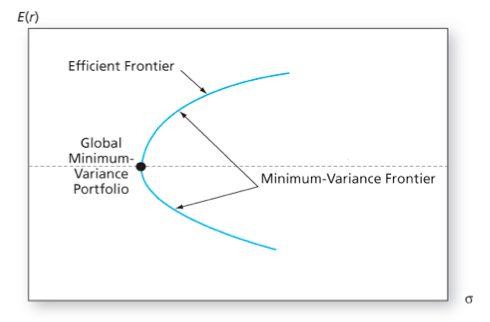
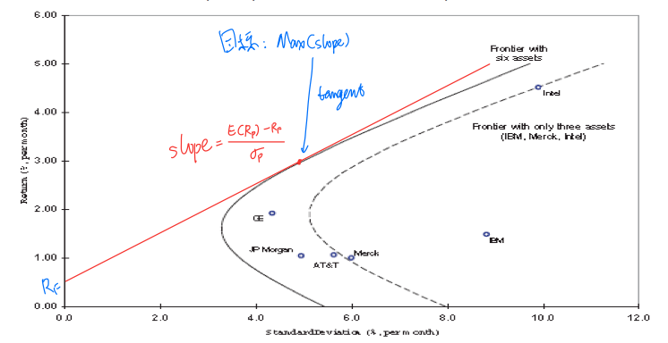

# Equity Market

<!-- vim-markdown-toc GitLab -->

* [Part 1](#part-1)
    * [Lecture 1 Risk and Return Measures](#lecture-1-risk-and-return-measures)
    * [Nominal Risk-free Rate(NRFR)](#nominal-risk-free-ratenrfr)
    * [Risk Premium](#risk-premium)
    * [Holding Period Yiekd(HPY)](#holding-period-yiekdhpy)
    * [Measuring Multi-period historical returns](#measuring-multi-period-historical-returns)
    * [Measuring Risk](#measuring-risk)
    * [The Normal Distribution](#the-normal-distribution)
    * [Value at Risk and Expected Shortfall](#value-at-risk-and-expected-shortfall)
    * [Lecture 2: Equity markets trading and Stock-Trak](#lecture-2-equity-markets-trading-and-stock-trak)
    * [Margin](#margin)
    * [Return on Invested Capital(ROIC)](#return-on-invested-capitalroic)
    * [Transaction Orders](#transaction-orders)
    * [Lecture 3: Stock market indexes](#lecture-3-stock-market-indexes)
    * [Weighting method used for calculation](#weighting-method-used-for-calculation)
* [Part 2: Portfolio Theory and Market Efficiency](#part-2-portfolio-theory-and-market-efficiency)
    * [Lecture 1: Portfolio Theory](#lecture-1-portfolio-theory)
    * [Historic returns of a portfolio](#historic-returns-of-a-portfolio)
    * [Historical Risk](#historical-risk)
    * [Efficient Assets, Assumptions about investors](#efficient-assets-assumptions-about-investors)
    * [Global Minimum variance portfolio](#global-minimum-variance-portfolio)
    * [Portfolio Frontier](#portfolio-frontier)
    * [Optimal risky portfolio and risk-free asset](#optimal-risky-portfolio-and-risk-free-asset)
    * [Lecture 2:](#lecture-2)

<!-- vim-markdown-toc -->

# Part 1

## Lecture 1 Risk and Return Measures

## Nominal Risk-free Rate(NRFR)
- RRFR: The Real Risk-Free Rate
- E(x): The Expected Rate of Inflation
- Exact: $$[1+NRFR]=[1+RRFR] \times [1+E(x)]$$
- Approx: $$NRFR \approx RRFR+E(x)$$

## Risk Premium
1. Business Risk
2. Financial Risk
3. Liqudity Risk
4. Exchange Risk Risk
5. Country Risk

## Holding Period Yiekd(HPY)
- Discrete compounding $$HPY_D=\frac{END}{Begin}-1$$
$$HPY_D=[\frac{END}{Begin}]^\frac{1}{n}-1$$
- continuous compunding $$HPY_C=\ln \frac{END}{Begin}$$
$$HPY_C=\ln [\frac{END}{Begin}] \times \frac{1}{n}$$
- Relationship 
$$[e^{HPR}]^n = \frac{END}{Begin}$$

## Measuring Multi-period historical returns
1. Arithmetic Mean(AM) 
    - Good Measure of Expected Return Next Period.
$$AM=\frac{\sum^{N}_{i=1}HPY_i}{N}$$
2. Geometric Mean(GM) 
    - Compounded Annual Growth Rate 
    - Good Measure for long term Performance.
$$GM = [[1+HPY_1]\times [1+HPY_2] \times ... \times [1+HPY_N]]^\frac{1}{N}-1$$

## Measuring Risk
- Variance, Standard Deviation
$$\sigma^2 = \frac{\sum^N_{i=1}(HPY-E(HPY))^2}{N}$$
$$Sample\ \sigma^2 = \frac{\sum^N_{i=1}(HPY-E(HPY))^2}{N}$$
- Coefficient of Variation (risk per unit of return)
$$CV = \frac{StdDeviation}{AM} = \frac{\sigma}{mu}$$ 

## The Normal Distribution
- Skewness is a measure of symmetry. 看mean两边那些值多
$$Skewness = \frac{\frac{\sum^n_{i=1}[HPY_i-E(HPY)]^3}{n}}{\sigma^3}$$
- Kurtosis measures extreme values. 表示肥尾程度
$$Kurtosis= \frac{\frac{\sum^n_{i=1}[HPY_i-E(HPY)]^4}{n}}{\sigma^4}$$

## Value at Risk and Expected Shortfall

## Lecture 2: Equity markets trading and Stock-Trak

## Margin
$$Margin \% = \frac{Total\ Value\ of\ Security-Loan\ Value\ at\
Purchase}{Total\ Value\ of\ Security}$$ 
$$Margin \% = \frac{Value\ of\ equity\ in\ account}{Total\ Value\ of\ Security}$$

## Return on Invested Capital(ROIC)
$$ROIC = \frac{Cap\ Gain\ or\ Loss\ on\ Position + Dividends- Commissions - Margin\
Internet}{Beg\ Ammount\ Inversted}$$

## Transaction Orders
1. Market order
2. Limit order(You want a little bit better price)
    - Buy limit: below current price
    - Sell limit: above current price
3. Stop orders (Executed only when accross)
    - Buy stop: above current price(to try break)
    - Sell stop: below current price(to protect profit)
4. Trailing stop orders
    - a special kind of stop orders
    - sets the stop price at a fixed amount(% or \$)

## Lecture 3: Stock market indexes

## Weighting method used for calculation
1. Price-weighted (larger priced stocks carry more weight)
    - affected by stock splits
    - Dow Jones Index Average(DJIA)
$$Index_i = \frac{\sum^n_{i=1}P_{i,t}}{n}$$
$$Index_i = \frac{\sum^n_{i=1}P_{i,t}}{Adj.Divisor_t}$$
2. Market Value-weighted (larger firms’ stocks carry more weight)
    - S&P500
    - Not affected by stock splits
$$Index_t = \frac{\sum^n_{i=1}(P_{i,t}) \times (\#OutstdgShares_{i,t})}{
\sum^n_{i=1}(P_{i,b}) \times (\#OutstdgShares_{i,b})} \times BaseValue$$
    - Base value is set arbitrarily, suually 10, 100 or 1000.
3. Equal-weighted (all stocks have equal weight, also called Unweighted Index)
    - Biased  towards  returns  of  small companies relative to value weighted indices.
    - Rebalance every day!!
        1. Calculate each stock’s return for that day 
        2. Use  either  an  arithmetic  mean  or  geometric  mean  to calculate the average return. 
        3. Multiply  last  day’s  index  value  by  (1  +  the  average  return) from step 2.

# Part 2: Portfolio Theory and Market Efficiency

## Lecture 1: Portfolio Theory

## Historic returns of a portfolio
- $$HPY_p = \sum^K_{j=1}\omega_j \times HPY_j$$

## Historical Risk
- Variance
$$\sigma_p^2 = \omega_a^2 \sigma_a^2 + \omega_b^2 \sigma_b^2 + 2\omega_a
\omega_b cov_{ab}$$ 
$$\sigma_p^2 = \omega_a^2 \sigma_a^2 + \omega_b^2 \sigma_b^2 + 2\omega_a
\omega_b \sigma_a \sigma_b \rho_{a,b}$$

$$\sigma_p^2 =\begin{bmatrix}\omega_1,\omega_2,\omega_3 \end{bmatrix}
\begin{bmatrix} \sigma_{11}&\sigma_{12}&\sigma_{13} \\
                \sigma_{21}&\sigma_{22}&\sigma_{23} \\ 
                \sigma_{31}&\sigma_{32}&\sigma_{33} \end{bmatrix} 
\begin{bmatrix}\omega_1 \\ \omega_2 \\ \omega_3 \end{bmatrix}$$

- Covariance
$$Cov_{i,j} = \frac{\sum^T_{t=1}(R_{i,t}-E(R_i))\times(R_{i,t}-E(R_j))}{T}$$ 
- Correlation Coefficient
$$\rho_{i,j} = \frac{Cov_{i,j}}{\sigma_i * \sigma_j}$$
    - The lower the  correlation coefficient between assets, the
        greater the benefits from diversification.

## Efficient Assets, Assumptions about investors
1. Non-satiation
2. Rational
3. Risk Aversion
4. Mean-variance
5. No transaction costs or taxes.
6. All investors have access to the same information and share similar views
    on expected returns.

## Global Minimum variance portfolio
- 

## Portfolio Frontier
- 

## Optimal risky portfolio and risk-free asset
- $$
\begin{align}
E(R_c) & = \omega_p \times E(R_p) + (1-\omega_p) \\
        & = R_f = \omega_p \times [E(R_p) - R_f]
\end{align}$$

$$\sigma_p^2 = \omega_p^2\sigma_p^2 + (1-\omega_p^2)\times 0 + 2 \times
\omega_p \times (1-\omega_p) \times 0$$

$$\sigma_c = \omega_p \sigma_p$$
$$\omega_p = \frac{sigma_c}{sigma_p}$$

$$E(R_c) = R_f + \sigma_c \times \underbrace{[\frac{E(R_p) - R_f}{
            \sigma_p}]}_{Sharp\ ratio}$$

## Lecture 2:

