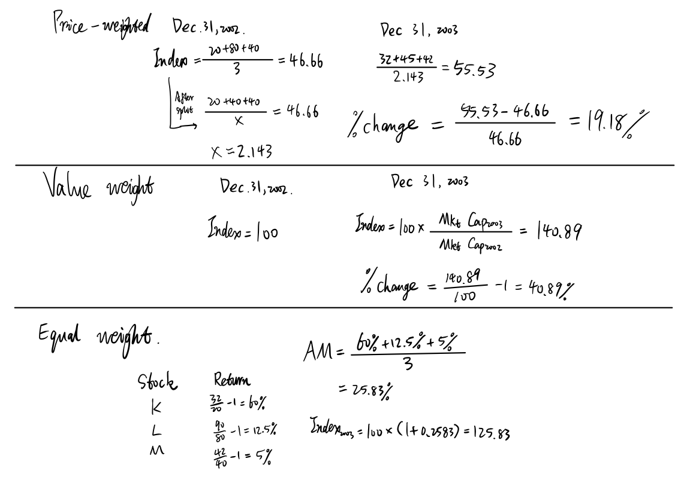
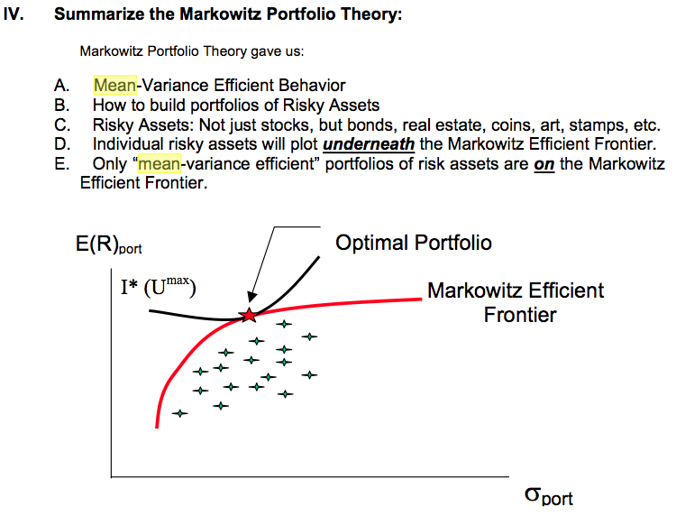
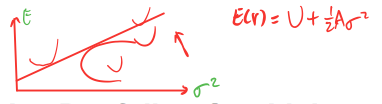
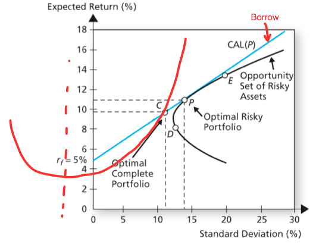
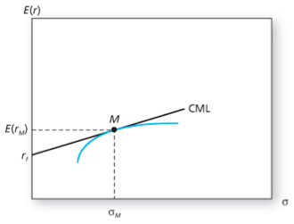
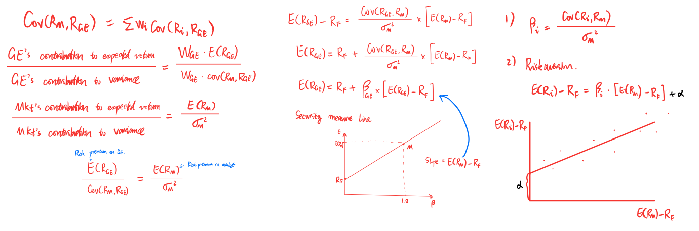
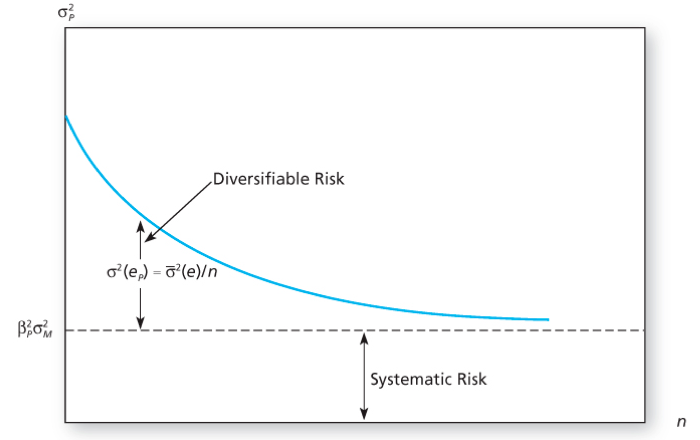
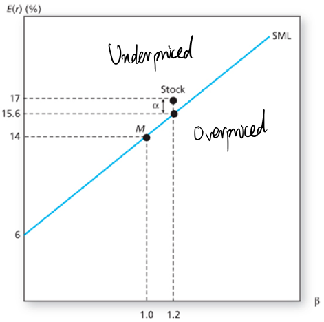
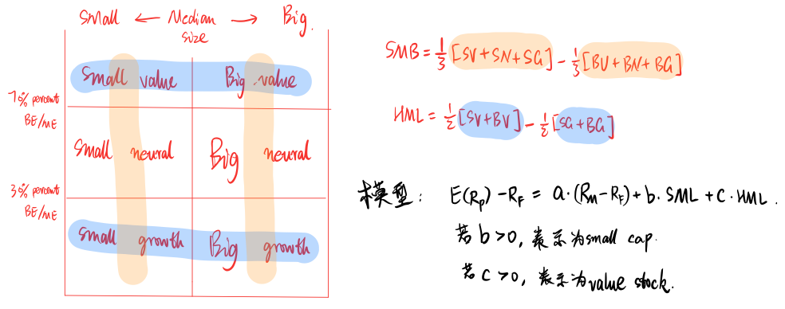

Equity Market
-------------

<!-- vim-markdown-toc GitLab -->

* [Part 1](#part-1)
    * [Lecture 1: Risk and Return Measures](#lecture-1-risk-and-return-measures)
    * [Lecture 2: Equity markets trading and Stock-Trak](#lecture-2-equity-markets-trading-and-stock-trak)
    * [Lecture 3: Stock market indexes](#lecture-3-stock-market-indexes)
* [Part 2: Portfolio Theory and Market Efficiency](#part-2-portfolio-theory-and-market-efficiency)
    * [Lecture 1: Portfolio Theory](#lecture-1-portfolio-theory)
    * [Lecture 2: CAPM and Multifactor Models](#lecture-2-capm-and-multifactor-models)
    * [Lecture 3: Market Efficiency](#lecture-3-market-efficiency)

<!-- vim-markdown-toc -->

# Part 1

## Lecture 1: Risk and Return Measures

- **Nominal Risk-free Rate(NRFR)**
    - RRFR: The Real Risk-Free Rate
    - E(x): The Expected Rate of Inflation
    - Exact: $$[1+NRFR]=[1+RRFR] \times [1+E(x)]$$
    - Approx: $$NRFR \approx RRFR+E(x)$$

- **Risk Premium**
    1. Business Risk
    2. Financial Risk
    3. Liquidity Risk
    4. Exchange Risk Risk
    5. Country Risk

- **Holding Period Yiekd(HPY)**
    - Discrete compounding 
   
    $$HPY_D=\frac{END}{Begin}-1$$

    $$HPY_D=[\frac{END}{Begin}]^\frac{1}{n}-1$$
  
    - continuous compounding
    
    $$HPY_C=\ln \frac{END}{Begin}$$

    $$HPY_C=\ln [\frac{END}{Begin}] \times \frac{1}{n}$$
 
    - Relationship 
    $$[e^{HPR}]^n = \frac{END}{Begin}$$

- **Measuring Multi-period historical returns**
    1. Arithmetic Mean(AM) 
        - Good Measure of Expected Return Next Period.
    $$AM=\frac{\sum^{N}_{i=1}HPY_i}{N}$$

    2. Geometric Mean(GM) 
        - Compounded Annual Growth Rate 
        - Good Measure for long term Performance.
    $$GM = [[1+HPY_1]\times [1+HPY_2] \times ... \times [1+HPY_N]]^\frac{1}{N}-1$$

- **Measuring Risk**
    - Variance, Standard Deviation

    $$\sigma^2 = \frac{\sum^N_{i=1}(HPY-E(HPY))^2}{N}$$

    $$Sample\ \sigma^2 = \frac{\sum^N_{i=1}(HPY-E(HPY))^2}{N-1}$$

    - Coefficient of Variation (risk per unit of return)

    $$CV = \frac{StdDeviation}{AM} = \frac{\sigma}{/mu}$$ 

- **The Normal Distribution**
    - Skewness is a measure of symmetry. 看mean两边哪些值多

    $$Skewness = \frac{\frac{\sum^n_{i=1}[HPY_i-E(HPY)]^3}{n}}{\sigma^3}$$

    - Kurtosis measures extreme values. 表示肥尾程度

    $$Kurtosis= \frac{\frac{\sum^n_{i=1}[HPY_i-E(HPY)]^4}{n}}{\sigma^4}$$

- **Value at Risk and Expected Shortfall**

## Lecture 2: Equity markets trading and Stock-Trak

- **Margin**

    $$\begin{align}
    Margin \% &= \frac{Total\ Value\ of\ Security-Loan\ Value\ at\
    Purchase}{Total\ Value\ of\ Security}\\
    &= \frac{Value\ of\ equity\ in\ account}{Total\ Value\ of\ Security}\\ 
    &= \frac{利润+初始保证金}{总value}
    \end{align}$$

- **Return on Invested Capital(ROIC)**
    - If short，then we should minus dividends.
    - Usually Dividend means dividend per share, so we should mutiply #shares.

    $$\begin{align}
    ROIC &= \frac{Cap\ Gain\ or\ Loss\ on\ Position + Dividends- Commissions - Margin\
    Internet}{Beg\ Ammount\ Inversted} \\ 
    &= \frac{总利润-commission-interest}{总成本}
    \end{align}$$

- **Transaction Orders**
    1. Market order
    2. Limit order(You want a little bit better price)
        - Buy limit: below current price
        - Sell limit: above current price
    3. Stop orders (Executed only when across)
        - Stop buy: above current price(to try break)
        - Stop sell: below current price(to protect profit)
    4. Trailing stop orders
        - a special kind of stop orders
        - sets the stop price at a fixed amount(% or \$)

## Lecture 3: Stock market indexes

- **Weighting method used for calculation**
    1. Price-weighted (larger priced stocks carry more weight)
        - affected by stock splits
        - Dow Jones Index Average(DJIA)

    $$Index_i = \frac{\sum^n_{i=1}P_{i,t}}{n}$$

    $$Index_i = \frac{\sum^n_{i=1}P_{i,t}}{Adj.Divisor_t}$$
    
    2. Market Value-weighted (larger firms’ stocks carry more weight)
        - S&P500
        - Not affected by stock splits
        - Base value is set arbitrarily, usually 10, 100 or 1000.

    $$Index_t = \frac{\sum^n_{i=1}(P_{i,t}) \times (\#OutstdgShares_{i,t})}{
    \sum^n_{i=1}(P_{i,b}) \times (\#OutstdgShares_{i,b})} \times BaseValue$$

    3. Equal-weighted (all stocks have equal weight, also called Unweighted Index)
        - Biased  towards  returns  of  small companies relative to value weighted indices.
        - Rebalance every day!!
            1. Calculate each stock’s return for that day 
            2. Use  either  an  arithmetic  mean  or  geometric  mean  to calculate the average return. 
            3. Multiply  last  day’s  index  value  by  (1  +  the  average  return) from step 2.

    - 

# Part 2: Portfolio Theory and Market Efficiency

## Lecture 1: Portfolio Theory

- **Historic returns of a portfolio**

    - $$HPY_p = \sum^K_{j=1}\omega_j \times HPY_j$$

- **Historical Risk**
    - Variance

    $$\sigma_p^2 = \omega_a^2 \sigma_a^2 + \omega_b^2 \sigma_b^2 + 2\omega_a
    \omega_b cov_{ab}$$ 

    $$\sigma_p^2 = \omega_a^2 \sigma_a^2 + \omega_b^2 \sigma_b^2 + 2\omega_a
    \omega_b \sigma_a \sigma_b \rho_{a,b}$$

    $$\sigma_p^2 =\begin{bmatrix}\omega_1,\omega_2,\omega_3 \end{bmatrix}
    \begin{bmatrix} \sigma_{11}&\sigma_{12}&\sigma_{13} \\
                    \sigma_{21}&\sigma_{22}&\sigma_{23} \\ 
                    \sigma_{31}&\sigma_{32}&\sigma_{33} \end{bmatrix} 
    \begin{bmatrix}\omega_1 \\ \omega_2 \\ \omega_3 \end{bmatrix}$$

    - Covariance

    $$Cov_{i,j} = \frac{\sum^T_{t=1}(R_{i,t}-E(R_i))\times(R_{i,t}-E(R_j))}{T}$$ 

    - Correlation Coefficient
        - The lower the  correlation coefficient between assets, the
            greater the benefits from diversification.

    $$\rho_{i,j} = \frac{Cov_{i,j}}{\sigma_i * \sigma_j}$$

- **Efficient Assets, Assumptions about investors**
    1. Non-satiation
    2. Rational
    3. Risk Aversion
    4. Mean-variance
        - Returns are normally distributed. The expected returns of all assets
          are known. The variance and covariances of all assets are also known.
          Inverstors can ignore skweness and kurtosis.
    5. No transaction costs or taxes.
    6. All investors have access to the same information and share similar views
        on expected returns.

- **Two ways to choose a portfolio**
    1. Minimizes risk for a given expected return
    2. Maximizes return for given risk

- **Portfolio Frontier(Markowitz Portfolio Theory)**
    - 
    - 

- **Optimal risky portfolio and risk-free asset**
    - $$
    \begin{align}
    E(R_c) & = \omega_p \times E(R_p) + (1-\omega_p)\times R_f \\
            & = R_f + \omega_p \times [E(R_p) - R_f]
    \end{align}$$

    $$\sigma_c^2 = \omega_p^2\sigma_p^2 + (1-\omega_p^2)\times 0 + 2 \times
    \omega_p \times (1-\omega_p) \times 0$$

    $$\sigma_c = \omega_p \sigma_p$$
    $$\omega_p = \frac{\sigma_c}{\sigma_p}$$

    $$E(R_c) = R_f + \sigma_c \times \underbrace{[\frac{E(R_p) - R_f}{
                \sigma_p}]}_{Sharp\ ratio}$$

- **Three typical portfolio**
    1. **Global Minimum variance portfolio**
        - $$Minimize\ \sigma_p^2, By\ changing\ \omega_1, \omega_2 , Subject\ 
        to\ \sum_{i=1}^n \omega_i=1$$ 
        - 
    2. **Maximize Sharp ratio**
        - Optimal risky N risky assets + risk free assetj
        - $$Maximize\ \frac{E(R_p)-R_f}{\sigma_p}, By\ changing\ \omega_1, 
        \omega_2 , Subject\ to\ \sum_{i=1}^n \omega_i=1$$ 
    3. **Given expected return**

- **Investor Utility**
    - $$U=E(r)-\frac{1}{2}A \sigma^2$$
    - A <--- Risk aversion parameter
    - Goal: Maximize(Utility), Utility表示investor对Return和Risk的权衡。
    - Optimization solution given by Bodie, Kane and Marcus:
        - $$W_p = \frac{E(R_p)-R_f}{A \times \sigma_p^2}, W_f = 1-w_p$$
    - 

- **Indifference curve**
    - 无差异曲线是有相同的utility的一系列risk和return的组合。

- **Capital Allocation Line(CAL)**
    - It's a straight line that represents all possible risk-return
      combinations avaiable to the investor.
    - 

- **Attention!**
    - The indifference curve represents what is acceptable to the investor
    - The capital allocation line represents what is available in the market.
    - The point of tangency represents where the investor can obtain the
      greatest utility from what is avaiable.

## Lecture 2: CAPM and Multifactor Models

- **The Capital Asset Pricing Model(CAPM)**
    - $$E(r_i) = R_f + \beta_i [E(r_m)-R_f]$$
    - Assumptions
        - Perfect Capital Markets:
            1. Investors cannot affect prices by their individual trades
            2. Unlimited risk-free borrowing and lending 
            3. No taxes or transaction costs
        - Investors have homogeneous expectations 
        - Investors have the same investment horizon (one period) and are 
        mean-variance optimizers as in Markowitz 
        - Investors are risk averse and choose portfolios that maximize expected 
        utility
        - All assets are publicly traded (short positions are allowed) 
        - Investors form portfolios from a common universe of publicly traded
        financial assets.
    - Important Result
        1. The Market Portfolio
            - CML is the Capital Market Line.
            - 
        2. Measure the reward to an individual asset’s market risk
            - We want: $$E(R_i) = f(Risk)$$
            - 
        3. Portfolio Beta
            - The beta of a portfolio is simple the weighted average of the
              betas of the stocks in the portfolio.
            - Under CAPM, market has to offer the highest Sharpe ratio.
            - 

    - Security market line(SML)
        - Alpha等于Expected return减去CAPM算的return，为正表示underprice.
        - 

    - Total Risk, Systematic Risk and Firm-specific risk
        - $$R_i = E(R_i)+e_i$$
        - $$\sigma_i^2 = \beta_i^2\sigma_M^2 + \sigma^2(e_i)$$
        - Total Risk= Systematic Risk + Firm-specific Risk
        
    - Critiques of the CAPM
        1. True Market Portfolio can never be observed.
        2. Borrowing constrains
        3. Problems with Beta Estimation
            - Challenges to measure beta
            - Market Beta does not tell the whole story of systematic risk.
        4. Use Beta to explain, not predict.

- **Multifactor Models**
    1. The Arbitrage Pricing Theory(APT) of Ross(1976)
    2. Fama-French three-factor model - Fama and French(1992,1996) 
        - $$E[r_i]=r_f+\beta_{iM} \times E[r_M-r_f]+\beta_{iSMB}E[SMB]+
          \beta_{iHML}E[HML]$$
        - Assumption:
            1. Value stocks: high B-M ratio
            2. SMB (Small-Minus-Big): measures the exposure to size premium.
            3. HML(High-Minus-Low Book-to-Market): measures the exposure to
               value premium.
        - If FF3 models holds:
            1. Alpha should be _insignificant_.
            2. Expected returns on portfolios should _line up_ with the beta.
        - 

## Lecture 3: Market Efficiency

- **Three Forms of Market Efficiency**
    1. Weak form efficiency
        - Assumption: Market prices incorporate _all past price_ information.
        - Past price information:
            1. past prices
            2. trading volume
            3. short interests
        - Anomalies:
            1. Momentum
            2. Price Reversal

    2. Semi-strong form efficiency
        - Assumption: Market prices incorporate _all publicly avaiable_ information.
        - Publicly avaiable information:
            1. All past price information
            2. Fundamental data on the firm
            3. Any public information
        - Anamalies:
            1. Size effect(小市值更赚钱)
            2. Book-to-market effect(Value vs. Growth) (value股low
               volatility，positive relation between BV/MV and returns)
            3. Post earnings announcement drift
            4. Calender effect
    3. Strong form efficiency
        - Assumption: Market prices incorporate _all information(both public and private)_
        - All available information:
            - All public and private information
        - Hard to test private information
    
    - Attention!
        1. If Weak form not hold, so do semi-strong and strong.
        2. If semi-strong not hold, so do strong.

