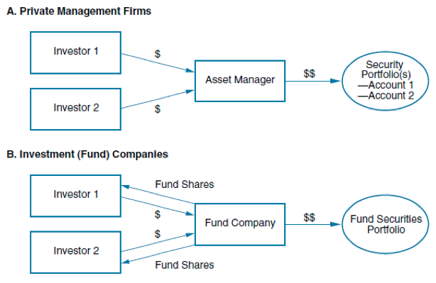
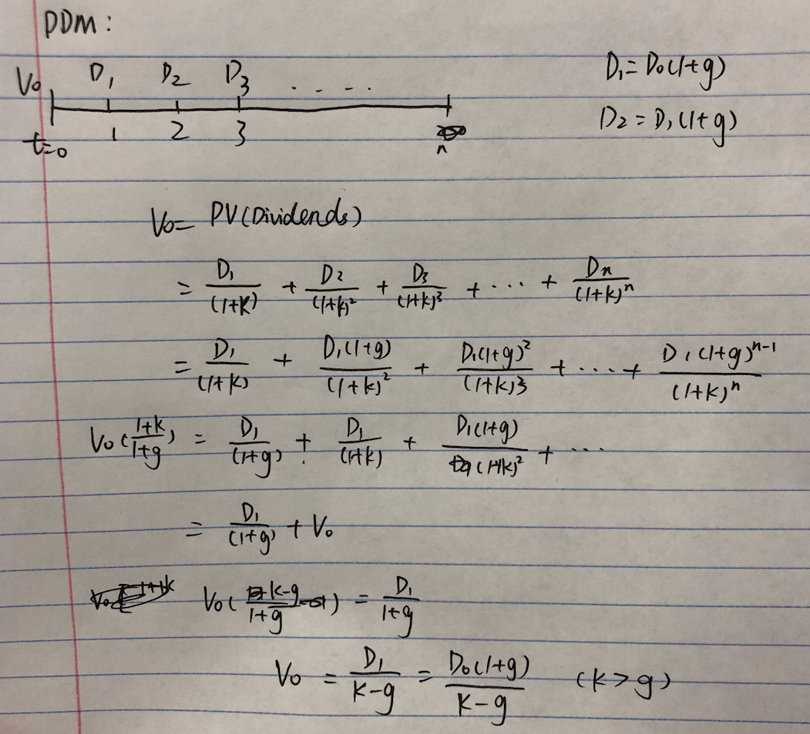
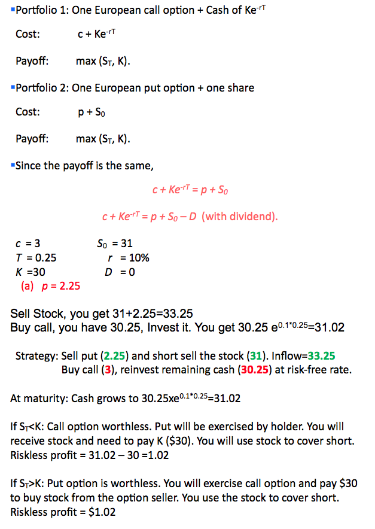
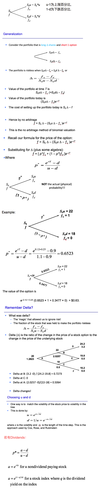
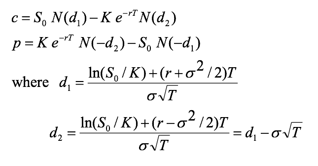

# Equity Market

<!-- vim-markdown-toc GitLab -->

* [Part 1: Investments Fundamentals](#part-1-investments-fundamentals)
    * [Lecture 1: Risk and Return Measures](#lecture-1-risk-and-return-measures)
    * [Lecture 2: Equity markets trading and Stock-Trak](#lecture-2-equity-markets-trading-and-stock-trak)
    * [Lecture 3: Stock market indexes](#lecture-3-stock-market-indexes)
* [Part 2: Portfolio Theory and Market Efficiency](#part-2-portfolio-theory-and-market-efficiency)
    * [Lecture 1: Portfolio Theory](#lecture-1-portfolio-theory)
    * [Lecture 2: CAPM and Multifactor Models](#lecture-2-capm-and-multifactor-models)
    * [Lecture 3: Market Efficiency](#lecture-3-market-efficiency)
* [Part 3: Equity Portfolio Management](#part-3-equity-portfolio-management)
    * [Lecture 1: Professional Asset Management and Equity Portfolio Performance Measures](#lecture-1-professional-asset-management-and-equity-portfolio-performance-measures)
    * [Lecture 2: Valuation Techniques](#lecture-2-valuation-techniques)
        * [Discounted Cash Flow Techniques](#discounted-cash-flow-techniques)
        * [Estimate the inputs in the discouted cash flow methods](#estimate-the-inputs-in-the-discouted-cash-flow-methods)
        * [Relative Valuation Techniques](#relative-valuation-techniques)
* [Part 4: Investments Fundamentals](#part-4-investments-fundamentals)
    * [Lecture 1: Basics Of Options](#lecture-1-basics-of-options)
        * [Topic 1: Mechanics of Options Markets](#topic-1-mechanics-of-options-markets)
        * [Topic 2: Properties of Options](#topic-2-properties-of-options)
    * [Lecture 2: Option Valuation](#lecture-2-option-valuation)
        * [Binomial Option Pricing](#binomial-option-pricing)
        * [Black-Scholes model](#black-scholes-model)
    * [Lecture 3: Option Trading Strategies](#lecture-3-option-trading-strategies)

<!-- vim-markdown-toc -->

# Part 1: Investments Fundamentals

## Lecture 1: Risk and Return Measures

- **Nominal Risk-free Rate(NRFR)**
    - RRFR: The Real Risk-Free Rate
    - E(x): The Expected Rate of Inflation
    - Exact: $$[1+NRFR]=[1+RRFR] \times [1+E(x)]$$
    - Approx: $$NRFR \approx RRFR+E(x)$$

- **Risk Premium**
    1. Business Risk
    2. Financial Risk
    3. Liquidity Risk
    4. Exchange Risk Risk
    5. Country Risk

- **Holding Period Yiekd(HPY)**
    - Discrete compounding 
   
    $$HPY_D=\frac{END}{Begin}-1$$

    $$HPY_D=[\frac{END}{Begin}]^\frac{1}{n}-1$$
  
    - continuous compounding
    
    $$HPY_C=\ln \frac{END}{Begin}$$

    $$HPY_C=\ln [\frac{END}{Begin}] \times \frac{1}{n}$$
 
    - Relationship 
    $$[e^{HPR}]^n = \frac{END}{Begin}$$

- **Measuring Multi-period historical returns**
    1. Arithmetic Mean(AM) 
        - Good Measure of Expected Return Next Period.
    $$AM=\frac{\sum^{N}_{i=1}HPY_i}{N}$$

    2. Geometric Mean(GM) 
        - Compounded Annual Growth Rate 
        - Good Measure for long term Performance.
    $$GM = [[1+HPY_1]\times [1+HPY_2] \times ... \times [1+HPY_N]]^\frac{1}{N}-1$$

- **Measuring Risk**
    - Variance, Standard Deviation

    $$\sigma^2 = \frac{\sum^N_{i=1}(HPY-E(HPY))^2}{N}$$

    $$Sample\ \sigma^2 = \frac{\sum^N_{i=1}(HPY-E(HPY))^2}{N-1}$$

    - Coefficient of Variation (risk per unit of return)

    $$CV = \frac{StdDeviation}{AM} = \frac{\sigma}{/mu}$$ 

- **The Normal Distribution**
    - Skewness is a measure of symmetry. 看mean两边哪些值多

    $$Skewness = \frac{\frac{\sum^n_{i=1}[HPY_i-E(HPY)]^3}{n}}{\sigma^3}$$

    - Kurtosis measures extreme values. 表示肥尾程度

    $$Kurtosis= \frac{\frac{\sum^n_{i=1}[HPY_i-E(HPY)]^4}{n}}{\sigma^4}$$

- **Value at Risk and Expected Shortfall**

## Lecture 2: Equity markets trading and Stock-Trak

- **Margin**

    $$\begin{align}
    Margin \% &= \frac{Total\ Value\ of\ Security-Loan\ Value\ at\
    Purchase}{Total\ Value\ of\ Security}\\
    &= \frac{Value\ of\ equity\ in\ account}{Total\ Value\ of\ Security}\\ 
    &= \frac{利润+初始保证金}{总value}
    \end{align}$$

- **Return on Invested Capital(ROIC)**
    - If short,then we should minus dividends.
    - Usually Dividend means dividend per share, so we should multiply #shares.

    $$\begin{align}
    ROIC &= \frac{Cap\ Gain\ or\ Loss\ on\ Position + Dividends- Commissions - Margin\
    Internet}{Beg\ Ammount\ Inversted} \\ 
    &= \frac{总利润-commission-interest}{总成本}
    \end{align}$$

- **Transaction Orders**
    1. Market order
    2. Limit order(You want a little bit better price)
        - Buy limit: below current price
        - Sell limit: above current price
    3. Stop orders (Executed only when across)
        - Stop buy: above current price(to try break)
        - Stop sell: below current price(to protect profit)
    4. Trailing stop orders
        - a special kind of stop orders
        - sets the stop price at a fixed amount(% or \$)

## Lecture 3: Stock market indexes

- **Weighting method used for calculation**
    1. Price-weighted (larger priced stocks carry more weight)
        - affected by stock splits
        - Dow Jones Index Average(DJIA)

    $$Index_i = \frac{\sum^n_{i=1}P_{i,t}}{n}$$

    $$Index_i = \frac{\sum^n_{i=1}P_{i,t}}{Adj.Divisor_t}$$
    
    2. Market Value-weighted (larger firms’ stocks carry more weight)
        - S&P500
        - Not affected by stock splits
        - Base value is set arbitrarily, usually 10, 100 or 1000.

    $$Index_t = \frac{\sum^n_{i=1}(P_{i,t}) \times (\#OutstdgShares_{i,t})}{
    \sum^n_{i=1}(P_{i,b}) \times (\#OutstdgShares_{i,b})} \times BaseValue$$

    3. Equal-weighted (all stocks have equal weight, also called Unweighted Index)
        - Biased  towards  returns  of  small companies relative to value weighted indices.
        - Rebalance every day!!
            1. Calculate each stock’s return for that day 
            2. Use  either  an  arithmetic  mean  or  geometric  mean  to calculate the average return. 
            3. Multiply  last  day’s  index  value  by  (1  +  the  average  return) from step 2.

    - 

# Part 2: Portfolio Theory and Market Efficiency

## Lecture 1: Portfolio Theory

- **Historic returns of a portfolio**

    - $$HPY_p = \sum^K_{j=1}\omega_j \times HPY_j$$

- **Historical Risk**
    - Variance

    $$\sigma_p^2 = \omega_a^2 \sigma_a^2 + \omega_b^2 \sigma_b^2 + 2\omega_a
    \omega_b cov_{ab}$$ 

    $$\sigma_p^2 = \omega_a^2 \sigma_a^2 + \omega_b^2 \sigma_b^2 + 2\omega_a
    \omega_b \sigma_a \sigma_b \rho_{a,b}$$

    $$\sigma_p^2 =\begin{bmatrix}\omega_1,\omega_2,\omega_3 \end{bmatrix}
    \begin{bmatrix} \sigma_{11}&\sigma_{12}&\sigma_{13} \\
                    \sigma_{21}&\sigma_{22}&\sigma_{23} \\ 
                    \sigma_{31}&\sigma_{32}&\sigma_{33} \end{bmatrix} 
    \begin{bmatrix}\omega_1 \\ \omega_2 \\ \omega_3 \end{bmatrix}$$

    - Covariance

    $$Cov_{i,j} = \frac{\sum^T_{t=1}(R_{i,t}-E(R_i))\times(R_{i,t}-E(R_j))}{T}$$ 

    - Correlation Coefficient
        - The lower the  correlation coefficient between assets, the
            greater the benefits from diversification.

    $$\rho_{i,j} = \frac{Cov_{i,j}}{\sigma_i * \sigma_j}$$

- **Efficient Assets, Assumptions about investors**
    1. Non-satiation
    2. Rational
    3. Risk Aversion
    4. Mean-variance
        - Returns are normally distributed. The expected returns of all assets
          are known. The variance and covariances of all assets are also known.
          Inverstors can ignore skweness and kurtosis.
    5. No transaction costs or taxes.
    6. All investors have access to the same information and share similar views
        on expected returns.

- **Two ways to choose a portfolio**
    1. Minimizes risk for a given expected return
    2. Maximizes return for given risk

- **Portfolio Frontier(Markowitz Portfolio Theory)**
    - 
    - 

- **Optimal risky portfolio and risk-free asset**
    - $$
    \begin{align}
    E(R_c) & = \omega_p \times E(R_p) + (1-\omega_p)\times R_f \\
            & = R_f + \omega_p \times [E(R_p) - R_f]
    \end{align}$$

    $$\sigma_c^2 = \omega_p^2\sigma_p^2 + (1-\omega_p^2)\times 0 + 2 \times
    \omega_p \times (1-\omega_p) \times 0$$

    $$\sigma_c = \omega_p \sigma_p$$
    $$\omega_p = \frac{\sigma_c}{\sigma_p}$$

    $$E(R_c) = R_f + \sigma_c \times \underbrace{[\frac{E(R_p) - R_f}{
                \sigma_p}]}_{Sharp\ ratio}$$

- **Three typical portfolio**
    1. **Global Minimum variance portfolio**
        - $$Minimize\ \sigma_p^2, By\ changing\ \omega_1, \omega_2 , Subject\ 
        to\ \sum_{i=1}^n \omega_i=1$$ 
        - 
    2. **Maximize Sharp ratio**
        - Optimal risky N risky assets + risk free assetj
        - $$Maximize\ \frac{E(R_p)-R_f}{\sigma_p}, By\ changing\ \omega_1, 
        \omega_2 , Subject\ to\ \sum_{i=1}^n \omega_i=1$$ 
    3. **Given expected return**

- **Investor Utility**
    - $$U=E(r)-\frac{1}{2}A \sigma^2$$
    - A <--- Risk aversion parameter
    - Goal: Maximize(Utility), Utility表示investor对Return和Risk的权衡。
    - Optimization solution given by Bodie, Kane and Marcus:
        - $$W_p = \frac{E(R_p)-R_f}{A \times \sigma_p^2}, W_f = 1-w_p$$
    - 

- **Indifference curve**
    - 无差异曲线是有相同的utility的一系列risk和return的组合。

- **Capital Allocation Line(CAL)**
    - It's a straight line that represents all possible risk-return
      combinations avaiable to the investor.
    - 

- **Attention!**
    - The indifference curve represents what is acceptable to the investor
    - The capital allocation line represents what is available in the market.
    - The point of tangency represents where the investor can obtain the
      greatest utility from what is avaiable.

## Lecture 2: CAPM and Multifactor Models

- **The Capital Asset Pricing Model(CAPM)**
    - $$E(r_i) = R_f + \beta_i [E(r_m)-R_f]$$
    - Assumptions
        - Perfect Capital Markets:
            1. Investors cannot affect prices by their individual trades
            2. Unlimited risk-free borrowing and lending 
            3. No taxes or transaction costs
        - Investors have homogeneous expectations 
        - Investors have the same investment horizon (one period) and are 
        mean-variance optimizers as in Markowitz 
        - Investors are risk averse and choose portfolios that maximize expected 
        utility
        - All assets are publicly traded (short positions are allowed) 
        - Investors form portfolios from a common universe of publicly traded
        financial assets.
    - Important Result
        1. The Market Portfolio
            - CML is the Capital Market Line.
            - 
        2. Measure the reward to an individual asset’s market risk
            - We want: $$E(R_i) = f(Risk)$$
            - 
        3. Portfolio Beta
            - The beta of a portfolio is simple the weighted average of the
              betas of the stocks in the portfolio.
            - Under CAPM, market has to offer the highest Sharpe ratio.
            - 

    - Security market line(SML)
        - Alpha等于Expected return减去CAPM算的return,为正表示underprice.
        - 

    - Total Risk, Systematic Risk and Firm-specific risk
        - $$R_i = E(R_i)+e_i$$
        - $$\sigma_i^2 = \beta_i^2\sigma_M^2 + \sigma^2(e_i)$$
        - Total Risk= Systematic Risk + Firm-specific Risk
        
    - Critiques of the CAPM
        1. True Market Portfolio can never be observed.
        2. Borrowing constrains
        3. Problems with Beta Estimation
            - Challenges to measure beta
            - Market Beta does not tell the whole story of systematic risk.
        4. Use Beta to explain, not predict.

- **Multifactor Models**
    1. The Arbitrage Pricing Theory(APT) of Ross(1976)
    2. Fama-French three-factor model - Fama and French(1992,1996) 
        - $$E[r_i]=r_f+\beta_{iM} \times E[r_M-r_f]+\beta_{iSMB}E[SMB]+
          \beta_{iHML}E[HML]$$
        - Assumption:
            1. Value stocks: high B-M ratio
            2. SMB (Small-Minus-Big): measures the exposure to size premium.
            3. HML(High-Minus-Low Book-to-Market): measures the exposure to
               value premium.
        - If FF3 models holds:
            1. Alpha should be _insignificant_.
            2. Expected returns on portfolios should _line up_ with the beta.
        - 

## Lecture 3: Market Efficiency

- **Three Forms of Market Efficiency**
    1. Weak form efficiency
        - Assumption: Market prices incorporate _all past price_ information.
        - Past price information:
            1. past prices
            2. trading volume
            3. short interests
        - Anomalies:
            1. Momentum
            2. Price Reversal

    2. Semi-strong form efficiency
        - Assumption: Market prices incorporate _all publicly avaiable_ information.
        - Publicly avaiable information:
            1. All past price information
            2. Fundamental data on the firm
            3. Any public information
        - Anamalies:
            1. Size effect(小市值更赚钱)
            2. Book-to-market effect(Value vs. Growth) (value股low
               volatility,positive relation between BV/MV and returns)
            3. Post earnings announcement drift
            4. Calender effect
    3. Strong form efficiency
        - Assumption: Market prices incorporate _all information(both public and private)_
        - All available information:
            - All public and private information
        - Hard to test private information
    
    - Attention!
        1. If Weak form not hold, so do semi-strong and strong.
        2. If semi-strong not hold, so do strong.

# Part 3: Equity Portfolio Management

## Lecture 1: Professional Asset Management and Equity Portfolio Performance Measures

- **Passive Management**
    - Match market performance at the lowest cost possible.
    - Strategies:
        1. Full Replication: buy the same weights
        2. Sampling: buy representative sample
        3. Quadratic Optimization or Quadratic Programming
            - minimize return deviations from the benchmark

    - Measure Tracking Errors:
        - Tracking Error is the deviation between the managed portfolio and the
         target index.
        - $$TE=Standard deviation of(R_A - R_B)$$
    - R-square: what fraction of the movement in the index’s returns can be 
    explained by the returns of the fund.
        - $$R^2=(\rho_{P,B})^2 = [\frac{Cov(R_P,R_B)}{\sigma_P \sigma_B}]^2$$

- **Active Management**
    - Challenges to overcome:
        1. Management Fees
        2. Transaction Costs
        3. Risk Adjustments
    - Strategies
        1. Fundamental Strategies
            - Top Down: Start with broad economy, then forecast
                (1). Asset Allocation --> Equities, Bonds, Cash
                (2). Sector Rotation --> link to business cycle
            - Bottom Up: By valuation model
                (1). Stock Picking --> Find undervalued stocks
        2. Technical Strategies
            a. Contrarian Investment Strategy
            b. Price Momentum
            c. Market Risk Neutral Investing
        3. Strategies based on Anomalies
            - Earnings momentum
            - Firm Characteristics
                (1). Value vs. Growth Investing

- **Operating Structure of asset management companies**
    1. Private Management Firms
    2. Investment(Fund)Firms
        - Valuing Investment Company Shares
        - $$NAV=\frac{(Total\ Market\ Value\ of\
          Portfolio)-(Liabilities)}{Total\ Fund\ Shares\ Outstanding}$$
    - 

- **Open-End Investment Companies**
    - Open-end funds(mutual funds)
        - Continue to sell and repurchase shares after their initial public
            offerings. Open-end funds can sell or buy back shares with or without 
            sales charges.
        - Pros: Investors can come in and go out at any time. New shares
         created when new money comes in; old shares deleted when money goes
          out. Same NAV for each investor that day.
        - Cons: Only buy or liquidate their positions at the end of the
        trading day, cannot short, unwanted tax repercussions due
        to capital gains distributions.

- **Sharpe Ratio**
    - $$Sharp\ Ratio = \frac{Arithmetic\ Mean\ R_P - Arithmetic\ Mean\
      RFR}{\sigma_p}$$
    - The Sharpe Ratio measures the excess return of a portfolio for a unit of
     total risk, given by the standard deviation of the portfolio returns.

- **Treynor Ratio**
    - $$Treynor\ Ratio = \frac{Arithmetic\ Mean\ R_P - Arithmetic\ Mean\
      RFR}{\beta_P}$$
    - The Treynor Ratio measures the excess return of a portfolio for a unit
     of systematic risk, given by Beta.
    - Assumes the portfolio is 100\% diversified.

- **Notes**
    - Negative Treynor Ratios
        - A negative Treynor ratio can indicate very good performance or
        very bad performance. 
    - Negative Sharpe Ratios
        - A negative Sharpe ratio is meaningless. It makes managers with
        large standard deviations look better than those with small
        standard deviations
    - 若个股风险被完全diversified away,两ratio排名应相同。
    - When to use:
        - 一个portfolio的用Sharp,
        - 若是大portfolio中的小portoflio,即假设风险分散,可用Treynor

- **Jensen's alpha**
    - Signal "Factor" model (CAPM)
        - Pros:解读容易
        - Cons: 模型只考虑到系统风险,没有考虑到portfolio manager 的diversify能力。
    - Multiple "Factor" model (FF3)
        - $$Alpha_i = (R_{i,t} - R_f) - (B_{i1} \times [R_{m,t}-R_f] + B_{i2} 
        \times [SMB_t] + B_{i3} \times [HMT_t])$$

- **Information Ratio(or Appraisal Ratio)**
    - $$IR_p = \frac{\overline{R_p} - \overline{R_b}}{\sigma_{ER}}$$
    - 即returns differential 除以 differential的standard deviation
    - $$IR_{p} = \frac{\alpha_p}{\sigma_e}$$
    - Divide alpha by standard error of the regression.
    - When to Use:
        - 假设已有passive strategy, 要加入active
          portfolio,可以用IR衡量添加进来后每单位alpha的benefit。

- **Style Analysis**
    1. Assume active manager is a closer indexer
    2. Regress fund excess returns VS Benchmark excess returns
    3. If n benchmarks, set Beta1, ...., Beta n
    4. Constrained  Regression, Beta_i > 0, sum(Beta_i) = 1, minimize TE
    5. What do we learn?
        1. Beta_i : Exposure to Benchmarks
        2. Alpha_0: Abnormal Performance

## Lecture 2: Valuation Techniques

- **Basic Idea**
    - The value of an asset is the present value of its **expected cash flows**.
    - $$V_j = \sum^{t=n}_{t=1} \frac{CF_t}{(1+k)^t}$$

### Discounted Cash Flow Techniques

- **Approach 1: The dividend discount model(DDM)**
    1. Dividends grow at constant rate(constant dividend growth model)
        - Assume that dividends grow at a constant rate, g, per period forever.
        - 即假设dividends增长率一直不变。
        - $$V_0 = \frac{D_0(1+g)}{k_e -g}$$
        - 
        - Impllications of constant-growth dividend model(PV is higher when:)
            1.  The larger its expected dividend per share
            2.  The lower the required rate of return (ke) 
            3.  The higher the expected growth rate of dividends (g). 
            4.  Stock price is expected to grow at the same rate as dividends.
                - $$V_1 = \frac{D_2}{k_e -g}  \frac{D_1(1+g)}{k_e -g} = V_0(1+g)$$
    2. Non-constant dividend growth
        - Assume dividends grow at different rates for different periods of 
        time, and then grow at a constant rate forever.
        - 公式同上,但需要计算增长率不变前的首个dividends, 然后再进行valuation.

- **Earnings will be used in**
    1. Dividends
    2. Reinvestment

- **Estimating growth rate of dividends(g)**
    - The determinants of growth(增长率决定因素)
        1. Reinvestment(重投资到公司内部能增强公司潜力)
        2. Rate of return on reinvested funds(钱投资到基金)
    - Measure of growth rate
        - $$ \begin{align}
            g &= [1-\frac{Dividend\ paid}{Earnings}] \times ROE\\
            &= PlowBack ratio \times ROE \\
            &= [1- Dividend\ payout\ ratio] \times ROE 
        \end{align} $$
        - Plow back ratio: 钱回流回公司的比例

- **Present Value of Growth Opportunities(PVGO)**
    - $$\begin{align} Stock\ Price &= No-growth\ value\ per\ share + Present\ 
    value\ of\ grwoth\ opportunities \\ &= \frac{E_i}{K} + PVGO \end{align}$$

- **Approach 2: The Free Cash Flows to Firm(or Operating Free Cash Flow)**
    - First estimate operating free cash flows and then compute the value.
    - $$V = \frac{FCFF_1}{1-WACC}+ \frac{FCFF_2}{(1-WACC)^2} +...+ \frac{FCFF_n}{(1-WACC)^n}$$
    - OFCF:
        - EBIT*(1-tax rate)
        - (+)  Depreciation Expense
        - (-)  Capital Expenditures
        - (-)  Change in Working Capital
    - $$V = \frac{FCFF_0 (1+g)}{WACC-g}$$
        - $$V_j = Value\ of\ firm\ j$$
        - $$n = number\ of\ periods\ assumed\ to\ be\ infinite$$
        - $$FCFF_t = the\ firm's\ operating\ free\ cash\ flow\ in\ period\ t$$
        - $$WACC_j = Firm\ j's\ weighted\ average\ cost\ of\ capital$$

- **Approach 3: The Free Cash Flows to Equity Approach:**
    - FCFE:
        - FCFF
        - (-)  Interest expense(1-tax rate)
        - (-)  Principal Debt Repayments
        - (+)  New Debt Issues
    - FCFE can also be calculated:
        - Net Income
        - (+)  Depreciation Expense
        - (-)  Capital Expenditures
        - (-)  Change in Working Capital
        - (-)  Principal Debt Repayments(Changes of current Assets)
        - (+)  New Debt Issues(Changes of liabilities)

### Estimate the inputs in the discouted cash flow methods

- **Estimating the required rate of return for equity(k)**
    - $$Cost\ of\ equity = Risk-free\ rate+ Expected\ risk\ premium(CAPM)$$

- **Estimate the weighted average cost of capital(WACC)**
    - $$WACC=(1-Tax\ rate)\times Cost\ of\ debt \times \frac{Debt}{Debt+Equity}
     + Cost\ of\ equity \times (1-\frac{Debt}{Debt+Equity})$$

- **Estimate growth rates**
    - Determined by the return on equity and the proportion of earnings paid
      out in dividends(the dividend payout ratio)

### Relative Valuation Techniques

- **Earnings multiplier model**
    - Price to earnings ratio(PE)
        - $$\begin{align}
        PE &= \frac{P_0}{E_1} \\
           &= \frac{D_1}{(k-g)E_1} \\
           &= \frac{D_1/E_1}{(k-g)} \\
           &= \frac{Expected\ Dividend \times Payout\ ratio}{(k-g)} \\
           &= \frac{1-Plowback\ ratio}{(k-Plowback\ ratio \times ROE)} \\
        \end{align}$$
        - $$P_0 = \frac{E_1}{k} + PVGO$$
            - $$\frac{P_0}{E_1} = \frac{1}{k} + \frac{PVGO}{E_1}$$
        - Implication of P/E Ratio
            1. P/E ratio increases with ROE
            2. P/E ratio increases with plowback ratio, as long as ROE exceeds k.
            3. P/E ratio decreases with stock risk.
    - The price to cash flow ratio
    - The price to book value ratio
    - The price to the price sales ratio
    - Applying the relative valuation technique
        - Historical Multiples
        - Industry Comparisons
        - Market Compparisions

# Part 4: Investments Fundamentals

## Lecture 1: Basics Of Options

### Topic 1: Mechanics of Options Markets

- **Options**
    - A call option gives the holder the right to buy a certain asset
    (underlying asset) by a certain date (maturity date)
    for a certain price (strike price).
    - A put option gives the holder the right to sell a certain asset by a 
    certain date for a certain price.
    - European option: exercised only at maturity. **Index options**
    - American option: exercised at any time before maturity. **Stock, ETF**

- **Limit**
    - **Position Limit**: 每次的仓位限制
    - **Exercise Limit**: 一段period内的成交仓位限制

- **Moneyness of Options**
    - In the money
    - Out of the money
    - At the money

- **Intrinsic vs. Time Value of Options**
    - Intrinsic value of call = $$max(S_t-K,0)$$, for t from 0 to T
    - Value of an option = Intrinsic Value + Time Value

- **Options clearing house(OCC)**
    - Issuer of all options. Works with the CBOE.
    - OCC takes the opposite side of every option traded. Becomes the buyer 
    for every seller and the seller for every buyer.

- **Covered vs. Naked Call and Margins**
    - **A covered call**: an investor writes a call and owns the asset.
    - **A naked call**: an investor writes a call, but does not own the asset.
    - 对于Naked Call会要求有Margins防止default

### Topic 2: Properties of Options

- **Effect on option prices**
    - Time to expiration: 
        - American: the longer maturity, the more value
        - European: usually the longer maturity, the more value. But consider
          Dividends, could be reversed.
    - Volatility: increase, the more value --> 从insurance value入手
    - Risk-free rate: increase, **call goes up, put goes down.**
    - Dividends: Dividends reduce stock. Good for put, bad for call.

- **American vs European Options**
    - Because of Time value of money in American:
        - C >= c
        - P >= p

- **Portfolio Example**
    - 

- **Reasons for not Exercising a Call Early(No Dividends)**
    - 不先行权,因为有time value and insurance value
        - time value: the option holder is able to earn interest on the strike
          price for a longer period of time.
        - insurance value: delaying exercise also provides insurance against
          the stock price falling below the strike price by the expiration
          date.
    - 不然就卖掉option,别行权,因为price of a call always > intrinsic value
    - 此时European call和American call价格相等

- **Put should be execise immediately**
    - Put若赚钱应该立刻卖掉。
    - 可以假设stock price为0时,若不行权就亏钱。

## Lecture 2: Option Valuation

### Binomial Option Pricing

- **Option Pricing简单原理**
    - 基本原理为将未来价值dicount到现值,即为option价格。
      首先假设同时做空n股stock和买call, 用binomial tree可以获得T时间后,
      上涨和下跌的后的价格为多少,若使此时上涨和下跌情况的portfolio价值相等,
      可以求得n股为多少。此时未来的股票市值和option价值已知,现在只有股票市值
      已知, 所以将未来T时间后的portfolio贴现,即可得option price.
    - 

### Black-Scholes model
- 

## Lecture 3: Option Trading Strategies
