# Financial Modeling 

<!-- vim-markdown-toc GitLab -->

* [1. Returns and Risk](#1-returns-and-risk)
* [2. Time series Models](#2-time-series-models)
* [3. Volatility Modeling](#3-volatility-modeling)
* [4. Non-Normal Distribution](#4-non-normal-distribution)
* [5. Covariance and Correlation Models](#5-covariance-and-correlation-models)

<!-- vim-markdown-toc -->

# 1. Returns and Risk

- **Risk**
    1. Market risk
    2. Liqudity risk
    3. Operational risk
    4. Credit risk
    5. Business risk

- **Asset Returns**
    - $$R_{t+1} = \frac{S_{t+1}}{S_t}-1$$
    - $$R_{t+1} = \ln(S_{t+1}) - \ln(S_t)$$
        - $$S_{t+1} = e^{R_{t+1}}S_t$$

- **Stylized fact**
    1. Daily returns have very little autocorrelation.(unpredictable)
        - $$Corr(R_{t+1},R_{t+1-\tau})\approx 0, for\ \tau = 1,2,3,...,100$$
    2. Daily returns have fat tail than normal distribution
    3. Negative skewed.(大跌状况比大涨多)
    4. 短期Standard deviation大于mean, 长期看mean=0
    5. Variance displays positive correlation with its own past.(Predictable)
        - $$Corr(R_{t+1}^2,R_{t+1-\tau}^2)>0,for\ small\ \tau$$
    6. Negative correlation between variance and returns.(leverage effect)
    7. Correlation between assets appears to be time varying, increase in
        highly volatile.
    8. Standardizing returns still have fat tail.
    9. As the return-horizon increases, increasingly like the normal
        distribution.

- **Model of asset returns**
    - $$R_{t+1} = \mu_{t+1}+\sigma_{t+1} z_{t+1} , with\ z_{t+1} ~ i.i.d.D(0,1)$$

- **JP Morgan's RiskMetrics model**
    - $$\sigma_{t+1}^2 = 0.94\sigma_t^2 + 0.06R_t^2$$

- **\$VaR & VaR**
    - VaR is defined as a positive number
    - $$Pr(\$Loss > \$VaR)=p$$
    - $$\$VaR = V_{PF}(1-e^{-VaR})$$ (log_return)
    - By **Normal distribution assumption**
        - $$VaR_{t+1} = -\sigma_{PF,t+1} \Phi_p^-1$$
        - Drawbacks
            - Extreme losses are ignored
            - VaR assumes that the portfolio is constant across the next K days.
            - Not clear how K(days) and p(percentile) should be chosen.
    - By **Historical Simulation**(Most popular)
        - Sort the returns in ascending order, and choose percentile
        - Pros: easy and model-free
        - Cons: Not clear how to choose the data sample length
            - 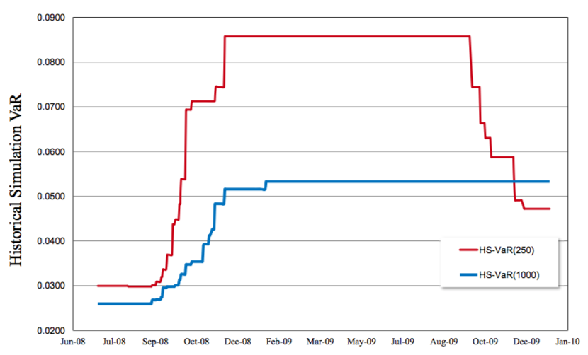
        - The HS VaR reacts too slowly to increases in volatility as well as to 
            decreases in volatility.

- **Expected Shortfall**
    - The ES tells us the expected value of tomorrow's loss, conditional on it
        being worse than the VaR.
    - The Expected SHortfall computes the average of the tail outcomes weighted
        by their probabilities.
    - $$ES_{t+1}^p = -E_t[R_{PF,t+1}|R_{PF,t+1} < -VaR^p_{t+1}]$$
    - By **Normal distribution assumption**
        - $$ES_{t+1}^p = \sigma_{PF,t+1} \frac{\phi(\Phi_p^{-1})}{p}$$
        - $$\phi(\Phi_p^{-1})$$ is the probability of PDF.
    - By **Historical Simulation**
        - Sum(probability_n X loss_n)/probability

# 2. Time series Models

- **Autocorrelation**
    - $$\rho_{\tau} = Corr[R_t,R_{t-\tau}] =
        \frac{Cov[R_t,R_{t-\tau}]}{\sqrt{Var[R_t]Var[R_{t-\tau}]}}=
        \frac{Cov[R_t,R_{t-\tau}]}{Var[R_{t}]}$$

- **Autoregressive(AR) Models**
    - ACF dies of exponentially.
    - Assumption
        - $$E[\epsilon_t] = 0$$
        - $$Var[\epsilon_t] = \sigma_\epsilon^2$$
        - $$R_{t-\tau}$$ and $$\epsilon_t$$ are independent for all $$\tau>0$$
    - AR(1):$$R_t = \phi_0 + \phi_1 R_{t-1} + \epsilon$$
    - ACF
        - AR(p): $$E_t(R_{t+1}) = \phi_0 + \phi_1 R_{t} + \phi_p R_{t+1-p}$$
        - 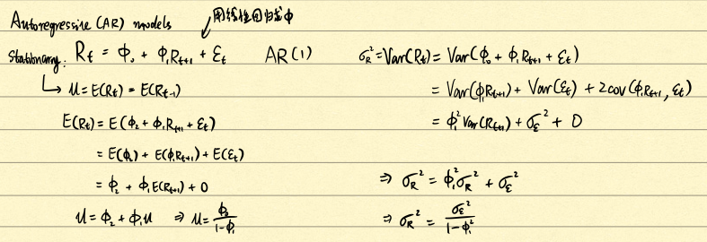
        - 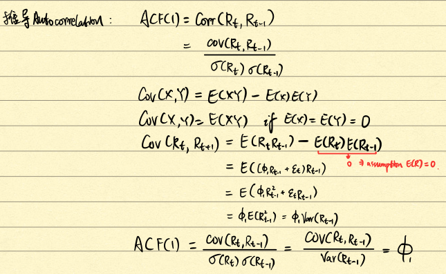
        - 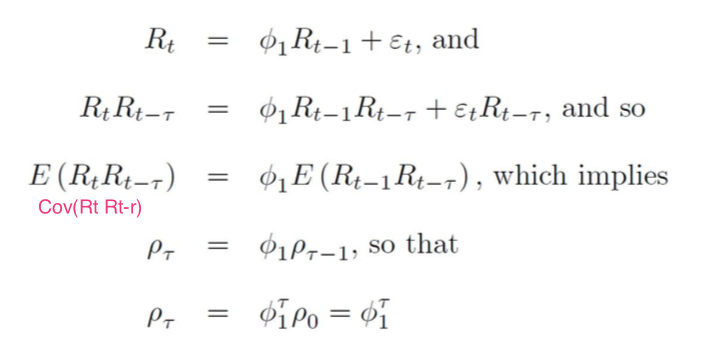
        - For AR(2)的 ACF(1): 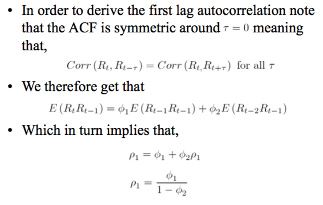
    - PACF
        - The optimal lag order p in the AR(p) can be chosen as the largest p such
        that is significant in the PACF.

- **Moving Average(MA) Models**
    - ACF die off abruptly
    - Assumption
        - $$\epsilon_t$$ and $$\epsilon_{t-1}$$ are independent
        - $$E[\epsilon_t] = 0$$
    - MA(1):$$R_t = \theta_0 + \epsilon_t + \theta_1\epsilon_{t-1}$$
    - MA(q):$$R_t = \theta_0 + \theta_1\epsilon_{t-1} + \theta_2\epsilon_{t-2} + ... +
    \theta_q\epsilon_{t-q} + \epsilon_t$$
    - $$E[R_t] = \theta_0$$
    - $$Var(R_t) = (1+\theta_1^2)\sigma_{\epsilon}^2$$
    - ACF
        - The ACF for MA(q) is non-zero for the first q lags and then drops
        abruptly to zero.
        - 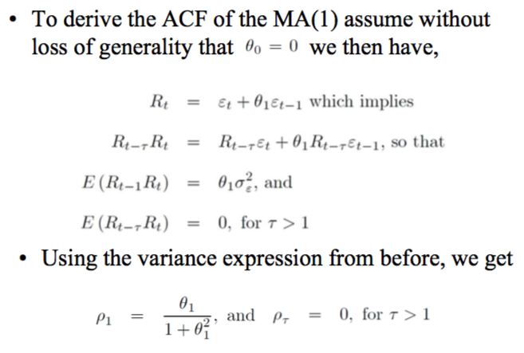 
        - 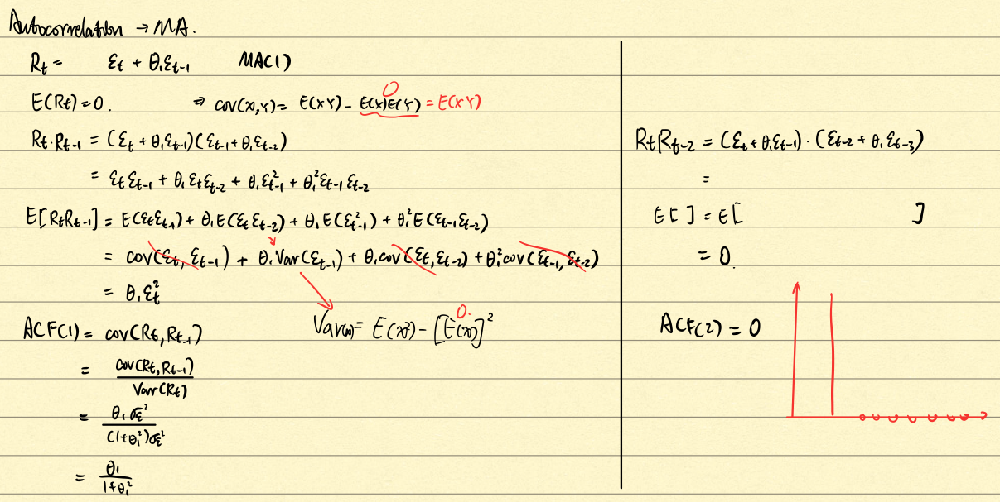 

- **ARMA Models**
    - ARMA(1,1)
        - $$R_t = \phi_0 + \phi_1R_{t-1} + \phi_1 \epsilon_{t-1}+ \epsilon_t$$
        - 推导$$E(R_t)$$
            - $$E(R_t) = \phi_0 + \phi_1E[R_{t-1}]+\theta_1E(\epsilon_{t-1})+E(\epsilon_t)$$
            - $$E(R_t) = \phi_0 + \phi_1E[R_{t-1}]+0+0$$
            - $$E(R_t) = \frac{\phi_0}{1-phi_1}$$ when $$|\phi_1|<1$$
        - 推导$$Var[R_t]$$
            - $$E[R_t\epsilon_t] = \sigma_\epsilon^2$$
            - $$Var[R_t] =
            \phi_1^2Var[R_t]+\theta_1^2\sigma_\epsilon^2+\sigma_\epsilon^2 +
            2\phi_1\theta_1\sigma_\epsilon^2$$
            - $$Var(R_t) =
            \frac{(1+2\phi_1\theta_1+\theta_1^2)\sigma_\epsilon^2}{1-\phi_1^2}$$
    - ARMA(p,q):$$R_t=\phi_0+\sum_{i=1}^p\phi_iR_{t-i} +
    \sum_{i=1}^q\theta_i\epsilon_{t-i} + \epsilon_t$$
    - ACF
        - 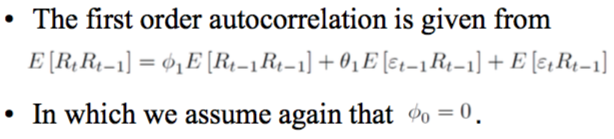
        - 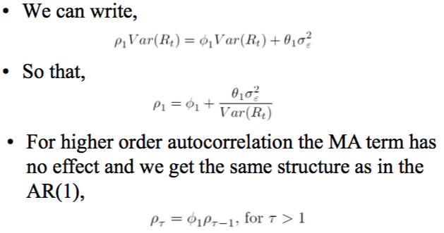

- **Random Walk Model**
    - Define: $$R_t = \ln(S_t) - ln(S_{t-1})=s_t-s_{t-1}$$ 
    - Random walk: $$s_t = s_{t-1} + \epsilon_t$$
    - $$E_t(s_{t+\tau}) = s_t$$
    - $$Var_t(s_{t+\tau}) = \tau\sigma_\epsilon^2$$
    - A small positive mean in Equity returns drift the model:
        - $$s_t = \mu + s_{t-1} + \epsilon_t$$
    - ACF
        - ACF($$\tau$$) = 1

- **ARIMA Model**

    - ARIMA(p,1,q) = ARMA(p,q)  <--- $$s_t$$ has a unit Roots
    - ARMA(0,0) = ARIMA(0,1,0) = Random Walk  <--- Because $$s_t-s_{t-1}=\epsilon_t$$
    - ARIMA(p,n,q), 若n为2，则应用$$(s_3-s_2)-(s_2-s_1)$$,以此类推，为difference of
    difference.

- **Pitfall!!!**
    1. Spurious Mean-Reversion
        - Hurwitz bias or the Dickey- Fuller bias: $$\phi_1$$越接近1,越容易低估$$R_t$$
            - Testing for Unit Roots, $$H_0:\phi_1=1$$, $$H_A:\phi_1<1$$
            - P-value < 5% : Stationary, reject Hypothesis 0.
        - 若sample太小，可能会导致ACF不准确，误以为有autocorrelation
        - 俩时间序列(比如price)跑出线性模型，但检查残差项的ACF **dies off slowly**,
        应该做差分运算
        $$(s_{1t}-s_{1t-1}) = a + b(s_{2t}-s_{2t-1})+e_t$$,
        然后再跑回归，再检查残差项。

    2. Spurious Regression
        - 俩完全不相关的时间序列(比如price)竟然能跑出显著的线性模型，但检查残差项的
        ACF 发现**highly persistent**, 说明不符合残差相互独立的假设，应该做差分运算
        $$(s_{1t}-s_{1t-1}) = a + b(s_{2t}-s_{2t-1})+e_t$$,然后再跑回归，再检查残差项。

- **Cointegration**
    - If two variables that are both integrated have a linear combination with no 
    unit root then we say they are cointegrated.
    - 比如pairs trading strategy, arbitrage

# 3. Volatility Modeling

- **Simple Variance Forecasting**
    - Assumption
        - $$R_{t+1} = \sigma_{t+1}z_{t+1},with\ z_{t+1} ~ i.i.d. N(0,1)$$
        - i.i.d. N(0,1):Independently and identically normally distributed with mean
        equal to zero and variance equal to 1.
    - Puts equal weights on the past m obervations.
        - $$\sigma_{t+1}^2= \frac{1}{m} \sum_{\tau=1}^m R_{t+1-\tau}^2 = 
        \sum_{\tau=1}^m R_{t+1-\tau}^2$$
        - Cons: 
            1. 无法定义$$E(sigma_t^2)$$
            2. 极值R影响过大
    - Puts weights decline exponentially
        - $$\sigma_{t+1}^2 = (1-\lambda)\sum_{\tau-1}^{\infty}R_{t+1-\tau}^2$$, for $$
        0<\lambda<1$$
        - 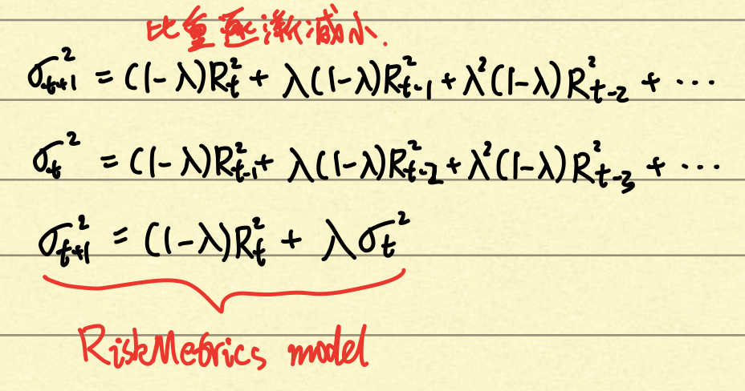
        - $$\sigma_{t+1}^2 = \lambda\sigma_t^2+(1-\lambda)R_t^2$$
        - Cons:
            1. Not allow for a leverage effect(下跌更容易使波动率上升)
            2. provides counterfactual longer-horizon forecasts.

- **The GARCH Variance Model**
    - The simplest generalized autoregressive conditional hetroskedasticity(GARCH)
    model of dynamic variance: 

    $$\sigma_{t+1}^2 = \omega + \alpha R_t^2 + \beta \sigma_t^2, with\
    \alpha+\beta<1$$

    - The RiskMetrics model can be viewed as a special case: 
    $$\alpha=1-\lambda, \beta=\lambda, s.t. \alpha+\beta=1, \omega=0$$

    - Now we can define **variance!**
        - $$\begin{align} \sigma^2 
        &= E[\sigma_{t+1}^2]\\
        &= \omega+\alpha E[R_t^2]+\beta E[\sigma_t^2]\\
        &= \omega+\alpha \sigma^2 + \beta \sigma^2\\
        &= \frac{\omega}{1-\alpha-beta}
        \end{align}$$

    - Substitute $$\omega$$ we can get:
    
    $$\begin{align}\sigma_{t+1}^2 
    &= (1-\alpha-\beta)\sigma^2 + \alpha R_t^2 + \beta \sigma_t^2\\
    &= \sigma^2 + \alpha(R_t^2-\sigma^2)+\beta(\sigma_t^2-\sigma^2)\\
    \end{align}$$

    - Parameters computed by **Maximum likelihood Estimation(MLE)**

- **The Leverage Effect**
    - A negative return increase variance by more than a positive return of
      the same magnitude.
    - Ways to capture:
        1. 所以我们修改GARCH使Return权重与Return正负有关--> NGARCH (Nonlinear GARCH)
            - $$\begin{align}
        \sigma_{t+1}^2 &= \omega + \alpha(R_t-\theta \sigma_t)^2 + \beta
          \sigma_t^2 \\ &= \omega + \alpha \sigma_t^2(z_t - \theta)^2+ \beta
           \sigma_t^2 \end{align}$$
        2. define 一个indicator函数，若return小于则为1，否则为0
            - $$\sigma_{t+1}^2 = \omega + \alpha R_t^2 + \alpha \theta I_t
              R_T^2 + \beta \sigma_t^2$$

- **Standardize Return**
    - $$\overline{R_t} = \frac{R_t^2}{\sigma_t^2}$$
    - 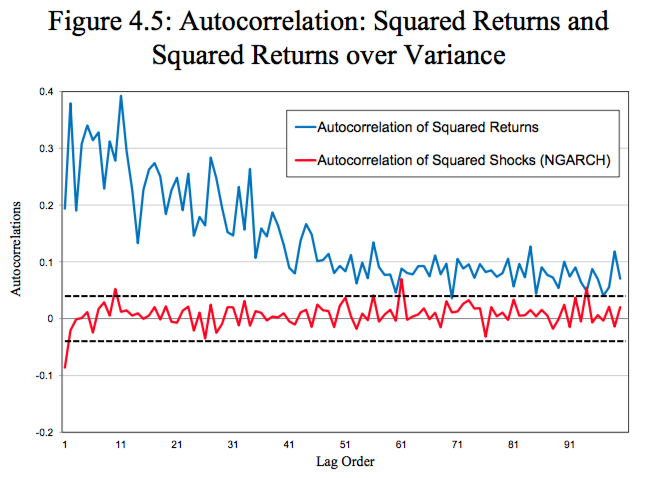

# 4. Non-Normal Distribution

- **Visualising Non-normality Using QQ Plots**
    1. Sort all standardized returns in ascending order and call them $$z_i$$
    2. Calculate the empirical probability of getting a value below the value i as (i-0.5)/T
    3. Calculate the standard normal quantiles as $$\Phi^{-1}_{(i-0.5)/T}$$
    4. Finally draw scatter plot
        - $$\{ X_i, Y_i\} = \{ \Phi^{-1}_{(i-0.5)/T}, z_i \}$$
    - If the data were normally distributed, then the scatterplot should
      conform to the 45-degree line.

    - 原理：
        1. 即先将数据标准化，并从小到大依次排列,作为纵坐标：
            - $$z_i = \frac{R - E(R)}{\sigma_R}$$
        2. 再计算横坐标:
            - 假设有n个值，需要取n个点作为横坐标，想像是在画直方图，
            - 则取值为间隔的中位数， 即以下区间的中点: 
            (0,1/n), (1/n, 2/n), ..., (n-1/n, 1)
            - 中间点依次为(1-0.5)/n, (2-0.5)/n, ..., (i-0.5)/n.
            - 再将这些点转化为正态分布的Z值作为横坐标

- **Filtered Historical Simulation Approach**
    - The Filtered Historical Simulation(FHS) attempts to combine the best of
      the model-based with the best of the model-free approaches in a very
      intuitive fashion.
    - 即往常算VaR，是假设Return都是正态分布，然后直接用Z值和实际标准差预测VaR，
      现在抛弃Return都是正太分布的假设，
      然后用GARCH模型预测出来的标准差来标准化Return，
      然后用标准化后的Return算出对应的quantile值乘以GARCH预测的标准差预测VaR.
    - 即正态下用Z值quantile,真实sigma,计算VaR，
      换成了用GARCH sigma 标准化实际return的quantile,GARCH sigma,计算VaR。
    1. Estimate GARCH
    2. Calculate $$\hat{R_t} = \frac{R_t}{\sigma_t}$$
    3. Find quantile for $$\hat{R_t}$$
    4. $$VaR_{FHS} = -quantile \times \sigma_{501}$$

- **The Standardized t distrbution**
    - Define:
        - $$f_{t(d)}(x;d) = \frac{\Gamma((d+1)/2)}{\Gamma(d/2)\sqrt{d \pi}} 
        (1+x^2/d)^{-(1+d)/2}, for\ d>0$$
        - The distribution has only one parameter d
        - $$E[x] = 0, when\ d>1$$
        - $$Var[x] = d/(d-2), when\ d>2$$
    - Standardized:
        - $$z= \frac{x-E[x]}{\sqrt{Var[x]}} = \frac{x}{\sqrt{d/(d-2)}}$$
        - $$f_{t(d)}(z;d) = C(d)(1+z^2/(d-2))^{-(1+d)/2}, for\ d>2$$
        - where $$C(d) = \frac{\Gamma ((d+1)/2)}{\Gamma (d/2)\sqrt{\pi(d-2)}}$$
        - $$E[x] = 0, Var[x] = 1$$

# 5. Covariance and Correlation Models

- **Exposure Mapping**
    1. 计算一个portfolio的Exposure，先用不同的模型表示portfolio里面的n个assets:
        - $$R_1 = a_1 + \beta_1R_M + \sigma_1$$
        - $$R_2 = a_2 + \beta_2R_M + \sigma_2$$
        - ...
        - $$R_n = a_n + \beta_nR_M + \sigma_n$$
    2. 求每一个assets的Variance，有三种方法
        1. $$\frac{1}{n}\sum_{i=1}^{n}R_t^2$$
            - Cons: dependence on windows and equal weight
        2. $$RiskMetrics\ \sigma_{t+1}^2 = (1-\lambda)R_t^2 + \lambda\sigma_t^2$$
            - Cons: No mean-reversion
        3. $$GARCH\ \sigma_{t+1}^2 + \omega + \alpha R_t^2 + \beta\sigma_t^2$$
    3. 若联合起来算Portfolio的Variance，重点在Coveriance, 有三种方法
        1. $$Cov(R_{A,t+1}, R_{B, t+1}) =\sigma_{AB,t+1} \frac{1}{n}\sum_{i=1}^{n}R_{A,t}R_{B,t}$$
        2. $$RiskMetrics\ \sigma_{t+1}^2 = (1-\lambda)R_{A,t}R_{B,t} + \lambda\sigma_{AB,t}$$
        3. $$GARCH\ \sigma_{t+1}^2 + \omega + \alpha R_{A,t}R_{B,t} + \beta\sigma_{AB_t}$$
    4. 以上Covariance不知道哪个方法好，方法2和3因为每个asset之间可能产生的
        参数不一样，会导致算出来的Var<0
    5. 为了统一Covarialce，不如直接计算correlation
        - $$Cov_{AB} = \rho_{AB} \sigma_A \sigma_B$$

