# Fixed Income

<!-- vim-markdown-toc GitLab -->

* [1. Course overview](#1-course-overview)
* [2. Fixed income markets](#2-fixed-income-markets)
* [3. Zeroes and coupon bonds](#3-zeroes-and-coupon-bonds)
* [4. Yield to maturity](#4-yield-to-maturity)
* [5. Forward rates](#5-forward-rates)
* [6. The repo market](#6-the-repo-market)
* [7. Duration](#7-duration)
* [8. Convexity](#8-convexity)
* [9. Immunization](#9-immunization)
* [10. Floaters and inverse floaters](#10-floaters-and-inverse-floaters)
* [11. Interest Rate Swaps](#11-interest-rate-swaps)

<!-- vim-markdown-toc -->

## 1. Course overview

## 2. Fixed income markets

- **U.S. Treasury securities**
    - Bills: 1,3,6,12 months  --> Zero
    - Notes: 2,5,10 years     --> Coupon-bearing, semi-annual
    - Bonds: 30 years         --> Coupon-bearing, semi-annual
        - A callable bond: 可被issuer repurchased.

- **Treasury auctions(sealed-bid auctions)**
    1. Uniform price auction: all bids receive the stop yield
    2. Discriminative auction:competitive bids receive the yield specified;
       non-competitive bids receive the average yield competitive bids 
       receive the yield specified; non-competitive bids receive the 
       average yield.

- **Stripped Treasury securities**: Zero-coupon bonds.

- **Agency bonds**: Issued by government agencies, semi-annual coupons

- **Corporate debt**
    - Ordinary bonds, Commercial Paper(CP), Structured notes(coupon determined
      by various different formulas)
    - Issued by U.S. corporations, semi-annual coupons

- **Municipal bonds**
    - Issued by local governments, semi-annual coupons
    - tax exempt.

- **Mortagage-backed securities**: secured by real estate.

- **Interest rate swaps, Futues, Options**

- **Risk**
    - Interest rate risk 
    - Credit risk
    - Liquidity risk
    - Contractual risk 
    - Inflation risk
    - Event risk 
    - Tax risk
    - FX risk

## 3. Zeroes and coupon bonds

- **Zero prices or "discount factors"**
    - The price today of an asset which pays off \$1 in t years
    - $$d_t=\frac{PV}{FV}$$
    - $$PV = d_t \times FV$$

- **The Law of One Price(No Arbitrage)**
    - coupon bond = corresponding package of zeroes
    - $$V= \$425 \times d_{0.5} + \$425 \times d_{1} + \$10425 \times d_{1.5}$$
    - $$V= K_1 \times d_{t_1} + K_2 \times d_{t_2} + K_n \times d_{t_n}$$
    - K is the cash flow at time t

- **Implied zero price**
    1. 已知 97.86 par value of the 1-year bonds, 和 2.10 par ... 0.5-year bond,
       和$$d_{0.5}$$和$$d_1$$, 
       - 可以运用两个PV相减求1-year zero price:

       $$PV_1 = (97.86 \times \$0.9896875) - (2.10 \times \$0.9940625)$$
        
       - 若已知条件为price和coupon rate，可以直接列方程组求discount factor

       $$\begin{cases} 
       99.86 = (100+\frac{4.25}{2}) \times d_{0.5}\\
       98.99 = (\frac{4.375}{2}) \times d_{0.5}+(100+\frac{4.375}{2}) \times d_{0.5}
       \end{cases}$$
  
- **Annual vs. semi-annual compounding**
    - A semi-annually compounded rate of "r" per year means "r/2" every six
      month.
    - $$(1+\frac{r}{2})^2 = 1+r_A$$

- **Zero rate or discount rate**
    - $$d_t \times (1+\frac{r_t}{2})^{2t} = 1$$

- **Value of a stream of cash flows**
    - $$V = \sum_{j=1}^{n} K_j \times d_t = \sum_{j=1}^{n} \frac{K_j}{(1 +
      \frac{r_{t_j}}{2})^{2t_j}}$$
    - 注意，每个时期的$$r_t$$都不同

## 4. Yield to maturity

- **Definition of yield to maturity**
    - 之前是分别用每个时期的discount rate分别计算每个时期的cash
      flow，现在重新定义一个能够全部都用来计算的yield
    - Yield is the single discount rate that sets the present value of a bond's
      cash flows equal to the market price.
    - Yield is not a good measure of value(需要知道现金流固不固定), but is a
      good summary(average) of interest rates.
    - $$V = \sum_{j=1}{n} \frac{K_j}{(1+y/2)^{2t_j}}$$
    - Yield is a kind of average of the different zero rates associated with
      the cash flows.

- **Yield of a bond**
    - $$P = \frac{c}{2}\sum_{s=1}^{2T} \frac{1}{i(1+y/2)} +
      \frac{1}{(1+y/2)^{2T}}$$
    - 利用等比数列公式得
        - $$P = \frac{c}{2} [1- (\frac{1}{1+y/2})^{2T}] + \frac{1}{(1+y/2)^{2T}}$$
        1. Note that if c=y, P=1 (the bond is priced at par)
        2. If c>y, P>1 (the bond is priced at a premium to par) 
        3. If c<y, P<1 (the bond is priced at a discount)
        4. The yield on a zero is the zero rate: c=0 -> y=rT

- **Value of a stream cash flows**
    - $$V = \sum_{j=1}^{n} K_j \times d_t = \sum_{j=1}^{n} \frac{K_j}{(1 +
      \frac{r_{t_j}}{2})^{2t_j}} = \sum_{j=1}^{n} \frac{K_j}{(1 + \frac{y}{2})^{2t_j}}$$

- **The coupon effect**
    - If the zero yield curve is upward sloping, then the bond with the higher
     coupon puts “more weights” to shorter maturities, have a lower yield
    - Conversely, if the yield curve is downward sloping, then the higher
      couponbond will have a higher yield. 
    - 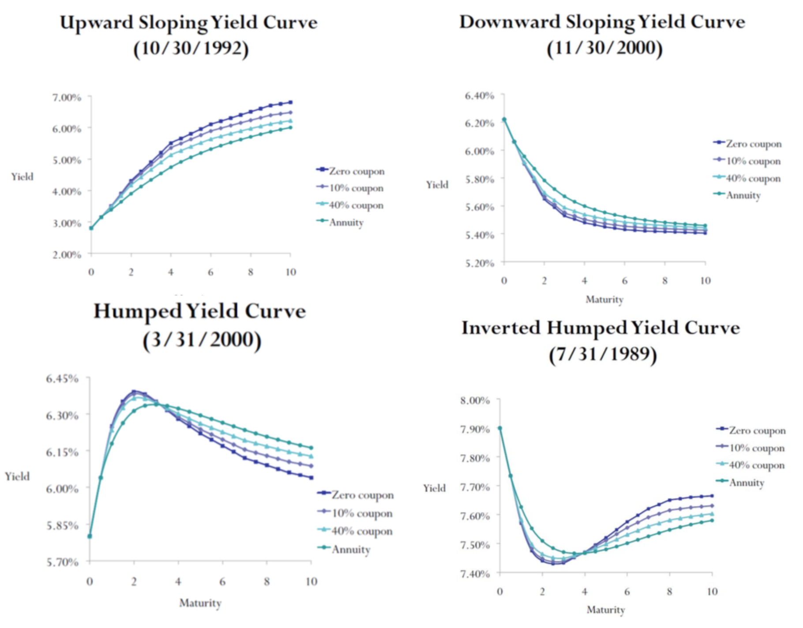

- **Par rates**
    - The par rate for a given maturity T is the coupon rate that makes a
      T-year coupon bond sell for par.
    - Par rate formula
        - 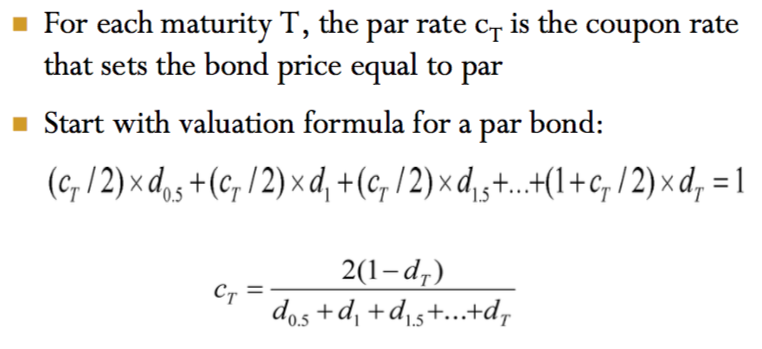

## 5. Forward rates

- **Ford contracts**
    - A forward contract is an agreement to buy an asset at a pre-specified
      date at a pre-specified price.
        - settlement(delivery) date, delivery price

- **Spot**
    - A spot transaction is for settlement immediately.

- **Motivation**
    - Suppose today you know you will need a certain Treasury note, you can
        1. Wait until time and buy
        2. Arrange a forward transaction todady, lock in the price
    - 可以假设成forward contract 为远期贷款,先把利息交了， spot为借给别人钱

- **Forward price**
    - Determined with "no arbitrage", synthesized with spot
    - Enter into long forward contract with maturity T = Buy one unit of spot
      today, hold until T  --> cost must be the same.
    - $$PV(F) = S+PV(holding\ costs) - PV(holding\ benefits)$$

- **Synthtic forward price for a zero**
    - Maturity: T, pay $$F_t^T$$ at time t.
    - $$PV(F_t^T) = Spot\ Price$$
    - $$\frac{F_t^T}{(1+r_t / 2)^{2t}} = d_T$$

- **Synthetic forward loan**
    - The forward loan lasts for T-t years
    - Forward rate: $$f_t^T$$
    - 思路1：
        - $$(1+f_t^T / 2)^{2(T-t)} = \frac{(1+r_T / 2)^{2T}}{(1+r_t/2)^{2t}}$$
        - 即全部转化为PV，然后再相除得出rate, 注意rate为年化，且半年付息一次
    - 思路2:
        - $$ (1+r_t/2)^{2t} (1+f_t^T / 2)^{2(T-t)} = (1+r_T / 2)^{2T}$$
        - 从0借到t，再从t借到T，等于从0借到T
        - 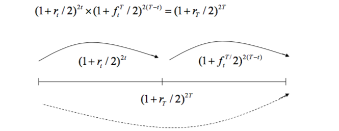
    - 思路3:
        - 已知的为discount factor
        - 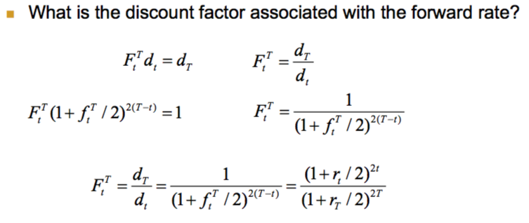
    - 总结：
        - 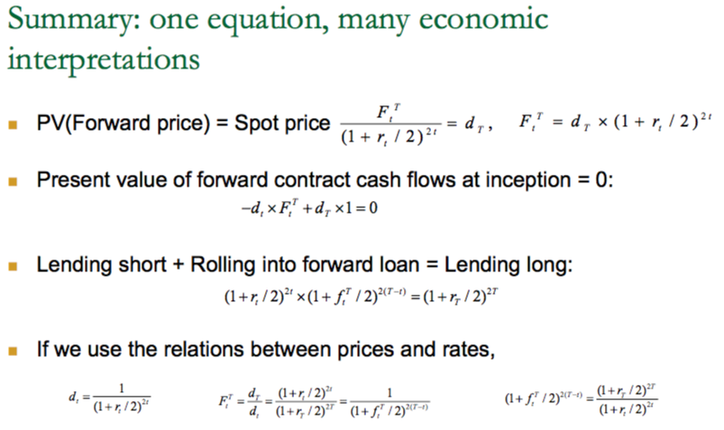

- **Term Premiums**
    - Term Premium = Forward rate - Expected future spot rate

## 6. The repo market

- **Repo**
    - A repurchase agreement, or repo, is a sale of securities for cash with a
      commitment to repurchase them at a specified price at a future date.
    - Reverse repo.
    - Financing a Long Position
    - Establishing a Short Position

- **Typical Market Participants**
    - Borrowers:
        1. Securities Dealers
        2. Thrifts
        3. Banks
    - Lenders
        1. Bank trust departments
        2. Money market funds
        3. Municipalities
        4. COrporations
    - Central banks

- **Types of Collateral**
    - Treasuries, Agencies, Mortgage-backed securities, Others

- **Term of the Loan**
    - Overnight repo
    - Term repo
    - Open repo(no fixed term, termininate any time)

- **Ways of reducing the credit exposure**
    - Margin(Haircut)
    - Mark to Market on a regular basis(调整collateral levels or loan balance)

## 7. Duration

- **Risk Measure**
    - Sensitivity of Fixed income securities to interest rate changes.
    - Dollar Duration
    - DV01
    - Modified Duration
    - Macaulay Duration
    - Effective Duration

- **Dollar Duration**
    - 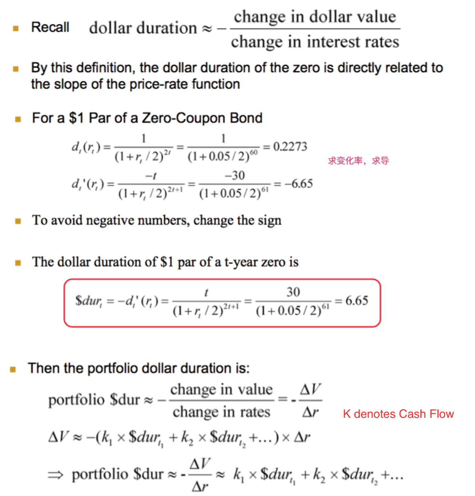

- **DV01**
    - DV01 = Dollar Value of a Basis Point
    - $$DV01 = \$dur \times 0.00001$$

- **Parallel Shift**
    - We assume all rates change by the same amount
    - There is a parallel shift to the term structure.

- **Duration**
    - The duration of a bond is an approximation of the percent change in its
      price given a 1% change in interest rates.
    - 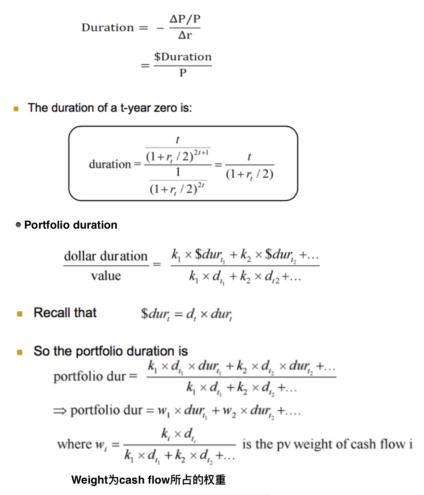

- **Two Other Duration Measures**
    - 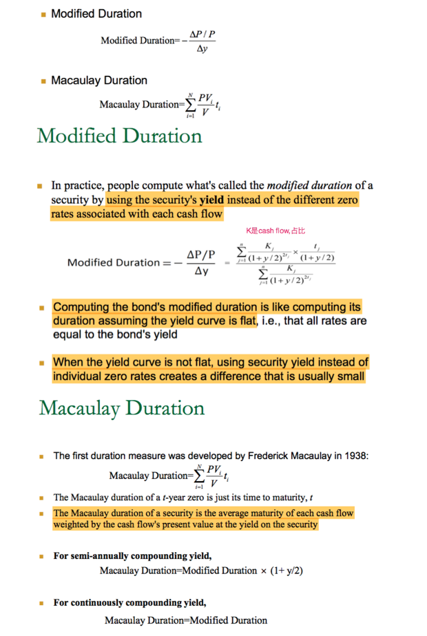

## 8. Convexity

- **Dollar Convexity**
    - 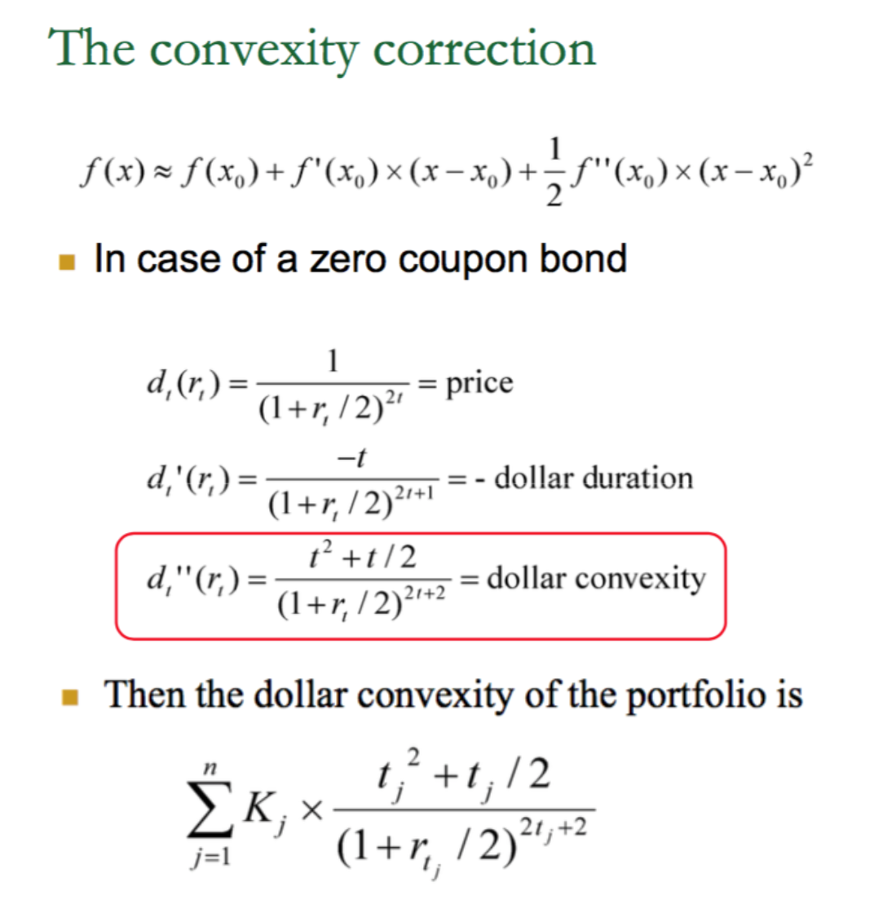

- **Convexity**
    - 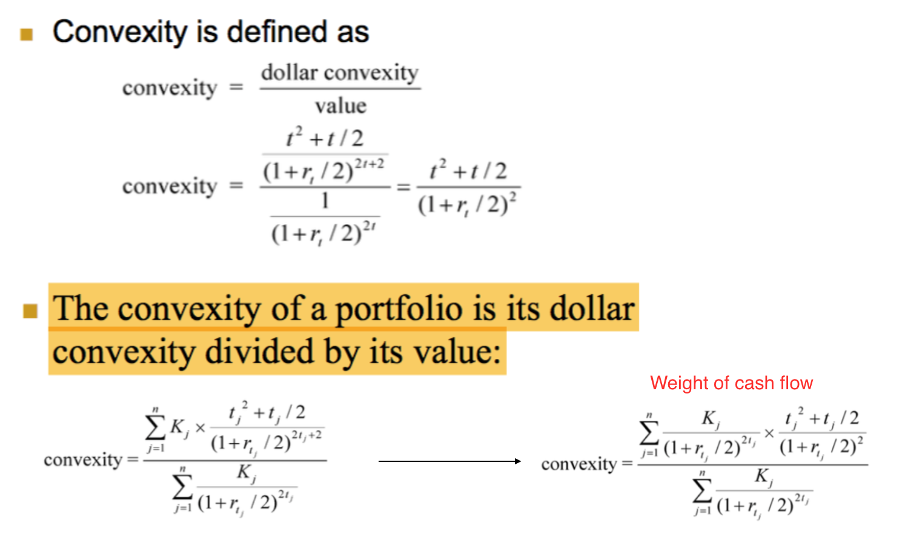

- **Barbells and bullets**
    - Barbell: a portfolio of a long-term and short-term zeros.
    - Bullet: an intermediate-term zero.
    - Let the barbell and bullet have the same value and duration.
    - The barbell will have more convexity.
        - Convexity is roughly the square of maturity
        - Duration is roughly the maturity
        - Weighted sum of squared maturities of the barbell is larger than the
          squared maturity of the bullet.
    - 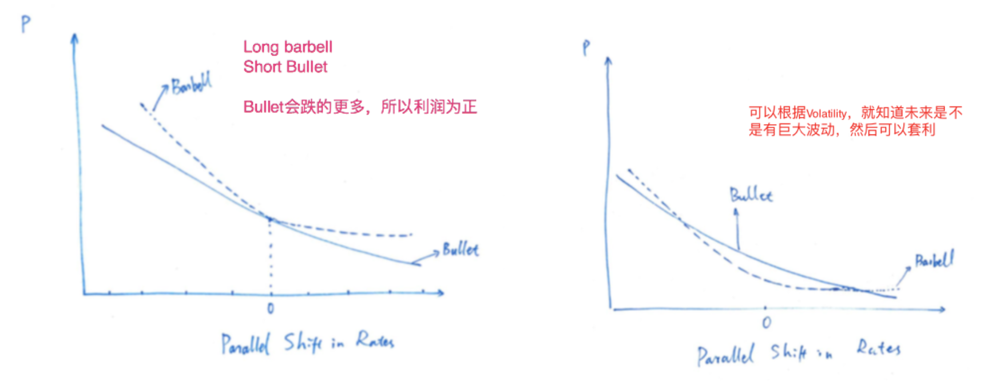

## 9. Immunization

## 10. Floaters and inverse floaters

## 11. Interest Rate Swaps

- **Key concepts and buzzwords**
    - Swaps
    - Swap spreads and credit risk
    - Counterparty, notional amount, plain vanilla swap, swap rate

- **Swap**
