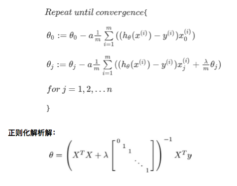

# Mechine Learning

*   Study Source:
    *   [《机器学习》--周志华](https://book.douban.com/subject/26708119/?from=tag)
    *   [《统计学习方法》--李航](https://book.douban.com/subject/10590856/)
    *   [Coursera-ML-AndrewNg-Notes](https://github.com/fengdu78/Coursera-ML-AndrewNg-Notes)
*   Python Code: [Hands_on_ML](https://github.com/Chandlercjy/Hands_on_ML)

## 目录

<!-- vim-markdown-toc GitLab -->

* [1 概论 Statistical learning](#1-概论-statistical-learning)
    * [1.1 策略 Strategy](#11-策略-strategy)
        * [1.1.1 损失函数 loss function](#111-损失函数-loss-function)
        * [1.1.2 风险函数 risk function](#112-风险函数-risk-function)
        * [1.1.3 代价函数 cost function](#113-代价函数-cost-function)
    * [1.2 模型 model](#12-模型-model)
    * [1.3 算法 Algorithms](#13-算法-algorithms)
* [2 优化算法](#2-优化算法)
    * [2.1 梯度下降法(Gradient descent)](#21-梯度下降法gradient-descent)
    * [2.2 随机梯度下降(Stochastic gradient descent)](#22-随机梯度下降stochastic-gradient-descent)
    * [2.3 增量梯度下降](#23-增量梯度下降)
* [3 损失函数构造算法](#3-损失函数构造算法)
    * [3.1 极大似然估计(Maximium Likelihood)](#31-极大似然估计maximium-likelihood)
    * [3.2 期望最大化(EM)算法(Expectation Maximiazation)](#32-期望最大化em算法expectation-maximiazation)
* [4 模型评估与模型选择](#4-模型评估与模型选择)
* [5 数据预处理](#5-数据预处理)
* [6 各种模型](#6-各种模型)
    * [6.1 线性回归 Linear Regression](#61-线性回归-linear-regression)
    * [6.2 逻辑回归 Logistic Regression](#62-逻辑回归-logistic-regression)
    * [6.3 决策树 Desicion Tree](#63-决策树-desicion-tree)
    * [6.3 神经网络](#63-神经网络)
    * [6.4 感知机](#64-感知机)
    * [6.5 k 近邻法](#65-k-近邻法)
    * [6.6 支持向量机 Support Vector Machines](#66-支持向量机-support-vector-machines)
    * [6.7 朴素贝叶斯法](#67-朴素贝叶斯法)
* [7 机器学习系统的设计](#7-机器学习系统的设计)

<!-- vim-markdown-toc -->

# 1 概论 Statistical learning

*   **基本概念**

    *   监督学习(supervised learnling), 非监督学习(unsupervised learnling)
    *   输入空间(input space), 输出空间(output space), 特征空间(feature vector)
    *   假设空间(Hypothesis space), 联合概率分布
    *   损失函数(loss function): 单个样本的误差
    *   代价函数(cost function): 整个训练集的平均误差

*   **统计模型三要素**

    *   模型(model)
        *   决策函数
        *   判别函数
    *   策略(strategy)
        *   损失函数(loss function)和风险函数(risk function)
        *   期望风险最小化与结构风险最小化
    *   算法(algorithm)

## 1.1 策略 Strategy

### 1.1.1 损失函数 loss function

*   **常用损失函数(loss function)**

    *   0-1 损失函数(0-1 loss function)

        $$L(Y, f(X)) = \begin{cases} 1, Y \not=f(X) \\ 0, Y=f(X) \end{cases} $$

    *   平方损失函数(quadratic loss function)

        $$L(Y, f(X)) = (Y-f(X))^2$$

    *   绝对损失函数(absolute loss function)

        $$L(Y, f(X)) = |(Y-f(X))|$$

    *   对数损失函数(logarithmic loss function)或对数似然函数(log-likelihood
        loss function)

        $$L(Y, P(Y|X)) = -logP(Y|X)$$

*   **损失函数的定义方法**

    1.  均方误差(Error of mean square)
    2.  最大后验概率(Maximum posterior probability)
    3.  交叉熵损失函数(Cross entropy loss)
    4.  极大似然估计(Maximum likelihood estimate)

### 1.1.2 风险函数 risk function

*   **类别**

    *   经验风险(empirical risk):训练样本集的平均损失

        <!-- prettier-ignore -->
        $$R_{emp}(f) = \frac{1}{N}\sum^N_{i=1} L(y_i, f(x_i))$$

    *   期望风险(expected loss):联合分布的期望损失。即样本值乘以出现概率。

        <!-- prettier-ignore -->
        $$R_{exp}(f) = E_p[L(Y, f(X))] = \int_{x*y}L(y, f(x))P(x, y)dxdy$$

    *   根据大数定律, 当样本容量 N 趋于无穷时, 经验风险趋于期望风险。

*   **经验风险最小化(empirical risk minimization, ERM)**

    <!-- prettier-ignore -->
    $$\frac{1}{N}\sum^N_{i=1} L(y_i, f(x_i))$$

*   **结构风险最小化(structural risk minimization, SRM)**

    <!-- prettier-ignore -->
    $$R_{srm}(f) = \frac{1}{N}\sum^N_{i=1} L(y_i, f(x_i)) + \lambda J(f)$$

*   **理解经验风险和期望风险区别**

    *   经验风险是局部的, 基于训练集所有样本点损失函数最小化的。
    *   期望风险是全局的, 是基于所有样本点的损失函数最小化的。
    *   经验风险函数是现实的, 可求的；
    *   期望风险函数是理想化的, 不可求的；
    *   基本思想是用局部最优代替全局最优。

*   **理解经验风险最小化与结构风险最小化关系**

    *   样本容量大用经验风险最小化, 样本容量小用结构风险最小化。
    *   当样本容量大的时候, 经验最小化可以保证很好的学习效果。
        *   比如, 极大似然估计就是经验风险最小化的例子。当模型是条件概率分布, 损
            失函数是对数损失函数时, 经验风险最小化等价于极大似然估计。
    *   结构风险最小化是为了防止过拟合而提出的策略。等价于在经验风险加上表示模型
        复杂度的正则化项(regularizer)或罚项(penalty term)。
        *   比如, 贝叶斯估计中的最大后验概率估计就是结构风险最小化的一个例子。当
            模型是条件概率分布、损失函数是对数损失函数、模型复杂度由模型的先验概
            率表示时, 结构风险最小化等价于最大后验概率估计。

### 1.1.3 代价函数 cost function

*   **作用**

    *   用来监控看最终结果是否收敛。

*   **类型**
    *   分类:
        1.  误分类时就更新参数。目标使误分类次数最小。
        2.  样本点到分割线(超平面)的总距离(或平均)最小化。
    *   拟合:
        1.  预测值与实际值的总误差最小化。
        2.  极大似然函数联合概率最大化。

## 1.2 模型 model

*   **理解生成模型与判别模型的区别**

    *   [点击查看参考资料](https://blog.csdn.net/zouxy09/article/details/8195017)

    *   决策函数
    *   判别函数

## 1.3 算法 Algorithms

*   **理解优化算法与损失函数的关系**

    *   最大似然(MLE), 最大后验(MAP)等都是构造目标函数的方法, 构造出这个目标函数
        后, 我们可以用各种优化方法来找到它的极值.
    *   

# 2 优化算法

## 2.1 梯度下降法(Gradient descent)

*   梯度下降是用来求函数最小值的算法。
*   名词解释:
    *   batch gradient descent: 批量梯度下降
    *   learning rate: 学习率$$\alpha$$
*   原理: 通过构建损失函数, 求其梯度, 然后根据步长 alpha 不断迭代更新参数
    theta。背后思想是开始时随机选择一个参数组合 theta, 计算代价函数, 然后寻找下
    一个能让代价函数值下降最多的参数组合, 知道找到一个局部最小值 (local
    minimum)。
*   注意要点:

    1.  因为并没有尝试所有的参数组合, 所以不能确定 得到的局 部最小值是否是全局最
        小值(global minimum)。选择不同的初始参数组合, 可能会找到不同的局部最小值
        。
    2.  学习率 alpha 如果太小, 会移动太慢导致迭代次数过高, 若太大可能无法收敛。
        此外, 当接近局部最低点时, 导数绝对值越来越小, 所以下降步伐也越来越小, 所
        以实际上没必要另外减小 alpha.
    3.  采用多项式回归模型, 运行梯度下降算法前, 特征缩放非常有必要。

*   
*   
*   

## 2.2 随机梯度下降(Stochastic gradient descent)

*   [点击查看参考资料](https://blog.csdn.net/zouxy09/article/details/20319673)
*   出现原因: 梯度下降法在每次更新回归系数的时候需要遍历整个数据集(即计算整个数
    据集的回归方差的平均值), 所以数据量大的话复杂度太高。由此引出随机梯度下降。
*   随机梯度下降特点:随机梯度下降每次更新回归系数只用一个样本点的误差。
    *   导致问题:一些误差太大的点会导致参数更新偏离太远。因为学习率 alpha 一直不
        变, 即每一个误差对参数调整影响的权重都相同。
    *   解决方法:
        1.  每次迭代的时候更新 alpha 的值, alpha 越来越小, 缓解波动频率, 但是如
            果 alpha 接近 0 的话又几乎没调整, 所以 alpha 应大于一个稍微大点的常
            数。
        2.  每次迭代随机选择样本来计算样本点误差, 减少周期性波动。

## 2.3 增量梯度下降

*   原理：和随机梯度下降一样，每次只选取一个点的误差进行更新，但点是当前 theta
    的点，而不是随机寻找的点。即，在普通梯度下降方法基础上不求和求平均，而是直接
    求那个点的误差。

<!-- prettier-ignore -->
*   $$\theta_j = \theta_j + \alpha(y^{(i)} - h_{\theta}(x^{(i)}))x_j^{(i)}$$
*   缺点:普通梯度下降能够不断收敛，而增量梯度下降可能不断在收敛处徘徊。

# 3 损失函数构造算法

## 3.1 极大似然估计(Maximium Likelihood)

<!-- prettier-ignore -->
* 公式:
    $$L(\theta)=L(x_1, ..., x_n; \theta)=\prod_{i=1}^n p(x_i;\theta)$$

*   直观理解:训练样本是众多数据中被你首次观察到的样本, 这样的样本发生的概率
    应尽可能大, 才那么顺利一下子作为训练样本被你观察到。所以求最大联合概率, 即得真实概率。
*   极大似然函数也是构造损失函数的一种方式, 所以求极大似然函数的最大值, 本质
    上就是求代价函数的最小值, 达到最小值时的参数即为所求参数。

    *   在一元情况下, 极大似然函数可以通过使二次导等于零, 从而求得参数的计算
        公式, 即解析解, 然后非常简便地算出参数值。

    *   在多元(n)情况下, 极大似然函数二次导等于零会产生 n 个方程, 此时要写出
        求 n 个参数的解析解非常困难, 所以要乖乖用优化算法计算。

*   极大似然估计通过假设概率密度函数的不同, 可以推导出各种代价函数。

## 3.2 期望最大化(EM)算法(Expectation Maximiazation)

*   [点击查看参考资料](https://blog.csdn.net/zouxy09/article/details/8537620)

<!-- prettier-ignore -->
* 公式:
    $$
    \begin{align}
    \sum_i log\ p(x^{(i)};\theta)
    &=\sum_i log\ \sum_{z^{(i)}} p(x^{(i)}, z^{(i)};\theta) \\
    &=\sum_i log\ \sum_{z^{(i)}} Q_i(z^{(i)})\frac{p(x^{(i)}, z^{(i)};\theta)}{Q_iz^{(i)}} \\
    &=\geq \sum_i \sum_{z^{(i)}}Q_i(z^{(i)})\frac{p(x^{(i)}, z^{(i)};\theta)}{Q_iz^{(i)}}
    \end{align}
    $$

*   直观理解: EM 算法本质上还是想获得一个使似然函数最大化的那个参数 θ, 但是不
    同的是多了未知变量 z。z 表示样本 i 对应的类别。
*   直观理解举例: 比如在一群男女中抽人测身高, 我们要求的 θ 矩阵为均值 μ 和
    σ, x 值为身高。如果将男生女生分开, 那极大似然函数 就是求联合概率最大, 此时
    就能得出男生女生各自对应的 θ 为多少, 得到男生的身高分布和女生的身高分布 ,
    计算方法是给 θ 初始值之后不断迭代算出。但是如果男生女生混在一起分不出男
    女, 就要多出一个未知变量 z 表示性别。z 值取值为 0 或 1。首先通过隐含变量
    z 将男女分开, 然后各自同样用极大似然函数计算, 不断迭代算出联合概率最大时
    候的各自 θ 矩阵。
*   步骤:
    1.  仅利用有标签的数据, 训练一个朴素贝叶斯分类器。
    2.  利用训练好的分类器给无类别标签的数据打上标签, 顺便记下分类器对该标签
        的把握。然后将所有标签的把握求和, 得到值 sum。
    3.  利用全部数据重新训练朴素贝叶斯分类器。
    4.  重复 2、3 步, 直到 sum 不再变化(或者说近似于不再变化)。
*   TODO

# 4 模型评估与模型选择

*   **模型评估**

    *   基于训练误差(training error)和测试误差(test error)对模型进行评估和选择。
    *   预测能力越高, 训练误差越小, 模型复杂度越高, 测试误差先减小后增大, 导致过
        拟合(over-fitting)
    *   

*   **模型选择**

    1.  正则化(regularization)

        *   即用结构风险最小化策略

        <!-- prettier-ignore -->
        $$R_{srm}(f) = \frac{1}{N}\sum^N_{i=1} L(y_i, f(x_i)) + \lambda J(f)$$

        *   正则化项可以取不同的形式, 比如参数向量的 L1, L2 范数。

    2.  交叉验证
        1.  简单交叉验证(cross validation):
            *   将数据随机分成两部分(70%训练, 30%测试 ), 选择测试误差最小模型。
        2.  S 折交叉验证:(S-fold cross validation):
            *   将数据集随机切成 S 个互不相交的子集, 然后选取其中一个子集作为测
                试集。重复 S 次得出 S 个模型, 然后选择平均测试误差最小的模型。
        3.  留一交叉验证:(leave-one-out cross validation)
            *   S 折的特殊情形 S=N, 即子集只包含一个样本, 而不是多个样本。每次只
                留下一个样本做测试集。

*   **泛化能力**

    *   泛化误差(generalization error)其实就是模型的期望风险。

        <!-- prettier-ignore -->
        $$R_{exp}(f) = E_p[L(Y, f(X))] = \int_{x*y}L(y, f(x))P(x, y)dxdy$$

*   **如何发现过拟合问题**

    1.  对 hypothesis 画图观察(如果可以的话)
    2.  将训练集和交叉验证集的代价函数画图, 横坐标为 d, 表示最高次项。判断过拟合
        是受诊断偏差(Diagnosing Bias)还是方差(Variance)影响。
        1.  训练集误差和交 叉验证集误差近似时:偏差/欠拟合
        2.  交叉验证集误差远大于训练集误差时:方差/过拟合
        *   
    3.  画学习曲线(Learning Curves), 即纵坐标为误差, 横坐标为训练集大小。
        1.  高偏差/欠拟合的情况下, 增加数据到训练集不一定能有帮助。
            *   
        2.  高方差/过拟合的情况下, 增加更多数据到训练集可能可以提高算法效果。
            *   

*   **如何解决过拟合问题**

    1.  利用 PCA 等方法降维
    2.  正则化

        *   通俗理解:过拟合是因为高次项导致, 所以可以降低高次项的权重。
        *   在代价函数后面加上正则项, 这样求梯度时会自动减少 theta 的权重。
        *   λ 若太大, 代价函数会变直线(因为高次项都接近 0), 若太小又没效果。

        <!-- prettier-ignore -->
        $$J(\theta) =\frac{1}{2m}[\sum_{i=1}^m(h_{\theta}(x^{(i)})-y^{(i)})^2 +
        \lambda \sum_{j=1}^n \theta_j^2 ]$$

        *   举例:
            1.  正则化线性回归(注: 常数项不惩罚)
                *   
            2.  正则化逻辑回归(注: 常数项不惩罚)
                *   同线性回归, 但是没有解析解
        *   选择 λ 方法:
            1.  使用训练集训练出 12 个不同程度正则化的模型
            2.  用 12 个模型分别对交叉验证集计算的出交叉验证误差
            3.  选择得出交叉验证误差最小的模型
            4.  运用步骤 3 中选出模型对测试集计算得出推广误差, 我们也可以同时将
                训练集和交叉验证集模型的代价函数误差与 λ 的值绘制在一张图表上:
            *   

    3.  总结
        1.  获得更多的训练实例——解决高方差(过拟合)
        2.  尝试减少特征的数量——解决高方差(过拟合)
        3.  尝试获得更多的特征——解决高偏差(欠拟合)
        4.  尝试增加多项式特征——解决高偏差(欠拟合)
        5.  尝试减少正则化程度 λ——解决高偏差(欠拟合)
        6.  尝试增加正则化程度 λ——解决高方差(过拟合)
    4.  早停策略(early stopping)
        *   将数据分成训练集和验证集。训练集用来计算梯度,更新权重等,验证集永利来
            估计误差。若训练集误差降低但验证机误差升高,则停止训练,同时返回具有最
            小验证集误差的参数。

*   **梯度检验(Numerical Gradient Checking)**

    *   结果算出来后, 用梯度检验检查所求 θ 是否正确。
    *   应对每一个参数都进行计算
    *   最终计算得到的结果, 应该和算法求得的导数相接近。但由于不是向量化计算, 所
        以在迭代过程中速度较慢, 若算法没有问题, 应该关闭这段代码。
        *   

*   **跳出局部极小,接近全局最小(目前理论尚缺保障)**
    1.  以多组不同参数值初始化多个神经网络,训练后选择误差最小的解。相当于从多个
        初始点搜索,在多个局部最小中选全局最小。
    2.  使用模拟退火(simulated annealing),每次更新时以一定概率接收次优解。概率随
        时间推移降低。
    3.  使用随机梯下降。

# 5 数据预处理

*   **归一化(标准化)方法**

    1.  Min-max 标准化(Min-Max Normalization), 使结果值映射到[0, 1]之间

        $$X_n = \frac{x-min}{max-min}$$

    2.  Z-score 标准化方法, 转化后数据符合标准正态分布, N(0, 1)

        $$x_n = \frac{x - \mu}{\sigma}$$

*   **归一化的重要性**
    *   数据归一化后, 最优解的寻优过程明显会变得平缓, 更容易正确的收敛到最优解。
    *   

# 6 各种模型

## 6.1 线性回归 Linear Regression

*   **基本原理**

    *   

*   **最小二乘法(Least squares, 又叫 Normal Equation)**

    *   $$\theta = (X^TX)^{-1} X^Ty$$
    *   对于线性回归问题, 我们采用极大似然来构造一个目标函数, 然后用梯度下降或者
        直接用向量的投影来直接算出最优解的表达式(最小二乘法)
    *   但是最小二乘法其实只是一种特殊情况, 当目标函数比较复杂的时候无法使用, 当
        变量 X 的列数多于行数导致 XTX 不是满秩矩阵时也无法使用(即不可逆, 通常是
        因为特征之间不独立, 也有可能是特征数量大于训练集的数量)。
    *   如果主要特征变量数目不大, 最小二乘法也是很好的, 具体要看情况。而不可逆的
        问题可以通过删除多余特征解决。
    *   

## 6.2 逻辑回归 Logistic Regression

*   **二元分类**

    *   理解要点:
        *   与线性回归非常相似, 只是假设函数不同。
        *   Y 的输出值永远为 0 或 1, 表示两种分类。
        *   **预测函数的输出值表示 Y 等于 1 时的概率是多少。**
    *   注意:无法用解析解求解。
    *   S 形函数(Sigmoid function):将变量映射为[0, 1]之间

        $$g(z) = \frac{1}{1+e^{-z}}$$

    *   预测函数:

        <!-- prettier-ignore -->
        $$h_{\theta}(x)=g(\theta^T x)$$

    *   代价函数由极大似然法推导:

        *   

    *   理解代价函数的意义:
        *   
    *   总体思路(注: 本来极大似然后应取 cost 函数最大值用梯度上升, 但下图取负以
        便用梯度下降):
        *   

## 6.3 决策树 Desicion Tree

*   **理解信息熵由来**

    *   

*   **理解信息熵越小, 纯度越高**
    *   信息熵越大, featues 中种类就越多, 不确定程度就越高。
    *   信息熵表示随机变量的不确定程度, 而引入 features 之后, 通过知道 results
        而求出的条件熵, 可以得知 features 解释了多少不确定程度, 所以相减得出的信
        息增益表示剩余还有多少不确定性。若信息增益为 0, 表示 features 完全解释了
        results。所以需要选择信息增益大的作为节点继续拆分, 因为还有很多不确定性,
        所以需要继续拆分。

## 6.3 神经网络

*   **神经网络**

    *   基本概念:

        *   输入层 Input Layer
        *   隐藏层 Hidden Layers
        *   输出层 Output Layer
        *   偏移单位 bias unit

    *   直观理解:就是分成很多层, 每一层有很多个神经元, 每个神经元都可以有自己的
        算法。比如第一层到第二层用正常的矩阵相乘获得, 然后第二层到第三层用了
        sigmod 函数包装, 再进行矩阵相乘等。然后第一层作为输入值传入第二层, 第二
        层的结果作为输出再传入第三层, 层层累积。
    *   注意每一层要加上 bias unit, 初始参数要随机初始化。
    *   训练流程:

        1.  参数的随机初始化
        2.  利用正向传播方法计算所有的 h
        3.  编写计算代价函数 J 的代码
        4.  利用反向传播方法计算所有偏导数
        5.  利用数值检验方法检验这些偏导数
        6.  使用优化算法来最小化代价函数

    *   过程
        *   

*   **反向传播法 BackPropagation**
    *   [一文了解反向传播算法](http://www.cnblogs.com/charlotte77/p/5629865.html)
    *   直观理解: 就是用最终的总误差公式, 往回求偏导。
    *   注意事项:
        1.  往回求偏导注意用链式法则
        2.  忽略正则项

## 6.4 感知机

*   **背景**

    *   是神经网络和支持向量机的基础。
    *   感知机是一种线性分类模型, 属于判别模型。
    *   y = -1 或者 1
    *   数据必须是线性可分的, 否则无法收敛,会一直震荡。
    *   坑:写代码会发现不同的步长会得出随学习率 alpha 等比例缩放的不同的参数值,
        但其实算的都是同个超平面。因为超平面由下面方程确定: $$w^Tx+b=0$$, 所以等
        比例缩放 w 和 b,超平面不变。

*   **基本原理**

    *   存在一个超平面, 能够刚好把点全部分为正负两类。损失函数为所有点到超平面距
        离之和, 同样采用梯度下降法求最小值即可(下图梯度符号为加是因为负负得正)。
        损失函数也可以用误分类的总次数最小化, 会更简单, 即用随机梯度下降, 每次判
        断样本是否误判断, 若误判断, 就更新梯度。一直重复直到所有样本都不会出现误
        判。
    *   符号函数:

        $$sign(x) = \begin{cases}+1, \ x\geq 0 \\ -1, \ x<0\end{cases}$$

    *   Hypothsis 函数:

        $$h(x)=sign(w·x_i+b)$$

    *   另一种代价函数:每次更新参数后使误分类的次数最小化。

    *   

*   **点到超平面的距离推导理解**

    *   

*   **损失函数推导理解**

    *   

*   **感知机的对偶形式(为了加快计算)**

    *   

<!-- prettier-ignore -->
*   **Gram 矩阵**
    $$G = [x_i \times x_j]_{N\times N}$$

## 6.5 k 近邻法

*   **目标**

    *   给定一个训练数据集, 对新的输入实例, 在训练数据集中找到与该实例最邻近的 k
        个实例。

*   **kd 树直观理解**

    *   从方差最大的维度入手, 横排方向寻找最中间点(中位数)开始纵向划分, 然后左右
        两边竖直方向寻找中间点再进行横向划分, 然后以此类推再进行纵向划分, 划分到
        矩形内没有元素为止。回溯搜索的话从末尾回追到根节点, 在分节点时将目标点与
        预测点之间的距离 d1 和目标点与分割线之间的距离 d2 进行比较, 如果 d1>d2,
        说明在分割线另一边可能存在更近的预测点, 所以需要寻找另一分支, 否则就不寻
        找。因为不用去检查那些没必要的分支, 所以算法效率颇高。
    *   选择方差最大维度是因为这个维度可以广泛将数据集分开。
    *   选择中位点有助于构造平衡的二叉树, 防止树的深度加深。
    *   平衡二叉树不一定是最优的？
    *   参考资料:[kd 树算法之详细篇](https://www.joinquant.com/post/2843?f=wx)

*   **K-mean K 均值算法**

    *   伪代码

        1.  准备数据，对数据进行预处理；
        2.  设定参数，如 k；
        3.  遍历测试集，
            *   对测试集中每个样本，计算该样本(测试集中)到训练集中每个样本的距离
                ；
            *   取出训练集中到该样本(测试集中)的距离最小的 k 个样本的类别标签；
            *   对类别标签进行计数，类别标签次数最多的就是该样本(测试集中)的类别
                标签。
        4.  遍历完毕.

    *   算法优点
        1.  简单，易于理解，易于实现，无需估计参数，无需训练；
        2.  适合对稀有事件进行分类；
        3.  特别适合于多分类问题(multi-modal,对象具有多个类别标签)， kNN 比 SVM
            的表现要好；
        4.  由于 KNN 方法主要靠周围有限的邻近的样本，而不是靠判别类域的方法来确
            定所属类别的，因此对于类域的交叉或重叠较多的待分样本集来说，KNN 方法
            较其他方法更为适合；
        5.  该算法比较适用于样本容量比较大的类域的自动分类，而那些样本容量较小的
            类域采用这种算法比较容易产生误分。
    *   算法缺点
        1.  该算法在分类时有个主要的不足是，当样本不平衡时，如一个类的样本容量很
            大，而其他类样本容量很小时，有可能导致当输入一个新样本时，该样本的 K
            个邻居中大容量类的样本占多数。 该算法只计算“最近的”邻居样本，某一类
            的样本数量很大，那么或者这类样本并不接近目标样本，或者这类样本很靠近
            目标样本。无论怎样，数量并不能影响运行结果。可以采用权值的方法(和该
            样本距离小的邻居权值大)来改进；
        2.  该方法的另一个不足之处是计算量较大，因为对每一个待分类的文本都要计算
            它到全体已知样本的距离，才能求得它的 K 个最近邻点。
        3.  属于硬分类，即直接给出这个样本的类别，并不是给出这个样本有多大的可能
            性属于该类别；
        4.  可解释性差，无法给出像决策树那样的规则；
        5.  计算量较大。目前常用的解决方法是事先对已知样本点进行剪辑，事先去除对
            分类作用不大的样本。
    *   可能问题:陷入局部最小化。可以多次随机初始化聚类中心点后，多次运行
        k-mean,取代价函数最小的结果。

-   **三要素**

    1.  距离度量:根据情况进行选择, 一般用 L2
        <!-- prettier-ignore -->
        1.  一般$$L_p$$距离:
            $$L_p(x_i, x_j)=(\sum_{l=1}^{n}|x_i^{(l)} - x_j^{(l)}|^p)^{1/p}$$
        2.  p=2时, 成为欧氏距离(Euclidean distance)
        3.  p=1时, 称为曼哈顿距离(Manhattan distance)
        4.  p=∞ 时, 为各个坐标距离的最大值, 即
            $$L_p(x_i, x_j)=max_l |x_i^{(l)}-x_j^{(l)}|
    2.  k 值的选择:k 值越小, 模型越复杂, 越容易过拟合。
    3.  分类决策规则:常用经验风险最小化

## 6.6 支持向量机 Support Vector Machines

*   **理解函数距离和几何距离**

    *   点到超平面距离为
        *   $$d=\frac{1}{||w||} |w·x_0+b|$$
    *   所以|w·x+b|可以表示点 x 距离超平面距离的远近,而(w·w+b)·y 表示分类的正确
        性以及确信度。
    *   由此定义函数距离:
        *   $$r_i=y_i(w·x_i + b)$$
    *   而几何距离是函数距离的标准化: $$r_i=\frac{y_i(w·x_i + b)}{||w||}$$
    *   区别:w 和 b 等比例缩放时,超平面不变,函数距离等比例缩放,几何距离不变。

*   **基本思想**

    *   支持向量机的基本想法是求解能够正确划分训练数据并且**几何间隔最大**的分离
        超平面。对于线性可分训练数据集而言,线性可分分离超平面有无穷多个(等同于感
        知机),但是**几何间隔最**的分离超平面只有一个(硬间隔最大化)。

*   **最优化最大间隔分离超平面问题推导**

    *   

*   **支持向量理解**

    *   在线性可分情况下，训练数据集的样本点中与分离超平面距离最近的样本点称为支
        持向量(support vector)。
    *   支持向量满足以下等式:
        *   $$y_i(w·x_i+b)-1=0$$
        *   
    *   分离超平面时只有支持向量起作用，所以起名叫支持向量机。所以支持向量由很少
        重要的样本决定，其他样本不会影响超平面结果。

*   **全过程**
    *   参考资料
        *   [python 实现](https://blog.csdn.net/csqazwsxedc/article/details/71513198)
        *   [理解 SVM 的三层境界](https://blog.csdn.net/v_july_v/article/details/7624837)

## 6.7 朴素贝叶斯法

# 7 机器学习系统的设计

*   **设计过程**

    1.  从一个简单的能快速实现的算法开始, 实现该算法并用交叉验证集数据测试算法。
    2.  绘制学习曲线, 决定是增加更多数据, 或者添加更多特征, 还是其他选择。
    3.  进行误差分析:人工检查交叉验证集中我们算法中产生预测误差的实例, 看看这些
        实例是否有某种系统化的趋势。

*   **查准率(Precision)和查全率(Recall)**

    *   符号:
        1.  正确肯定(True Positive, TP):预测为真, 实际为真
        2.  正确否定(True Negative, TN):预测为假, 实际为假
        3.  错误肯定(False Positive, FP):预测为真, 实际为假
        4.  错误否定(False Negative, FN):预测为假, 实际为真
    *   Precision = TP/(TP+FP)
        *   $$precision = \frac{true\ positives}{no.\ of\ predicted\ positive}$$
    *   Recall = TP/(TP+FN)
        *   $$recall = \frac{true\ positives}{no.\ of\ actual\ positive}$$

*   **经验 Tips**

    1.  当数据量很大的时候, 不同类型的算法效果都很好。所以假设使用非常非常大的训
        练集, 在这种情况下, 尽管有很多参数, 但是训练集比参数数量还大得多, 这时候
        不太可能会过度拟合。也就是说可以用非常大的训练集来保证算法的准确性。
    2.  许多学习算法的性能都非常相似, 重点在你个人水平。比如特征工程如何, 正则化
        参数选择等。
